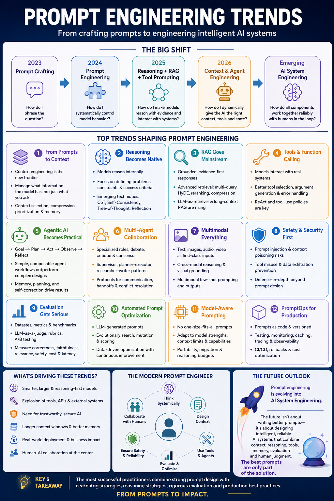

# Prompt Engineering Learning Hub

> Design reliable AI behavior with clear instructions, deliberate context, typed outputs, evidence, evaluation, and guardrails.

[**Open the Prompt Engineering Learning Hub →**](https://mahsa-teimourikia.github.io/prompt-engineering/)
 · [Knowledge check](https://mahsa-teimourikia.github.io/prompt-engineering/quiz/)



## What is prompt engineering?

Prompt engineering is the disciplined design, testing, and improvement of the instructions and context that guide a model toward a useful result. A production prompt is not a magic phrase: it is a **behavior contract**. It states the task, supplies the relevant evidence, constrains unsafe or unsupported behavior, and asks for a result that software and people can verify.

Modern practice increasingly includes **context engineering**: selecting and structuring the right instructions, user state, retrieved evidence, tool definitions, tool results, and conversation history for a particular decision. Better wording cannot compensate for missing evidence, unsafe tools, or an unmeasured failure mode.

This curriculum follows the evolution from **prompt crafting → prompt engineering → reasoning engineering → context engineering → tool and workflow engineering → agent prompt engineering → evaluation-driven optimization → PromptOps → AI system engineering**. Prompt engineering did not become irrelevant; it became one measurable layer of a larger behavior system. The core framework is:

`Prompt + model + context + examples + retrieval + tools + state + policies + evaluation + runtime configuration = dependable AI behavior`

## Start in the Learning Hub

The [Learning Hub](https://mahsa-teimourikia.github.io/prompt-engineering/) is the structured starting point. Choose a level, select a lesson, then use its **Learn**, **Notebook**, and **Checkpoint** tabs. The hub links to each self-contained notebook, source material, and focused quiz question. Your completion status stays in your browser.

## Curriculum roadmap

The repository is being migrated in deliberate phases; it does **not** claim that all target lessons have already been generated. The current published lessons remain available in the Hub while the canonical structure is built and validated topic by topic. See the [curriculum evolution plan](CURRICULUM_EVOLUTION_PLAN.md) for the audit, source-material disposition, implementation sequence, and complete mapping.

| Level | Canonical sequence | Current focus |
| --- | --- | --- |
| Beginner | 01–05: behavior, contracts, examples, typed interfaces, technique selection | Turn ambiguous support requests into validated case briefs. |
| Intermediate | 06–13: reasoning, workflows, context, conversations, RAG, tools, multimodality, security | Build evidence- and tool-grounded systems with explicit trust boundaries. |
| Advanced | 14–21: evaluation, judges, optimization, agents, coding, models, efficiency | Improve behavior only when a measured evaluation supports the change. |
| Production | 22–29: PromptOps, observability, release engineering, governance, trust, portability, architecture, capstone | Ship, diagnose, govern, and roll back an AI behavior artifact. |

The notebooks share the **Northstar Support Copilot** scenario. They help support specialists answer order, billing, and product-policy questions. The scenario deliberately includes conflicting evidence, injection-like content, strict schemas, and evaluation cases—conditions that make trade-offs visible without requiring credentials.

The course distinguishes **foundational** practices (clear task contracts, schemas, context, and evaluation), **practical** practices (boundary examples, evidence grounding, narrow tools, and PromptOps), **model-dependent** rituals (for example blanket personas or verbose chain-of-thought requests), and **emerging** practices (automatic optimization and learned context policies). The [current coverage map](docs/20-course-coverage-map.md) remains available during the migration.

## Run locally

This project uses **`uv`** for lightning-fast dependency management. Ensure you have `uv` installed (`pip install uv` or via your system package manager).

```bash
git clone https://github.com/mahsa-teimourikia/prompt-engineering.git
cd prompt-engineering

# Create the virtual environment and install dependencies via uv
make setup

# Activate the virtual environment
source .venv/bin/activate  # Windows: .venv\Scripts\activate

# Start Jupyter Lab
jupyter lab
```

Run the self-contained notebooks with `make notebooks`, or run `make test` to validate notebook coverage and quiz data. Provider calls are optional and deliberately absent from the default execution path.

## Canonical course navigation

The canonical [29-course curriculum](CURRICULUM_EVOLUTION_PLAN.md) is now available in the curriculum directory: Beginner (01–05), Intermediate (06–13), Advanced (14–21), and Enterprise (22–29). Every course contains a chapter, credential-free notebook, and reusable lab module. The Learning Hub and full quiz are generated from the same 29-course registry; legacy docs and notebooks remain supporting material during link-preserving migration.

| Level | Courses | Start point |
| --- | --- | --- |
| Beginner | 01–05 | [Course 01](curriculum/beginner/01-llm-behavior-and-prompt-anatomy/README.md) |
| Intermediate | 06–13 | [Course 06](curriculum/intermediate/06-reasoning-oriented-prompting/README.md) |
| Advanced | 14–21 | [Course 14](curriculum/advanced/14-prompt-evaluation/README.md) |
| Enterprise | 22–29 | [Course 22](curriculum/enterprise/22-promptops/README.md) |

Use the Hub for the complete ordered course list, chapter, notebook, reusable lab, checkpoint, and full 29-question knowledge check.

## Supporting reference material

These useful resources are retained as supporting material during the migration; they are not canonical completion requirements.

- [Technology landscape](docs/10-technology-review.md) · [notebook](notebooks/10_technology_review.ipynb)
- [Prompt technique catalog](docs/14-technique-catalog.md) · [notebook](notebooks/14_technique_catalog.ipynb)
- [Application playbooks](docs/15-application-playbooks.md) · [notebook](notebooks/15_application_playbooks.ipynb)
- [Curated resource library](docs/17-resource-library.md) · [notebook](notebooks/17_resource_library.ipynb)
- [Current coverage map](docs/20-course-coverage-map.md) · [notebook](notebooks/20_course_coverage_map.ipynb)

## Technology and state of the art

The course treats vendor frameworks as tools, not the curriculum. Use a model provider's prompt guide for model-specific details; use **JSON Schema/Pydantic** for contracts; **DSPy** or equivalent optimizers only after establishing an evaluation set; and an eval/tracing platform when prompt changes need release governance. For agents, tool descriptions and permission checks are part of the prompt interface, but authorization remains application code.

See [Technology review](docs/10-technology-review.md) for decision guidance covering OpenAI, Anthropic, Google Gemini, open-source structured-generation libraries, DSPy, LangSmith, Promptfoo, Phoenix, and evaluation approaches.

## Curated references

- [The Prompt Report — systematic survey of prompting techniques](https://arxiv.org/abs/2406.06608)
- [A systematic survey of prompt engineering](https://arxiv.org/abs/2402.07927)
- [Chain-of-Thought Prompting](https://arxiv.org/abs/2201.11903), [ReAct](https://arxiv.org/abs/2210.03629), and [Toolformer](https://arxiv.org/abs/2302.04761)
- [Anthropic: effective context engineering for agents](https://www.anthropic.com/engineering/effective-context-engineering-for-ai-agents) and [building effective agents](https://www.anthropic.com/engineering/building-effective-agents)
- [Google prompt design strategies](https://ai.google.dev/gemini-api/docs/prompting-strategies)
- [OpenAI prompting guide](https://platform.openai.com/docs/guides/prompting), [structured outputs](https://platform.openai.com/docs/guides/structured-outputs), and [evals](https://platform.openai.com/docs/guides/evals)
- [OWASP LLM Prompt Injection Prevention Cheat Sheet](https://cheatsheetseries.owasp.org/cheatsheets/LLM_Prompt_Injection_Prevention_Cheat_Sheet.html)

## Contributing

Contributions should add a cited explanation, a credential-free executable notebook section, an experiment, and an evaluation or checkpoint. Please open an issue before introducing a provider-specific dependency.

Learning with [One+i](https://oneplusi.io) · responsible AI, real-world impact.
