# 17 — Automatic Prompt Optimization and DSPy

## Learning objectives

Define an objective and dataset split, compare a manual baseline with an
optimized prompt/program, detect overfitting and data leakage, and decide when
optimization cost and portability are justified.

## Technology landscape and state of the art

**Foundational:** Manual prompt engineering (tweaking words by hand).
**Current State of the Art:** 
1. **Prompt Programming:** We are shifting from "Prompt Engineering" to "Prompt Programming." Instead of writing brittle English instructions, you write programmatic pipelines (e.g., using **DSPy**).
2. **Automatic Prompt Optimization (APO):** You define a signature (Inputs -> Outputs), an Evaluation Metric, and a Dataset. A framework like DSPy compiles your program by having an "Optimizer LLM" automatically generate, test, and tweak the prompt instructions until the metric is maximized over your dataset.

## Lab and production

The [notebook](17_automatic_prompt_optimization_and_dspy.ipynb) demonstrates the underlying mechanics of APO using a vanilla Google GenAI script. It shows how an Optimizer LLM can read a failing evaluation and automatically rewrite the prompt instructions to fix the error. While you should use production frameworks like DSPy in the real world, understanding the vanilla mechanics is critical. Automatic optimization without trustworthy evaluation is meaningless.

## References

- [DSPy optimizers](https://dspy.ai/learn/optimization/optimizers/)
