# 18 — Agent and Multi-Agent Prompt Contracts

## Learning objectives

Define agent goals, typed state, narrow tools, permissions, budgets, stop
conditions, handoffs, and escalation; then evaluate trajectories rather than
only final text.

## Technology landscape and state of the art

**Foundational:** Trying to write one massive "God Prompt" that instructs a single LLM to handle everything from database queries to customer chat.
**Current State of the Art:** 
1. **Multi-Agent Systems:** Complex tasks are broken down into narrow, highly constrained "Specialist Agents" orchestrated by a central "Supervisor Agent" (e.g., LangGraph).
2. **Contracts over Prompts:** The boundaries between these agents are not defined by fuzzy English instructions, but by strict programmatic contracts (Pydantic schemas). The Supervisor isn't told "talk to the Database Agent," it is given a tool that *requires* it to generate a valid `DatabaseQuerySchema` JSON payload before the handoff can occur.

## Lab and production

The [notebook](18_agent_and_multi_agent_prompt_contracts.ipynb) demonstrates a multi-agent Supervisor/Specialist pattern using the Google GenAI SDK. It highlights how to enforce handoffs using Pydantic contracts rather than relying on unstructured LLM chat. Extra autonomy must demonstrate measured benefit. Prompts describe a role; runtime policy enforces identity, tenant boundaries, authorization, idempotency, and effects.

## References

- [Building effective agents](https://www.anthropic.com/engineering/building-effective-agents)
