# 19 — Prompting for Coding Agents

## Learning objectives

Write a repository-aware task contract, constrain file scope, specify tests and
completion evidence, and compare a vague request with a reviewable engineering
task.

## Technology landscape and state of the art

**Foundational:** Sending a snippet of code to an LLM and asking "why is this broken?"
**Current State of the Art:** 
1. **Autonomous Coding Agents:** Tools like **GitHub Copilot Workspace**, **Devin**, and advanced IDEs like **[Cursor](https://www.cursor.com/)** or CLI agents like **[Aider](https://aider.chat/)** can now operate across an entire codebase. They can read thousands of files, propose architecture changes, and execute terminal commands.
2. **Engineering Contracts:** Because these agents are so powerful, a vague prompt like "fix authentication" is dangerous. It can lead to the agent rewriting massive, unrelated parts of the codebase. The state of the art involves defining strict "Task Contracts" that explicitly scope which files the agent is allowed to touch and which tests it must pass before reporting success.

## Lab and production

The [notebook](19_prompting_for_coding_agents.ipynb) demonstrates the difference between a vague request and a structured engineering contract. It uses Pydantic to force the *human* to define a strict problem statement, file scope, and test criteria before handing the task off to an autonomous agent. A coding agent must inspect the repository, propose a plan, make minimal changes, run tests, review the diff, and report evidence. Never give an agent unconstrained production access by prompt alone.

## References

- [GitHub repository custom instructions](https://docs.github.com/en/copilot/customizing-copilot/adding-repository-custom-instructions-for-github-copilot)
