# 21 — Cost, Latency, and Token Engineering

## Learning Objectives
- **Understand Context Economics:** Calculate the cost and latency implications of instructions, examples, history, and retrieved context.
- **Utilize Context Caching:** Implement memory caching for massive, static contexts to dramatically reduce per-query latency and cost.
- **Implement Semantic Routing:** Cascade requests between cheap/fast models and expensive/slow models based on task complexity.
- **Navigate Pareto Frontiers:** Plot the trade-offs between quality, cost, and latency, and establish strict SLA boundaries.

## Core Concepts & Workflow

With models like Gemini 1.5 Pro supporting 2 million+ token context windows, you can often drop entire codebases or libraries directly into the prompt, bypassing the need for complex, error-prone vector retrieval (RAG) systems.

However, while massive contexts solve the "Quality" problem, they introduce massive Latency and Cost problems. The LLM must re-process the entire context on every request. Engineering is about trade-offs. You must implement solutions like Context Caching (loading a massive static context into memory once) and Semantic Routing (sending simple queries to fast models and complex queries to slow models) to navigate the Pareto frontier between quality, speed, and budget.

## Technology Landscape and State of the Art

**Foundational:** Building complex RAG pipelines to chunk and retrieve tiny snippets of text to avoid hitting strict, low token limits, resulting in fragmented context and "lost in the middle" errors.

**Current State of the Art:** 
1. **Massive Context Windows:** Models like Gemini 1.5 Pro now support 2 million+ token context windows. This fundamentally changes system architecture. You can often drop entire codebases, massive log files, or complete video libraries directly into the prompt, bypassing the need for complex, error-prone vector databases or retrieval systems entirely.
2. **Context Caching:** While massive contexts solve the "Quality" problem (giving the LLM all the data it needs), they introduce massive Latency and Cost problems because the LLM must re-process the entire context on every request. The state of the art solution is **Context Caching** (e.g., **[Google GenAI Context Caching](https://ai.google.dev/gemini-api/docs/caching)** or Anthropic's Prompt Caching). You load a massive static context (like a codebase or rulebook) into the model's memory *once*, and subsequent queries against that cached context return almost instantly at a fraction of the per-token cost.
3. **Model Routing and Cascading:** Instead of sending every request to the most expensive model, advanced architectures use "Semantic Routers". Simple or fast requests are routed to smaller, cheaper models (like Gemini 1.5 Flash), while complex, high-reasoning tasks are routed to larger models (like Gemini 1.5 Pro). If the smaller model fails a validation gate, the system "cascades" up to the larger model.
4. **Pareto Frontiers & Token Economics:** Engineering is about navigating trade-offs. You must measure the cost and latency of a "Full Context" policy vs. a "Pruned Context" policy. Tools like **[Cloudflare AI Gateway](https://developers.cloudflare.com/ai-gateway/)**, **LangSmith**, or **Helicone** are used to monitor these token economics and latency budgets in production. You plot a Pareto frontier to find the sweet spot where you maximize quality while staying within your latency/cost SLA.

## Lab and Production

### The Lab
The [notebook](21_cost_latency_and_token_engineering.ipynb) demonstrates the harsh reality of latency and token costs. It compares a "Full Context" policy against a "Pruned Context" policy, measuring the latency and token usage (cost) of each using the Google GenAI SDK. Crucially, it demonstrates a scenario where the "Pruned Context" saves money and time, but fails the Quality Gate by returning an incorrect answer. 

### Production Best Practices
- **Token Telemetry:** Always emit token usage (`prompt_token_count`, `candidates_token_count`) in your logging spans to enable granular cost tracking.
- **Measure Before Pruning:** Use context caching and context pruning only after measuring baseline regressions. Do not prematurely optimize context size if it destroys accuracy.
- **Safety is Non-Negotiable:** Plot Pareto frontiers for quality vs. cost, but keep safety and evidence-checking gates completely non-negotiable regardless of the token cost.
