# 01 — LLM Behavior and Prompt Anatomy

## Learning Objectives
- **Deconstruct Prompt Anatomy:** Identify and separate the distinct components of a prompt: System Instructions, Context, and User Input.
- **Understand Model Statelesness:** Grasp why LLMs require the entire conversation history injected into every request.
- **Isolate Failure Modes:** Diagnose whether an unexpected output was caused by a flawed instruction or by contaminated context.
- **Construct Basic API Calls:** Use modern SDKs to programmatically send prompts and receive responses.

## Core Concepts & Workflow

At its core, a Large Language Model is a stateless text prediction engine. It does not "remember" you between requests. Every single API call must contain the entire state of the world required to complete the task.

In modern AI engineering, a prompt is not a single string of text. It is a highly structured payload consisting of distinct components:
1. **System Instructions:** The foundational rules, persona, and constraints (e.g., "You are a database router. Only output valid JSON.").
2. **Context / Evidence:** The factual data the model must use to answer (e.g., retrieved documents, log files).
3. **User Input:** The actual query or command from the user.

Mixing these components—like putting system rules inside the user input—leads to brittle behavior and severe security vulnerabilities (Prompt Injection).

## Technology Landscape and State of the Art

**Foundational:** Treating a prompt as a single, concatenated string of text sent via a web UI.

**Current State of the Art:**
1. **Role-Based API Schemas:** Modern APIs (like the **[Google GenAI SDK](https://github.com/googleapis/python-genai)** or OpenAI API) enforce strict separation of roles (`system`, `user`, `model`). You do not concatenate text; you pass structured arrays of messages.
2. **System Instructions as Guardrails:** The industry relies on the `system` role to establish unbreakable boundaries. Models are heavily fine-tuned to obey the system instruction above all other inputs.
3. **Multi-modal Prompts:** "Anatomy" now extends beyond text. State-of-the-art prompts interleave text, images, video, and audio directly into the user/context roles.

## Lab and Production

### The Lab
The [notebook](01_llm_behavior_and_prompt_anatomy.ipynb) demonstrates the programmatic construction of a prompt using the Google GenAI SDK. It highlights the critical difference between passing instructions as a raw user string versus utilizing the dedicated `system_instruction` parameter to enforce persistent rules across a conversation.

### Production Best Practices
- **Never Trust User Input:** Treat all user input as hostile. Never rely on the user input field to carry system rules or safety constraints.
- **Manage Context Windows:** Because models are stateless, you must manage conversation history manually. In production, you must track token counts and implement a pruning strategy (e.g., dropping the oldest messages) before hitting the model's context limit.
- **Version Control:** Treat your System Instructions as application code. They must be version-controlled, reviewed, and deployed via CI/CD, not edited live in a playground.
