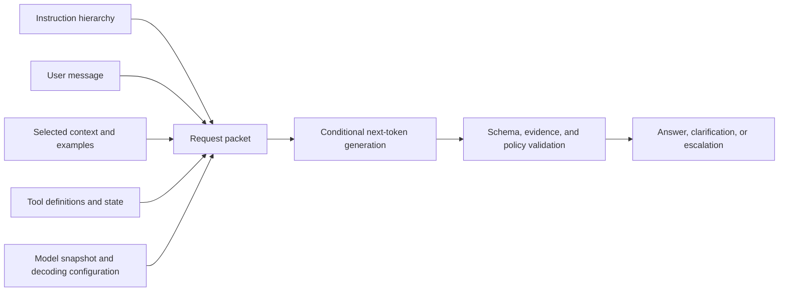

# 01 — LLM Behavior and Prompt Anatomy

## Learning objectives

By the end of this course, you can describe an inference request without
anthropomorphizing the model; identify its mutable inputs; design a controlled
behavior experiment; and decide whether a failure belongs to the instruction,
context, decoding configuration, evidence, or an application boundary.

## Why this matters

Northstar’s support classifier gives a different answer after a model update,
longer history, or sampling change. “The prompt used to work” is not a useful
diagnosis. A production response is conditional generation inside a whole
request packet, followed by validation and policy. This lesson makes that
packet observable before later lessons teach contracts, examples, schemas, and
context selection.

**Scenario.** A support team must classify requests as `refund`, `shipping`,
`account`, or `unknown`. A wrong confident label is worse than an explicit
escalation, because a later workflow could act on the label.

**Experimental question.** Which observable request-packet change explains a
behavior regression: the instruction, evidence position, distracting context,
or sampling configuration?

**Success criteria.** Run the same 20 sliced cases five times per strategy,
vary one request component at a time, and report accuracy, abstention accuracy,
unsupported-output rate, cross-run instability, selection latency, and
estimated packet tokens. Preserve a safe `unknown` result when approved
evidence is missing. This lesson does not train a model, authorize actions, or
claim that a deterministic teaching simulator represents any provider model.

## Prerequisites and next steps

No API account is required for the default offline experiment. Familiarity
with basic Python dictionaries and tables helps with the lab. Continue to
[Course 02: Instruction Contracts](../02-instruction-contracts/README.md)
when you can identify the fields a contract must constrain.

## Mental model

An LLM maps the visible request state to a distribution over the next token.
Generation repeats that operation until a stop condition, output limit, or
provider/runtime boundary ends it. A prompt changes the condition; it is not
program code and does not itself enforce permissions.

## Theory and foundations

### Tokens, context, and decoding

Models consume token sequences, not words. Tokenization, context capacity, and
the relationship between input and output limits are model-specific. Reserve
space for a required result before adding more context. A larger context window
is capacity—not proof that every item will be selected, weighted, or recalled
well.

At each step, a model assigns scores (logits) to possible next tokens. A decoder
turns those scores into a selection. Temperature and sampling controls affect
the selection policy; they do not make unsupported content become evidence.
Lower variation may improve repeatability on one task while harming a task that
needs diverse candidates. Measure the trade-off on a frozen suite.

### Order, position, and ambiguity

The model sees a sequence. Therefore instruction placement, conflicting text,
example order, long history, and distractors are experimental variables.
Research on long-context use has found position sensitivity in tested settings;
test this for the model, task, and source layout you intend to ship rather than
turning the result into folklore. Ambiguity is also a data-design problem:
define when `unknown` is correct before attempting to tune it away.

## How it works internally

An application assembles messages, evidence, examples, tools, and configuration
into a request. The model generates a candidate; application code validates
shape, evidence use, authorization, and business rules. A trace should capture
the inputs and decisions that are safe to retain: contract version, model
snapshot, context identifiers, decoding configuration, validation result,
latency, and token/cost measurements. It should not seek private chain of
thought.

## Architecture and workflow patterns

| Pattern | Use when | Strength | Risk | First evaluation |
| --- | --- | --- | --- | --- |
| Deterministic rule | policy is explicit and bounded | cheap, auditable | brittle coverage | correctness on edge cases |
| Single model request | judgment needs language flexibility | simple surface | unclear failure location | task and abstention accuracy |
| Retrieval-grounded request | evidence changes by request | current source selection | miss, noise, poisoning | retrieval and citation support |
| Multi-stage workflow | stages have different contracts | observable failure isolation | added latency/complexity | end-to-end and stage metrics |

Choose the smallest architecture that meets the decision’s reliability and risk
requirements. An agent is not the default answer to a classification task.

## Worked example: isolate the change

Freeze 20 Northstar cases across normal, ambiguous, boundary, multilingual,
missing-evidence, and injection slices. Run the same classifier five ways:

1. a vague instruction as the baseline;
2. a precise `classify` instruction with evidence first and temperature `0`;
3. the same packet with evidence positioned in the middle of synthetic context;
4. the original packet at non-zero temperature across repeated runs; and
5. the stable packet with 800 synthetic distracting tokens.

Compare accuracy, correct `unknown` behavior, and request-size proxy. The lab’s
simulator makes the position and variation effects visible without claiming a
universal provider result. In a real run, replace only the adapter and record
the model/version, raw output, validation, tokens, and latency.

## Implementation and experiments

The [guided notebook](llm_behavior_and_prompt_anatomy.ipynb) imports
[`lab.py`](lab.py), loads the versioned
[dataset](../../../data/behavior/support_cases.jsonl), runs the frozen suite,
changes one variable per experiment, and injects a missing-evidence failure. It
compares vague, stable, position-sensitive, higher-variation, and overloaded
packets. The token figure is an explicit estimate used only for relative
comparisons; use the target provider’s tokenizer and billing telemetry in
production.

The notebook is offline by default. For one optional integration call, each
learner must configure their own `OPENAI_API_KEY`, explicitly set
`PROMPT_COURSE_PROVIDER=openai`, and follow the
[root setup instructions](../../../README.md). Never paste a key into a
notebook, commit it, or treat one live response as an evaluation result.

## Evaluation

Do not rate a prompt from one appealing answer. Use a case set containing clear,
ambiguous, adversarial, and missing-evidence inputs. Predefine:

- task accuracy and `unknown`/abstention correctness;
- schema validity and evidence support where applicable;
- variation across repeated runs;
- token use, latency, and cost per successful task; and
- safety failures as release blockers, not a metric to average away.

## Failure modes and safety boundaries

| Failure | Likely cause | Appropriate response |
| --- | --- | --- |
| Different output after a release | model/config/context changed | compare versioned request traces and rerun the frozen suite |
| Unsupported answer | missing or untrusted evidence | select authorized evidence or abstain; do not add persona text |
| Invalid downstream data | free-form output used as an interface | apply a typed schema and application validation in Course 04 |
| User text asks for an action | instruction/data confusion | treat it as data; authorize effects in deterministic code |
| Cost rises with no quality gain | irrelevant history/examples/tools | inspect packet allocation and remove measured waste |

Delimiters and roles make the packet legible, but neither authenticates a user,
isolates tenants, or authorizes a tool call. Those controls belong in the
application runtime.

## Technology landscape and state of the art

**Foundational:** clear task definitions, explicit output expectations,
controlled experiments, schemas, and external validation. **Practical:**
provider-supported structured outputs, request tracing, targeted retrieval, and
versioned evaluation suites. **Model-dependent:** blanket persona prompting and
verbose “think step by step” rituals—evaluate them rather than assuming a gain,
especially with reasoning-capable models. **Emerging/research:** learned context
policies, automatic prompt/program search, and automated agent optimization;
they require stronger held-out evaluation, not less.

Use provider documentation for current decoding and context parameters. Keep a
provider adapter behind a stable request/response contract, so model-specific
tuning does not leak into business policy.

## Production considerations

Record model/version and configuration; pin or detect version changes where the
provider supports it; reserve output capacity; validate outputs outside the
model; monitor drift by slice; and retain an evaluation-gated rollback path.
Never log secrets or raw sensitive content merely to explain a response.

## When to use / when not to use

Use this analysis whenever a model behavior changes, when choosing a sampling
configuration, or before adding more prompt complexity. Do not use an LLM when
a deterministic policy engine can make the decision more reliably and cheaply.

## Exercises and review questions

1. Add a spelling-variant support case and decide whether the correct response
   is classification or clarification.
2. Move a required policy statement through a synthetic long packet. Which
   metric demonstrates a real regression?
3. Explain why a stable seed is useful for debugging but not a semantic
   guarantee.
4. A model chooses a tool with a valid argument. Which checks must still occur
   before any effect is executed?

**Advanced challenge.** Repeat the frozen experiment with an approved live
model snapshot, capture provider-reported tokens and latency, and distinguish
model variance from configuration drift. Keep credentials learner-owned and
make no release claim unless the held-out and safety slices support it.

## References

- [Language Models are Few-Shot Learners](https://arxiv.org/abs/2005.14165)
- [Lost in the Middle: How Language Models Use Long Contexts](https://arxiv.org/abs/2307.03172)
- [The Prompt Report](https://arxiv.org/abs/2406.06608)
- [OpenAI prompting guide](https://platform.openai.com/docs/guides/prompting)
- [Google prompt design strategies](https://ai.google.dev/gemini-api/docs/prompting-strategies)
