# 02 — Instruction Contracts

## Learning Objectives
- **Define Engineering Contracts:** Move from writing polite requests to defining strict, declarative input/output contracts.
- **Eliminate Ambiguity:** Remove adjectives and replace them with measurable, binary boundaries.
- **Implement Fallback Paths:** Explicitly instruct the model on what to do when it cannot complete the task.
- **Test Deterministically:** Evaluate instruction adherence using programmatic assertions.

## Core Concepts & Workflow

A prompt is an engineering contract. If you ask an LLM to "write a good summary," you have failed to define the contract. "Good" is subjective, unmeasurable, and impossible to test. 

A production instruction contract must specify the exact input format, the required transformation steps, the exact output schema, and the negative constraints (what *not* to do). If the model is asked to route a support ticket based on a policy document, the contract must explicitly state what the model should output if the ticket *does not match* the policy. Without a defined fallback, the model will hallucinate a guess.

## Technology Landscape and State of the Art

**Foundational:** Writing polite, conversational instructions ("Please summarize this text and be helpful").

**Current State of the Art:**
1. **Declarative Contracts:** The industry has moved to highly structured, declarative instructions using formats like Markdown or XML to clearly delineate sections (e.g., `<rules>`, `<input>`, `<output_format>`).
2. **Pydantic Schemas:** The ultimate instruction contract is a programmatic schema. Using tools like **[Pydantic](https://docs.pydantic.dev/)**, engineers define the exact shape of the required output, and the SDK translates that schema into instructions the model understands.
3. **Automated Optimization:** Frameworks like **[DSPy](https://github.com/stanfordnlp/dspy)** treat the instruction text as a hyperparameter. You define the input/output signature, and an optimizer rewrites your English instructions to maximize a defined metric.

## Lab and Production

### The Lab
The [notebook](02_instruction_contracts.ipynb) illustrates the transition from a vague "zero-shot" prompt to a rigid instruction contract. It demonstrates how adding explicit constraints (e.g., "Output exactly one of the following three categories") dramatically increases the reliability and testability of the model's output.

### Production Best Practices
- **Define the 'None' State:** Every contract must define an escape hatch. Explicitly state: "If the answer is not present in the text, output 'INSUFFICIENT_DATA'."
- **Remove Politeness:** Do not use "please" or "if you can." LLMs do not have feelings. Use direct, imperative commands.
- **Measure Adherence:** You cannot improve what you cannot measure. A contract is only valid if you can write an automated test to verify that the model obeyed the constraints.
