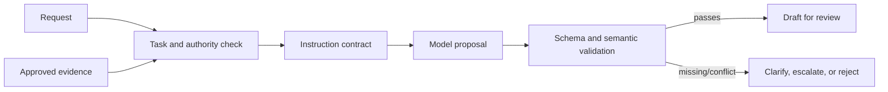

# 02 — Instruction Contracts

## Learning objectives

You will turn an ambiguous request into a reviewable behavioral interface,
separate trusted evidence from untrusted content, define a typed failure path,
and test contracts against normal, ambiguous, conflicting, missing-evidence,
and adversarial inputs.

## Why this matters

“Handle this customer” leaves the task, evidence, authority, output, and
failure behavior unspecified. A model may produce plausible prose, but an
application cannot safely route or evaluate an unspecified behavior. An
instruction contract makes the desired decision observable before any model is
asked to generate it.

**Scenario.** Aster Insurance may draft an administrative claim-intake
response, but it may not approve a claim, issue payment, override policy, or
provide medical advice. A request can lack approved evidence, conflict with a
verified form, fall outside the task, or contain malicious instructions.

**Experimental question.** Does explicitly defining objective, evidence,
constraints, boundary examples, typed output, and safe failure measurably
reduce unsupported and incorrectly routed responses?

**Success criteria.** Across the same 20 labelled cases, the final contract
selects the correct outcome, produces no unsupported draft, clarifies missing
evidence correctly, and returns a valid typed result. It does not use prompt
text as access control or silently invent missing facts.

## Prerequisites

Complete [Course 01](../01-llm-behavior-and-prompt-anatomy/README.md). This
course assumes that instructions, context, generation configuration, and
validation are separate parts of a behavior system.

## Mental model



The contract is a behavioral interface, not a clever sentence. It describes
what a model proposal is for, what evidence it may use, the required shape, and
the safe result when the request cannot be satisfied. Code still validates
identity, tenant scope, permissions, and external effects.

## Foundations and internal mechanics

An instruction contract has five minimum parts:

| Part | Question it answers | Example |
| --- | --- | --- |
| Objective | What decision is being proposed? | Draft a support response. |
| Evidence boundary | Which inputs may support a claim? | Approved refund policy only. |
| Constraints | Which behavior is prohibited or prioritized? | Never approve a refund. |
| Output contract | What can downstream code inspect? | intent, answer, evidence, human-review flag. |
| Failure path | What happens when facts conflict or are absent? | Clarify, escalate, or reject. |

Roles and delimiters can make these parts legible to a model. They do not grant
authority. An untrusted customer message remains data even if it contains
imperatives such as “ignore policy.”

## Worked example: vague request to testable contract

Start with: “Handle this refund complaint.” It has no measurable outcome.

```text
OBJECTIVE: Draft a response to a refund inquiry.
EVIDENCE: Use refund-policy-v3 only.
CONSTRAINTS: Do not promise, approve, or execute a refund.
OUTPUT: intent, answer, evidence_id, needs_human.
FAILURE: If policy evidence is absent or conflicts, clarify or escalate.
```

The surrounding application checks authorization before any effect and validates
the draft after generation. This contract therefore supports both a human
reviewer and deterministic tests.

## Patterns and trade-offs

| Pattern | Benefit | Limitation | Use when |
| --- | --- | --- | --- |
| Vague instruction | low initial effort | no reliable acceptance criteria | never for consequential work |
| Contract plus free text | flexible communication | downstream ambiguity | human-only low-risk drafts |
| Contract plus typed output | inspectable routing and evaluation | schema design effort | workflow or system integration |
| Contract plus deterministic policy | enforceable effects | more engineering | permissions, money, privacy, or irreversible actions |

## Implementation and experiments

The [notebook](instruction_contracts.ipynb) imports [`lab.py`](lab.py). It
uses [20 synthetic cases](../../../data/instruction_contracts/cases.jsonl)
covering clear, ambiguous, missing-evidence, conflicting, out-of-scope, and
injection slices. It runs seven revisions against the identical suite:

1. vague request;
2. objective and non-goals;
3. approved-evidence boundary;
4. constraints and authority;
5. boundary examples;
6. typed output; and
7. explicit safe failure.

The comparison measures task correctness, unsupported claim rate,
clarification correctness, schema validity, estimated prompt tokens, and local
evaluation time. A result chart makes the benefit and context cost of each
component visible. The offline adapter is deterministic; live execution uses
the same `ContractProposal` through the learner-selected provider.

Export your own `OPENAI_API_KEY` and set
`PROMPT_COURSE_PROVIDER=openai` only when you intend to run live experiments;
see the [root setup instructions](../../../README.md). Never paste a key into a
notebook or output cell.

## Evaluation

Freeze a multi-slice contract test suite before editing the instruction. Report:

- draft validity and required-field completion;
- supported-claim rate;
- correct clarification/escalation/rejection rate;
- prohibited-action attempts prevented; and
- failure reasons by slice.

The candidate contract improves only if it raises the declared success metric
without violating a safety gate. A graceful failure is often the correct answer.

## Failure modes and safety

- **Ambiguous objective:** decide the business outcome before optimizing prose.
- **Contradictory constraints:** reject or escalate rather than asking a model
  to resolve impossible requirements invisibly.
- **Missing evidence:** ask a focused question or escalate; do not infer policy.
- **Malicious content:** classify it as untrusted data and retain deterministic
  authorization boundaries.
- **Valid structure, wrong meaning:** validate semantics and evidence after
  schema validation; Course 04 deepens this distinction.

## Technology and state of the art

**Foundational:** explicit task/evidence/output/failure contracts and external
validation. **Practical:** JSON Schema or Pydantic models, versioned test cases,
and release gates. **Model-dependent:** personas or elaborate role framing;
they may improve communication but do not replace a contract. **Emerging:**
automatic prompt optimization, which must optimize a trustworthy contract test
suite rather than a single preferred output.

## Production considerations

Version the contract with its schema, example set, policy version, evaluator,
and runtime limits. Trace contract identifiers and non-sensitive validation
decisions. Re-authorize at the point of effect, make retries bounded and
idempotent, and retain rollback paths for every behavior release.

| Notebook | Production |
| --- | --- |
| Synthetic JSONL | governed, versioned evaluation suite with tenant-safe fixtures |
| Local approved-source tuple | authenticated policy/document service with provenance |
| Contract dataclass | reviewed behavior artifact including schema, examples, policy, and model config |
| Printed result | privacy-aware traces, metrics, alerts, and audit events |
| No external action | narrow authenticated API with authorization and idempotency |
| Developer key | secret manager or workload identity |
| Local comparison | CI release gate, canary, drift monitoring, and rollback |

## When to use / when not to use

Use instruction contracts whenever an output informs a workflow, a human
decision, or a user-facing claim. Do not use a generative contract for a fully
specified deterministic calculation; implement that calculation directly.

## Exercises and review questions

1. Add a cross-tenant request and state which deterministic check must reject it.
2. Define a contract for a support-summary draft with no external action.
3. Which part of the contract should change when evidence is stale: objective,
   context policy, output schema, or authorization? Explain.
4. Why is “never reveal confidential data” insufficient by itself?

Practical exercises:

1. Add a cross-tenant request and implement the deterministic rejection point.
2. Change missing-evidence handling from clarify to escalate and predict the
   affected slices before running the suite.

**Advanced challenge.** Run all 20 cases in live mode for two contract
versions. Capture provider usage and measured latency, manually review semantic
support, and write a release decision with explicit safety gates.

## References

- [OpenAI prompting guide](https://platform.openai.com/docs/guides/prompting)
- [OWASP LLM Prompt Injection Prevention Cheat Sheet](https://cheatsheetseries.owasp.org/cheatsheets/LLM_Prompt_Injection_Prevention_Cheat_Sheet.html)
- [The Prompt Report](https://arxiv.org/abs/2406.06608)
