# 03 — Constraints, Examples, and Few-Shot Learning

## Learning Objectives
- **Shape Behavior with Examples:** Use Few-Shot learning to demonstrate desired outputs rather than relying solely on complex instructions.
- **Define Decision Boundaries:** Curate examples that explicitly map the edge cases and boundary lines of a task.
- **Include Negative Examples:** Provide examples of what *not* to do, or how to handle missing data safely.
- **Measure Example Impact:** Calculate the token cost vs. quality tradeoff of adding examples to a prompt.

## Core Concepts & Workflow

Even the most perfectly written Instruction Contract will sometimes fail on complex edge cases. When a direct instruction fails, the solution is not to write a longer, more complicated instruction. The solution is to *show*, not just tell.

This is "Few-Shot Learning." By providing a few examples of the exact Input and the desired Output within the prompt, you anchor the model's behavior. The goal is not volume; it is variance. You should select examples that define the *boundaries* of your logic—for instance, an example that barely qualifies for Category A, and an example that barely falls into Category B. 

## Technology Landscape and State of the Art

**Foundational:** Believing that writing a longer, more detailed instruction is the only way to fix an LLM mistake.

**Current State of the Art:**
1. **Dynamic Few-Shot Routing:** Instead of hard-coding the same 5 examples into every prompt, advanced systems use a vector database to dynamically retrieve the 5 examples that are most semantically similar to the user's current query.
2. **Automated Example Selection:** Frameworks like **[DSPy](https://github.com/stanfordnlp/dspy)** (specifically its BootstrapFewShot optimizers) automate the process of finding the best possible combination of examples from a training set to maximize evaluation scores.
3. **Agentic Workflows:** Multi-stage reasoning flows often use different few-shot examples for different stages (e.g., planning examples vs. execution examples).

*Note: While massive context windows (like Gemini 1.5 Pro) make blanket large few-shot blocks less strictly necessary, targeted negative and boundary examples remain critical for shaping specific behavioral nuances.*

## Lab and Production

### The Lab
The [notebook](03_constraints_examples_and_few_shot_learning.ipynb) demonstrates fixing a boundary failure. It first establishes a baseline where instructions alone fail to categorize an edge case correctly. It then injects a single, targeted Few-Shot example mapping that edge case, proving how examples override instruction ambiguity.

### Production Best Practices
- **Curate, Don't Hoard:** 3 highly specific boundary examples are vastly superior to 20 random examples.
- **Include the 'Unknown':** Always include at least one example where the correct behavior is to decline the request or output a fallback state.
- **Tenant Filtering:** If selecting examples dynamically, production systems *must* apply tenant/permission filtering before retrieval to ensure data from Customer A is never used as a few-shot example in a prompt for Customer B.
