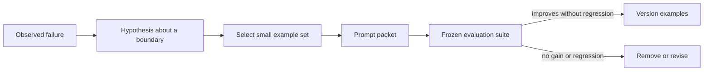

# 03 — Constraints, Examples, and Few-Shot Learning

## Learning objectives

You will specify useful constraints, construct positive, negative, boundary,
and counterexamples, select examples by an explicit strategy, and evaluate
accuracy and context cost rather than declaring a longer prompt “better.”

## Why this matters

Examples can demonstrate a decision boundary without changing model weights.
They can also add contradictory policy, irrelevant context, token cost, and
anchoring bias. The question is not “How many examples should I add?” It is
“Which observed failure does this example address, and does it improve held-out
behavior enough to justify its context budget?”

**Scenario.** An enterprise IT service desk routes tickets to `access`,
`billing`, `hardware`, `network`, `security`, or `software`. Boundary tickets,
multilingual requests, and malicious routing instructions expose whether the
example policy improves the decision or merely adds convincing context.

**Experimental question.** Is adding more examples better than selecting a
small, relevant, diverse, and correctly labelled set?

**Success criteria.** Evaluate every strategy on the same 24 held-out tickets,
report accuracy and macro F1, expose selected example IDs, measure selection
latency and estimated example tokens, and demonstrate that poisoned examples
can perform worse than zero-shot routing.

## Prerequisites

Complete [Course 01](../01-llm-behavior-and-prompt-anatomy/README.md) and
[Course 02](../02-instruction-contracts/README.md). The routing contract has a
defined safe outcome and measurable labels before examples are introduced.

## Mental model

Examples are context. They influence the conditional generation alongside the
instruction and user request; they are neither training data nor a substitute
for a schema, evidence policy, or authorization check.

## Foundations and patterns

| Example type | Purpose | Common misuse |
| --- | --- | --- |
| Positive | demonstrate a valid mapping | duplicating obvious cases |
| Negative | show an unacceptable result | teaching unsupported policy as fact |
| Boundary | distinguish nearby labels | omitting access/software or billing/software edge cases |
| Counterexample | prevent a tempting wrong shortcut | treating it as a universal rule |
| Contrastive pair | make a specific decision difference visible | hiding irrelevant differences |

Start with a direct instruction. Add an example only when an evaluation reveals
a specific decision boundary. Keep examples consistent with the current
contract, source, and output schema; version them with the behavior artifact.

## Static and dynamic selection

Static examples are predictable and easy to review, but can become stale or
poorly matched to a request. Dynamic few-shot selection retrieves examples at
request time using semantic similarity, metadata, or a diversity objective.
It can improve relevance, but also risks selecting near-duplicates, leaking
sensitive content, or reinforcing a misleading historical pattern.

The lab compares zero-shot, one-shot, static, seeded random,
similarity-selected, diversity-selected, and deliberately poisoned examples.
It first exposes the transparent keyword classifier, then uses scikit-learn
TF-IDF vectors and cosine similarity. Diversity selection applies a small
maximal-marginal-relevance objective: relevance to the query minus redundancy
with examples already chosen. This teaches the mechanism without requiring an
embedding service. In production, semantic embedding models may improve
matching, but selection still needs tenant, permission, privacy, freshness,
label-quality, and context-budget controls.

## Worked example

For “VPN calls freeze only from home,” network and access examples can appear
nearby for different reasons. Similarity selection favors the closest lexical
match; diversity selection reduces redundant demonstrations. A deliberately
mislabeled nearest example creates a realistic failure: it adds context while
reducing held-out quality. Expected label, selected IDs, predicted label,
estimated context tokens, and measured selector time remain traceable.

## Evaluation and failure modes

Report accuracy, macro F1, urgent-security routing, selected-example relevance,
mean estimated example tokens, measured selection latency, and regressions on
cases that were already correct. Test conflicting examples, order, stale or
poisoned examples, injection, multilingual requests, and over-represented
classes. Never tune on the same cases used to declare a final improvement; use
development and held-out sets.

The [dataset](../../../data/few_shot/tickets.jsonl) contains 24 approved
training examples and 24 held-out cases across normal, boundary, urgent,
multilingual, adversarial, and injection slices. The notebook plots accuracy
and macro F1 across strategies and plots quality against example count from
zero through eight. In the deterministic experiment, the best count need not
be the largest; learners must interpret the measured curve instead of assuming
monotonic improvement.

## Technology and production considerations

**Foundational:** clear instructions, compact boundary examples, and frozen
evaluation cases. **Practical:** versioned example stores, metadata filtering,
embedding retrieval, diversity/reranking, and context-budget enforcement.
**Model-dependent:** blanket large few-shot blocks or ritualistic example
ordering. **Emerging:** learned example/context policies. Production systems
must apply tenant/permission filtering before retrieval, log non-sensitive
example identifiers, cache safe selections where appropriate, and roll back a
bad example set with the rest of the behavior artifact.

The default notebook runs offline. To compare actual model behavior, learners
export their own `OPENAI_API_KEY`, explicitly set
`PROMPT_COURSE_PROVIDER=openai`, and follow the
[root setup instructions](../../../README.md). The same typed route contract
is used in both modes; a single live call is only an integration check, not an
evaluation result.

## Production upgrade

| Notebook | Production |
| --- | --- |
| Local JSONL | governed example registry plus versioned held-out suite |
| TF-IDF vectors | approved embedding service/index with model-version tracking |
| No tenant data | tenant and permission filters before similarity search |
| Sequential selector | cached/batched service with latency budget and fallback |
| Printed selected IDs | privacy-aware traces, drift metrics, and label-quality alerts |
| Local token estimate | provider tokenizer/usage metadata and context budget |
| Manual comparison | CI release gate, shadow traffic, canary, rollback |

## When to use / when not to use

Use examples when a measured boundary remains unclear after a direct contract.
Do not use them to compensate for missing facts, to smuggle untrusted
instructions into context, or when a deterministic classifier is simpler.

## Exercises

1. Add a contradictory refund example and identify the regression slice.
2. Add a metadata filter that excludes examples from another tenant.
3. Compare two and four selected examples using quality and token metrics.
4. Design a human review rule for dynamically selected examples.

**Advanced challenge.** Replace TF-IDF with an approved sentence-embedding
model, keep the identical held-out set, and compare quality, latency, memory,
portability, and multilingual performance. Do not ship the change unless the
held-out and safety slices justify the added dependency.

## References

- [Language Models are Few-Shot Learners](https://arxiv.org/abs/2005.14165)
- [The Prompt Report](https://arxiv.org/abs/2406.06608)
- [OpenAI prompting guide](https://platform.openai.com/docs/guides/prompting)
- [scikit-learn text feature extraction](https://scikit-learn.org/stable/modules/feature_extraction.html#text-feature-extraction)
- [Maximal marginal relevance](https://dl.acm.org/doi/10.1145/290941.291025)
