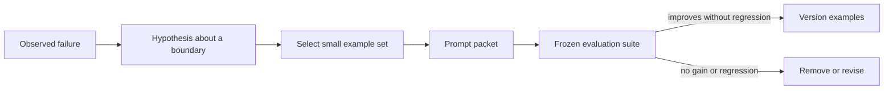

# 03 — Constraints, Examples, and Few-Shot Learning

## Learning objectives

You will specify useful constraints, construct positive, negative, boundary,
and counterexamples, select examples by an explicit strategy, and evaluate
accuracy and context cost rather than declaring a longer prompt “better.”

## Why this matters

Examples can demonstrate a decision boundary without changing model weights.
They can also add contradictory policy, irrelevant context, token cost, and
anchoring bias. The question is not “How many examples should I add?” It is
“Which observed failure does this example address, and does it improve held-out
behavior enough to justify its context budget?”

**Scenario.** Northstar must route support messages to `refund`, `shipping`,
`account`, or `unknown`. Ambiguous payment messages must remain `unknown`; a
confident but incorrect category sends users into the wrong workflow.

## Prerequisites

Complete [Course 01](../01-llm-behavior-and-prompt-anatomy/README.md) and
[Course 02](../02-instruction-contracts/README.md). The routing contract has a
defined safe outcome and measurable labels before examples are introduced.

## Mental model

Examples are context. They influence the conditional generation alongside the
instruction and user request; they are neither training data nor a substitute
for a schema, evidence policy, or authorization check.

## Foundations and patterns

| Example type | Purpose | Common misuse |
| --- | --- | --- |
| Positive | demonstrate a valid mapping | duplicating obvious cases |
| Negative | show an unacceptable result | teaching unsupported policy as fact |
| Boundary | distinguish nearby labels | omitting the ambiguous `unknown` case |
| Counterexample | prevent a tempting wrong shortcut | treating it as a universal rule |
| Contrastive pair | make a specific decision difference visible | hiding irrelevant differences |

Start with a direct instruction. Add an example only when an evaluation reveals
a specific decision boundary. Keep examples consistent with the current
contract, source, and output schema; version them with the behavior artifact.

## Static and dynamic selection

Static examples are predictable and easy to review, but can become stale or
poorly matched to a request. Dynamic few-shot selection retrieves examples at
request time using semantic similarity, metadata, or a diversity objective.
It can improve relevance, but also risks selecting near-duplicates, leaking
sensitive content, or reinforcing a misleading historical pattern.

The lab compares no examples, static examples, seeded random examples,
similarity-selected examples, and diversity-selected examples. Its transparent
word-overlap selector teaches the mechanism. In production, retrieve only
approved, non-sensitive, versioned examples and evaluate selection separately
from answer generation.

## Worked example

For “I want to send back the product,” a refund example containing `return`
and `product` is relevant. For “There is a payment problem,” nearby refund
examples may create harmful bias. A correct selector may return no examples or
include an `unknown` boundary example. The expected label, selected examples,
token count, and failure reason are all traceable.

## Evaluation and failure modes

Report accuracy by label, correct `unknown` rate, selected-example relevance,
mean example-token cost, latency, and regressions on cases that were already
correct. Test conflicting examples, example order, stale examples, adversarial
examples, and over-represented classes. Never tune on the same cases used to
declare a final improvement; use development and held-out sets.

## Technology and production considerations

**Foundational:** clear instructions, compact boundary examples, and frozen
evaluation cases. **Practical:** versioned example stores, metadata filtering,
embedding retrieval, diversity/reranking, and context-budget enforcement.
**Model-dependent:** blanket large few-shot blocks or ritualistic example
ordering. **Emerging:** learned example/context policies. Production systems
must apply tenant/permission filtering before retrieval, log non-sensitive
example identifiers, cache safe selections where appropriate, and roll back a
bad example set with the rest of the behavior artifact.

## When to use / when not to use

Use examples when a measured boundary remains unclear after a direct contract.
Do not use them to compensate for missing facts, to smuggle untrusted
instructions into context, or when a deterministic classifier is simpler.

## Exercises

1. Add a contradictory refund example and identify the regression slice.
2. Add a metadata filter that excludes examples from another tenant.
3. Compare two and four selected examples using quality and token metrics.
4. Design a human review rule for dynamically selected examples.

## References

- [Language Models are Few-Shot Learners](https://arxiv.org/abs/2005.14165)
- [The Prompt Report](https://arxiv.org/abs/2406.06608)
- [OpenAI prompting guide](https://platform.openai.com/docs/guides/prompting)
