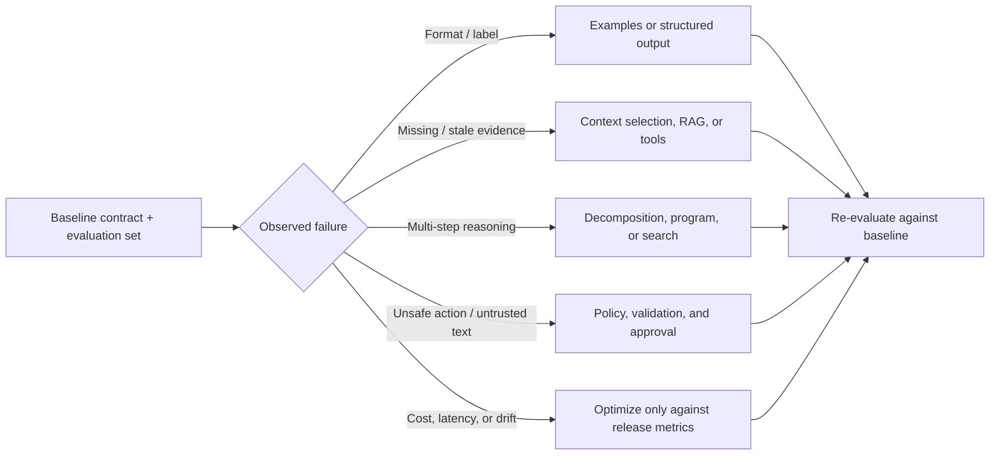

# 03 — Constraints, Examples, and Few-Shot Learning

**Level:** Beginner · **Estimated time:** 60–90 min · **Prerequisites:** Courses 01–02 and Python collections

## Learning Objectives

- **Shape Behavior with Examples:** Use Few-Shot learning to demonstrate desired outputs rather than relying solely on complex instructions.
- **Define Decision Boundaries:** Curate examples that explicitly map the edge cases and boundary lines of a task.
- **Include Negative Examples:** Provide examples of what *not* to do, or how to handle missing data safely.
- **Measure Example Impact:** Calculate the token cost vs. quality tradeoff of adding examples to a prompt.

## Scenario

Northstar must route support messages to a small closed set of categories.
Direct instructions can leave boundary cases underspecified, so this lab
compares zero-shot, static, random, and similarity-selected examples. The
evaluation set has five labelled cases and the replay records intentionally
produce 3/5, 4/5, 3/5, and 5/5. Similarity is offline lexical-hash retrieval:
it is deterministic and useful for teaching the measurement loop, but it is
not semantic embedding behavior.

## Core Concepts & Workflow

Even the most perfectly written Instruction Contract will sometimes fail on complex edge cases. When a direct instruction fails, the solution is not to write a longer, more complicated instruction. The solution is to *show*, not just tell.

This is "Few-Shot Learning." By providing a few examples of the exact Input and the desired Output within the prompt, you anchor the model's behavior. The goal is not volume; it is variance. You should select examples that define the *boundaries* of your logic—for instance, an example that barely qualifies for Category A, and an example that barely falls into Category B. 


## Deep dive

This is a **decision catalog**, not a leaderboard. It groups the most useful prompt and context patterns into families, explains the failure each family is meant to address, and links to the lesson that teaches the surrounding engineering practice. It is informed by the taxonomy in [The Prompt Report](https://arxiv.org/abs/2406.06608), but deliberately emphasizes techniques that can be evaluated and operated safely in applications.

> **Rule of thumb:** establish a task contract and a small evaluation set first. Add the simplest technique that improves a measured failure. A more elaborate prompt can increase cost, latency, privacy exposure, and the number of ways a system fails.

### How to read an entry

Every technique answers five questions:

1. **Mechanism** — what changes in the inputs, control flow, or output interface?
2. **Use when** — what observable failure could it address?
3. **Do not use when** — when it is needless or creates a new risk.
4. **Control** — what must remain deterministic, validated, or human-reviewed?
5. **Learn it here** — the course material and runnable companion where available.



### 1. Instruction, example, and output-interface patterns

| Technique | Mechanism | Use when | Do not use when | Learn it here |
| --- | --- | --- | --- | --- |
| **Zero-shot instruction** | State the task, constraints, and success condition without demonstrations. | The task is familiar and output variability is acceptable. | A boundary, format, or label is repeatedly misunderstood. | [Instruction contracts](../../../curriculum/beginner/02-instruction-contracts/README.md) · [Notebook 01](03_constraints_examples_few_shot.ipynb) |
| **Role or audience framing** | Set the decision perspective, reader, and scope. | An explanation needs a defined audience or review rubric. | It is only decorative persona text (“be an expert”). | [Instruction contracts](../../../curriculum/beginner/02-instruction-contracts/README.md) · [Application playbooks](../../../docs/15-application-playbooks.md) |
| **One-shot / few-shot prompting** | Demonstrate input → output behavior, especially contrasts. | Labels, tone, edge cases, or formatting need a concrete boundary. | Examples are stale, confidential, unrepresentative, or consume needed context. | [Structured outputs](../../../curriculum/beginner/04-structured-outputs-and-typed-interfaces/README.md) · [Context engineering](../../intermediate/08-context-engineering/README.md) |
| **Contrastive examples** | Show a near-miss pair with different correct outputs. | The system confuses adjacent intents (for example, refund vs duplicate charge). | You only have one generic “happy path” example. | [Application playbooks](../../../docs/15-application-playbooks.md) |
| **Delimited sections / templates** | Separate instructions, evidence, user input, and output contract with stable headings or tags. | The prompt mixes trusted instructions and variable data. | Delimiters are mistaken for a security boundary. | [LLM behavior and prompt structure](../../../curriculum/beginner/01-llm-behavior-and-prompt-anatomy/README.md) · [Prompt security](../../intermediate/13-prompt-security-and-untrusted-content/README.md) |
| **Structured output** | Constrain the response to a JSON schema or typed interface. | Software needs fields, enums, optional values, or detectable refusal/error states. | Schema conformance is treated as factual correctness. | [Structured outputs](../../../curriculum/beginner/04-structured-outputs-and-typed-interfaces/README.md) · [Notebook 02](03_constraints_examples_few_shot.ipynb) |
| **Constrained decoding / grammar** | Limit legal tokens or structure at generation time. | Exact syntax, machine-readable forms, or safe enumerations are essential. | The semantic evidence still needs checking; grammar cannot validate truth. | [Technology review](../../../docs/10-technology-review.md) · [Structured outputs](../../../curriculum/beginner/04-structured-outputs-and-typed-interfaces/README.md) |

#### Mini pattern: use a contrast before adding many examples

```text
Classify one customer request. Allowed labels: duplicate_charge, refund_request,
shipping, account, unknown.

Contrast examples:
- "My order was delivered but I want to return it." → refund_request
- "Checkout failed but my bank shows two charges." → duplicate_charge

Choose unknown when no label is supported by the request alone.
Return JSON: {"intent":"...", "evidence":"short quote"}.
```

The application, not the model, should validate the enum and decide which internal route the label can trigger.

### Technique selection worksheet

For each proposed change, record the following before implementation:

```text
Observed failure:
Baseline metric and dataset slice:
Technique and mechanism:
Expected improvement:
Extra model calls / tokens / latency:
New trust boundary or permission:
Deterministic validator or human approval:
Rollback or stop criterion:
```

If you cannot state an expected metric and stop criterion, the change is an experiment—not yet a production technique.

### Guided practice: change one example variable

Start with the zero-shot request and record the five expected labels, five
observed labels, estimated prompt tokens, and the exact request fingerprints.
Then add one contrastive example for the duplicate-charge boundary while leaving
the instruction, model settings, and evaluation cases unchanged. The purpose is
not to maximize the score by adding arbitrary context; it is to test whether a
specific example repairs a named failure. If the boundary improves, check the
clear cases for regressions and compare the added token cost.

Next, replace the static example with a deterministic selector. Seed the selector
with the case ID, exclude the query from the candidate bank, and print the
selected examples. A random-looking result is not reproducible evidence if it
depends on Python's process-randomized hash. Finally, compare the lexical-hash
offline embedding path with a live semantic retriever only as a separate
experiment. Record which documents were eligible, why they were selected, and
which tenant or authorization filters ran before prompt construction.

Use the worksheet for the decision record: observed failure, technique,
expected metric, additional context cost, new trust boundary, validator, and
rollback criterion. If those fields are blank, the change is still a hypothesis.

Continue with [Context Engineering](../../intermediate/08-context-engineering/README.md), [Prompt Security](../../intermediate/13-prompt-security-and-untrusted-content/README.md), [Prompt Evaluation](../../advanced/14-prompt-evaluation/README.md), and [PromptOps](../../enterprise/22-promptops/README.md).

## Technology Landscape and State of the Art

**Foundational:** Believing that writing a longer, more detailed instruction is the only way to fix an LLM mistake.

**Current State of the Art:**
1. **Dynamic Few-Shot Routing:** Instead of hard-coding the same 5 examples into every prompt, advanced systems use a vector database to dynamically retrieve the 5 examples that are most semantically similar to the user's current query.
2. **Automated Example Selection:** Frameworks like **[DSPy](https://github.com/stanfordnlp/dspy)** (specifically its BootstrapFewShot optimizers) automate the process of finding the best possible combination of examples from a training set to maximize evaluation scores.
3. **Agentic Workflows:** Multi-stage reasoning flows often use different few-shot examples for different stages (e.g., planning examples vs. execution examples).

*Note: While massive context windows (like Gemini 1.5 Pro) make blanket large few-shot blocks less strictly necessary, targeted negative and boundary examples remain critical for shaping specific behavioral nuances.*

## Lab walkthrough

- Zero-shot renders no examples and asserts a recorded accuracy of 3/5.
- Static selection uses two fixed examples and asserts 4/5.
- Random selection uses `random.Random(case_id)` and asserts reproducible 3/5.
- Similarity selection calls `client.embed()`, prints `HASH_EMBEDDING_NOTICE`,
  and asserts 5/5 while labelling token counts as estimated.
- The leakage guard ensures `select_examples(k=2)` never returns the query
  itself when it is present in the bank.

### Implementation detail

The [notebook](03_constraints_examples_few_shot.ipynb) demonstrates fixing a boundary failure. It first establishes a baseline where instructions alone fail to categorize an edge case correctly. It then injects a single, targeted Few-Shot example mapping that edge case, proving how examples override instruction ambiguity.

## Exercises

1. Modify the `example_bank` array in `fixtures/cases.json` with a new boundary example and watch the static
   `static_accuracy` numerator over the denominator of five.
2. Change the random case ID and watch `random_accuracy`; explain why the
   seed must remain deterministic.
3. Replace one similarity example and watch both `similarity_accuracy` and
   the estimated token metric.

### Reflection questions

## Checkpoint

1. Why prefer boundary examples to a large example collection? **They teach
   the decision boundary with less context cost and noise.**
2. What does the offline similarity notice mean? **Hash embeddings are
   lexical and deterministic, not semantic provider embeddings.**
3. What must example retrieval do before rendering a prompt? **Filter for
   relevance, permissions, tenant scope, freshness, and query leakage.**

## Production Best Practices

- **Curate, Don't Hoard:** 3 highly specific boundary examples are vastly superior to 20 random examples.
- **Include the 'Unknown':** Always include at least one example where the correct behavior is to decline the request or output a fallback state.
- **Tenant Filtering:** If selecting examples dynamically, production systems *must* apply tenant/permission filtering before retrieval to ensure data from Customer A is never used as a few-shot example in a prompt for Customer B.

## Further reading

Read an entry in a technique catalog by asking what failure it addresses, what
it changes, what it costs, and what evidence would justify keeping it. Direct
instructions, role framing, one-shot and few-shot examples, delimiters,
templates, schemas, constrained decoding, and output validation solve
different problems. Examples are valuable for labels, format, tone, missing
data, and contrasts; they are not a substitute for validation. Similarity
selection can reduce irrelevant context, but a production retriever needs
permission and tenant filters before examples enter a prompt. A static bank is
easy to audit; random selection tests robustness but should never use
process-randomized hashes; dynamic retrieval needs freshness and provenance.
Measure quality and estimated context cost together. If a direct contract
already passes, adding examples may increase noise without improving the
metric.

References: [Language Models are Few-Shot Learners](https://arxiv.org/abs/2005.14165),
[DSPy](https://github.com/stanfordnlp/dspy), and
[JSON Schema](https://json-schema.org/specification).

### Additional references

- <https://arxiv.org/abs/2406.06608>
