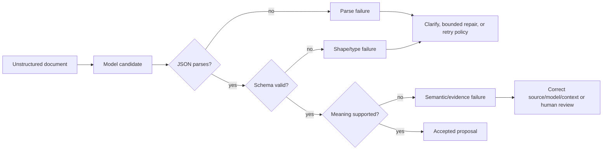

# 04 — Structured Outputs and Typed Interfaces

## Learning objectives

By the end of this course, you can design a nested response contract, explain
the difference between JSON syntax, schema validity, and semantic correctness,
compare manual and Pydantic validation with provider-native constrained
generation, diagnose failures at the correct layer, and decide whether an
extracted record is safe for downstream use.

## Why this matters

An insurance operations team turns unstructured claim messages into case
records. Free-form prose may look correct to a reviewer while being unusable by
a queue, database, or policy engine. “Return JSON” only asks for a serialization
format: it does not guarantee required fields, allowed enum values, nested
types, evidence fidelity, or a correct business decision.

**Experimental question.** How much does constrained generation reduce parse
and schema failures, and which semantic failures remain after the output is
perfectly valid?

**Success criteria.** On the same 20-case suite, distinguish parse, schema, and
semantic errors; reject unsafe candidates; preserve evidence identifiers; and
report measured validation time. A valid record remains a proposal. This lab
does not approve a claim or perform any external action.

## Prerequisites and boundaries

Complete [Instruction Contracts](../02-instruction-contracts/README.md). You
should already separate task authority, evidence, output, and safe failure.
Course 04 turns the output portion into a machine-checkable interface.

The dataset is synthetic. Offline mode is deterministic. Live mode requires
your own `OPENAI_API_KEY` and explicit `PROMPT_COURSE_PROVIDER=openai` as
documented in the [root README](../../../README.md). Never place a key in a
notebook or output cell.

## Mental model and mechanics

The model emits tokens. A JSON parser recognizes syntax. A schema validator
checks fields, nesting, types, enums, unions, and constraints. A semantic
validator compares the record with trusted facts and business invariants.
These are different control points and should produce different diagnostics.

### The case contract

The lab's `CaseRecord` includes:

- a constrained case identifier and `claim | inquiry | complaint` enum;
- a nested claimant with a discriminated email-or-phone contact union;
- an ISO date and optional positive money value with a supported currency;
- one or more typed evidence references;
- a bounded next action and explicit missing-field list; and
- `extra="forbid"` at every object boundary.

Strict shape validation prevents silent field drift. It cannot determine
whether `USD 125.50` was copied correctly, whether `INV-101` actually supports
the amount, or whether `review` is the right action. Those checks use labelled
evidence and business policy.

## Architecture patterns and trade-offs

| Approach | What it guarantees | Strength | Limitation | Production fit |
| --- | --- | --- | --- | --- |
| Free text | nothing machine-readable | flexible for humans | brittle parsing and routing | low for system boundaries |
| “Return JSON” | usually only intent | low effort | malformed, missing, extra, or wrong values | weak without validation |
| Manual parsing/checks | checks explicitly written | transparent and portable | easy to omit nested constraints | useful at small boundaries |
| Pydantic/JSON Schema | deterministic shape and types | reusable schema and readable errors | no factual guarantee | strong application boundary |
| Provider-native structured output | generation constrained to schema | fewer syntax/shape failures | model can still choose wrong valid value; provider capability varies | strong when paired with semantic validation |

Teach and test the parser and validators before relying on provider helpers.
Framework convenience should package a mechanism the learner already
understands.

## Worked scenario and lab progression

The [notebook](structured_outputs_and_typed_interfaces.ipynb) uses the same
[20 synthetic claim cases](../../../data/structured_outputs/cases.jsonl) for
five strategies:

1. free-text baseline;
2. prompt-only JSON accepted after parsing;
3. transparent manual schema checks;
4. Pydantic validation plus semantic checks; and
5. provider-native structured generation, simulated offline or executed live.

Deterministic candidates inject malformed JSON, extra fields, invalid enums,
missing nested data, and schema-valid but incorrect values. The learner first
observes the naive system accepting parseable bad records, then adds layers and
re-evaluates. Results include parse success, schema validity, semantic
correctness, safe accept/reject decisions, failure category, and measured local
validation time.

## Evaluation and debugging

Do not collapse all failures into “invalid output.” Use this routing:

| Symptom | Category | Fix the prompt? | Correct first response |
| --- | --- | --- | --- |
| Truncated object | RUNTIME or MODEL | sometimes | inspect output limit/stop state, then bounded retry |
| Extra or missing key | SCHEMA | possibly | reject deterministically; align schema and consumer |
| Wrong enum | SCHEMA or MODEL | possibly | constrain generation and keep validator |
| Correct schema, wrong amount | MODEL / CONTEXT / EVALUATOR | not necessarily | compare trusted evidence, extraction instruction, and label |
| Correct extraction, unauthorized action | SECURITY / WORKFLOW | no | enforce policy and authorization outside the model |

Evaluate by slice (`normal`, missing information, unsupported currency,
conflicting evidence, injection, international contact) and preserve concrete
error messages for debugging. Release gates should treat an unsafe semantic
acceptance as more serious than a correctly rejected parse failure.

## Failure injection and bounded repair

The lab repairs one narrow class: an otherwise valid object with an unknown
root field. It removes that field once and validates the result. It deliberately
does not invent missing claimant data, change an enum, fabricate evidence, or
loop until a model happens to comply. Repair policy should be bounded by error
type, attempt budget, latency/cost budget, and safe terminal state.

## What changes in production?

| Notebook | Production |
| --- | --- |
| Local JSONL | governed, versioned labelled dataset with access controls |
| One Pydantic class | versioned schema with consumer compatibility tests |
| Sequential loop | bounded concurrent service with backpressure and timeouts |
| Printed errors | structured traces and privacy-aware telemetry |
| Synthetic evidence | authorized tenant-scoped document service |
| Optional shell key | secret manager or workload identity |
| One user | tenant isolation, identity, authorization, audit trail |
| Local comparison | CI evaluation gate, canary, rollback and schema migration |

Pin schema and model versions where supported. Record refusal and incomplete
states separately from invalid output. Monitor error classes, repair attempts,
token usage, latency distributions, and semantic regressions. Never log raw
sensitive documents merely to debug an extraction.

## When not to use this approach

Do not call an LLM when deterministic parsing, a form, or a source API already
provides the fields reliably. Do not use structured generation as an
authorization mechanism. Do not force uncertain information into required
fields; model absence explicitly and route for clarification.

## Review questions and exercises

1. Why can provider-native structured output reach 100% schema validity and
   still fail the release gate?
2. Which errors are safe to repair automatically, and which require new
   evidence?
3. Why should unknown fields be forbidden at a downstream system boundary?
4. How would you version a schema without breaking an existing consumer?

Practical exercises:

1. Add an `organization` claimant variant to the discriminated union and two
   new labelled cases. Predict which validators need to change before running.
2. Add a semantic rule that an invoice evidence ID is required when an amount
   is present. Measure regressions by slice.

**Advanced challenge.** Run the provider-native strategy with your own key,
repeat it across two model snapshots available to your project, and prepare a
release decision using schema validity, semantic accuracy, provider token
usage, measured latency, and refusal/incomplete states.

## References

- [JSON Schema specification](https://json-schema.org/specification)
- [Pydantic models](https://docs.pydantic.dev/latest/concepts/models/)
- [OpenAI Structured Outputs](https://developers.openai.com/api/docs/guides/structured-outputs)
- [OpenAI Responses API text generation](https://developers.openai.com/api/docs/guides/text)
