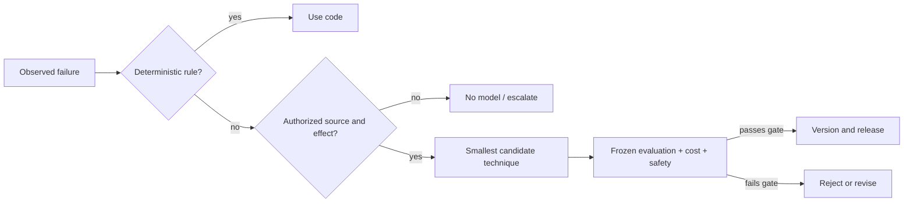

# 05 — Prompt Patterns and Technique Selection

## Learning objectives

Identify an observed failure, select the smallest technique that addresses it,
state when not to use that technique, and define the metric and rejection rule
that would justify its added complexity.

## Why this matters

A technique catalog is reference material, not an architecture. Adding persona
text, examples, retrieval, tools, reflection, and agents to every task raises
cost and hides failure causes. Start with a measurable contract and add only a
component that resolves a demonstrated gap.

**Scenario.** An AI platform review board receives proposed solutions ranging
from vague prompts to multi-stage agents. It must recommend `direct_instruction`,
`contrastive_examples`, `schema_constraint`, `retrieval_context`,
`tool_calling`, `bounded_workflow`, `deterministic_code`, or `no_model`.

**Experimental question.** Does pattern matching to a technique name make a
sound system decision, or must source authority, action authority, deterministic
alternatives, cost, and a frozen evaluation gate be checked first?

**Success criteria.** Evaluate three selectors on the same 24 architecture
cases. Report selection accuracy, unsafe-selection rate, avoidable-complexity
rate, mean relative cost, estimated input tokens, and selector latency. Inject a
case where an apparently relevant tool or retrieval technique must be rejected.

## Prerequisites

Complete Courses 01–04. You should already have a measurable behavior contract,
know when examples clarify a boundary, and separate schema validity from
semantic correctness.

## Mental model

Technique selection begins with the failure and system boundary, not with a
favorite prompt pattern. A valid candidate still needs an evaluation that can
disprove the choice.

## Technique map

| Observed problem | First candidate | Primary metric | Do not use it when |
| --- | --- | --- | --- |
| Unclear task | direct instruction | task success | evidence or authority is missing |
| Label boundary | contrastive examples | boundary macro F1 | direct contract already passes |
| Unreliable interface | schema constraint | schema + semantic validity | prose is intentionally required |
| Missing current knowledge | retrieval context | supported-claim rate | source is unauthorized |
| Bounded live data | tool calling | tool success + authorization | deterministic local data suffices |
| Separable language subtasks | bounded workflow | end-to-end and stage success | one bounded request passes |
| Explicit computable rule | deterministic code | exact edge-case correctness | language judgment is required |
| Missing source or authority | no model / escalate | zero unsafe effects | a compliant bounded path exists |

Direct instructions, schemas, validation, deterministic alternatives, and
authority boundaries are foundational. Few-shot examples, approved retrieval,
and narrow tools are practical. Elaborate planning/reflection loops and blanket
persona prompting are model-dependent: test them rather than assuming value.
Automatic optimization and learned context policies are emerging and demand
stronger held-out evaluation, not weaker gates.

## Lab design

The [dataset](../../../data/technique_selection/cases.jsonl) contains 24 cases
across normal, boundary, interface, current-evidence, live-data, complexity,
deterministic, cost, safety, and injection slices. Metadata describes the
observed failure and externally established controls; the selector does not
infer authorization from user text.

The [notebook](prompt_patterns_and_technique_selection.ipynb) compares:

1. `maximalist`: chooses a planner/verifier workflow for every problem;
2. `pattern_match`: maps failure categories to popular techniques but ignores
   authority and source controls; and
3. `guardrailed`: checks deterministic alternatives, action authority, and
   source authority before selecting the smallest adequate technique.

The reusable [`lab.py`](lab.py) exposes every selection, expected result,
relative cost, safety flag, and latency. The costs are teaching units for
comparison, not provider prices.

## Evaluation and failure modes

Selection accuracy alone is insufficient. A selector can choose a topically
relevant technique that violates source or action authority. Conversely, a
maximalist design may eventually produce acceptable output while imposing
avoidable latency, cost, and failure surfaces.

| Failure | Diagnosis | Appropriate response |
| --- | --- | --- |
| planner chosen for a threshold | deterministic alternative missed | implement and test code |
| retrieval chosen for private tenant data | source authority missing | reject; enforce tenant filters outside model |
| tool chosen to issue a refund | effect authority missing | require application authorization or no action |
| schema added to a factual error | interface confused with semantics | validate against trusted evidence |
| examples added without a boundary regression | cargo-cult technique | remove and rerun frozen suite |
| workflow improves one example only | evaluation leakage | test held-out cases and stages |

## Optional live provider path

The default notebook is credential-free. For one typed integration call,
learners export their own `OPENAI_API_KEY`, explicitly set
`PROMPT_COURSE_PROVIDER=openai`, and follow the
[root setup instructions](../../../README.md). Never embed or share a key. The
live model proposes a technique; application code still owns source checks,
authorization, cost budgets, and the release decision.

## Production upgrade

| Notebook | Production |
| --- | --- |
| local JSONL cases | versioned review corpus with held-out and regression sets |
| explicit metadata | trusted policy/config services and ownership records |
| relative cost units | measured provider, retrieval, tool, and operations cost |
| local selector time | stage p50/p95/p99 latency and timeout budgets |
| manual decision table | review record with hypothesis, metric, rejection rule, owner |
| printed failures | privacy-aware traces, dashboards, alerts, and rollback |

Version the problem statement, technique choice, evaluation cases, and rollback
decision together. Retrieval requires source and tenant controls. Tools require
application authorization and idempotency. Workflows require budgets, stop
conditions, stage contracts, and end-to-end evaluation.

## When to use / when not to use

Use this method when a measured failure suggests adding prompt or system
complexity. Do not use an LLM when an explicit rule, ordinary search, database
query, or conventional workflow solves the task more reliably. Do not use any
prompt technique to bypass missing identity, permission, evidence, or policy.

## Exercises

1. Classify five new failures and record the evidence for each expected choice.
2. Add a case where retrieval is relevant but the source is stale.
3. Replace relative cost with measured latency and price for an approved stack.
4. Define a gate that accepts a workflow only when it beats a single call on
   held-out quality without violating a latency budget.

**Advanced challenge.** Implement a multi-objective selector that produces a
Pareto frontier for quality, safety, latency, and cost. Keep hard authority
constraints outside the optimization and test whether the frontier changes on
held-out cases.

## References

- [The Prompt Report](https://arxiv.org/abs/2406.06608)
- [ReAct](https://arxiv.org/abs/2210.03629)
- [OpenAI prompting guide](https://developers.openai.com/api/docs/guides/prompting)
- [OWASP LLM Prompt Injection Prevention Cheat Sheet](https://cheatsheetseries.owasp.org/cheatsheets/LLM_Prompt_Injection_Prevention_Cheat_Sheet.html)
