# 22 — PromptOps

## Learning objectives

Package, version, test, release, observe, and roll back a complete behavior
artifact comprising prompt, model configuration, context policy, examples,
schemas, tools, permissions, evaluations, and runtime limits.

## Technology landscape and state of the art

**Foundational:** Editing a prompt directly in the production codebase and deploying without tests.
**Current State of the Art:** 
1. **Behavior Artifacts:** A prompt is no longer just a string. It is a "Behavior Artifact" that includes the prompt text, the required Pydantic schema, the model configuration, and the evaluation suite.
2. **Prompt Registries:** Tools like LangSmith, Google Cloud Vertex AI prompt management, or internal hubs act as registries. Prompts are versioned and pulled dynamically, rather than hardcoded.
3. **CI/CD for Prompts:** Just like software, a prompt must pass a "Release Gate." Automated evaluations must run against the test suite, and the deployment is blocked if the accuracy or latency drops below a defined threshold.

## Lab and production

The [notebook](22_promptops.ipynb) demonstrates a simulated CI/CD release gate using the Google GenAI SDK. It packages a prompt, schema, and test suite into a `BehaviorArtifact` class. It then runs an evaluation threshold against an updated version of the prompt; if the new prompt fails the evaluation, the deployment is blocked. Production PromptOps adds Git history, registries, CI, feature flags, canaries, tracing, incident response, ownership, approvals, and rollback. Do not deploy an edited prompt in place without its evaluated dependencies.

## References

- [OpenTelemetry](https://opentelemetry.io/docs/)
