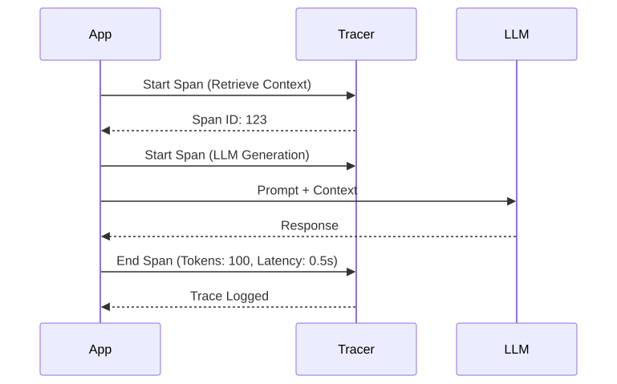

# 23 — Prompt Observability and Failure Diagnosis

## Learning Objectives
- **Implement Distributed Tracing:** Track multi-step LLM workflows across network boundaries using standardized trace IDs.
- **Diagnose Silent Failures:** Identify when a model hallucinates or degrades even when the API returns a HTTP 200 success.
- **Monitor Token Economics:** Track token usage at the granular level of individual prompts, users, and tenants.
- **Build Feedback Loops:** Capture implicit and explicit user feedback to continuously improve evaluation datasets.

## Core Concepts & Workflow

In traditional software, if a function fails, it throws a stack trace. LLMs do not throw stack traces when they fail; they return beautifully formatted, perfectly confident hallucinations. From an infrastructure perspective (HTTP 200), the request succeeded. From a business perspective, it was a catastrophic failure.

Enterprise AI requires massive investments in Observability. You must monitor not just latency and error rates, but semantic quality. This requires distributed tracing. If an agent executes a 5-step workflow (Plan -> Retrieve -> Critique -> Tool -> Generate), you must be able to visualize the exact inputs, outputs, latency, and token cost of *each individual step* to diagnose where the reasoning derailed.

## Technology Landscape and State of the Art

**Foundational:** Printing LLM responses to `stdout` and relying on users to report when the bot says something wrong.

**Current State of the Art:**
1. **LLM Observability Platforms:** Tools like **[LangSmith](https://www.langchain.com/langsmith)**, **[Phoenix by Arize](https://phoenix.arize.com/)**, and **[Datadog LLM Observability](https://www.datadoghq.com/product/llm-observability/)** provide purpose-built dashboards for visualizing multi-step LLM traces, capturing token metrics, and flagging anomalies.
2. **OpenTelemetry (OTel):** The industry is standardizing on OpenTelemetry semantic conventions for GenAI, ensuring that LLM traces can be ingested by any major APM provider (Datadog, New Relic, Dynatrace).
3. **Shadow Evaluation:** SOTA systems route a percentage of live production traffic to async "Judge LLMs" to continuously score production outputs for helpfulness, tone, and hallucination without adding latency to the user request.

## Lab and Production

### The Lab
The [notebook](23_prompt_observability_and_failure_diagnosis.ipynb) demonstrates building a manual trace for a multi-step workflow. It shows how to capture the input, output, latency, and token cost for every node in a chain, and assemble them into a cohesive telemetry payload that allows an engineer to pinpoint exactly which step caused a final hallucination.

### Production Best Practices
- **Log the Exact Prompt:** The prompt you *think* you sent is rarely the prompt you *actually* sent after templating, context injection, and history appending. Always log the final, fully-resolved string or message array sent to the API.
- **Capture User Feedback:** Implement explicit (thumbs up/down) and implicit (user copied the text, user immediately regenerated) feedback mechanisms. Route negatively signaled traces directly into a queue for human review and addition to the Golden Dataset.
- **Data Privacy in Tracing:** Traces contain raw user data. Ensure your observability platform is compliant with your data retention policies (GDPR/CCPA) and redacts PII before storing the trace.
