# 24 — Prompt Versioning, Experimentation, and Release Engineering

## Learning objectives

Version behavior manifests, gate candidates on evaluation, run shadow/canary
experiments, and roll back a release when observed error exceeds its threshold.

## Technology landscape and state of the art

**Foundational:** "Pushing to prod" by replacing a prompt string and hoping it works, leading to catastrophic regressions.
**Current State of the Art:** 
1. **Shadow Testing:** Before a prompt ever sees live traffic, it is deployed as a "Shadow" prompt. It receives a mirror of 100% of production traffic asynchronously, but its outputs are not shown to the user. Engineers compare the shadow outputs to the production outputs to find regressions.
2. **Canary Releases:** A new prompt is deployed to a small fraction of traffic (e.g., 5%). If the telemetry (latency, errors, thumbs-downs) remains stable, the traffic is gradually ramped up to 100%.
3. **Automated Rollbacks:** If the Canary fails its evaluation gate (e.g., schema violations spike, or hallucination detectors fire), the system automatically aborts the rollout and routes 100% of traffic back to the stable v1.0 prompt.

## Lab and production

The [notebook](24_prompt_versioning_experimentation_and_release_engineering.ipynb) simulates a Canary Release strategy using the Google GenAI SDK. It builds a traffic router that sends 90% of requests to a stable `v1.0` prompt and 10% to a `v1.1` candidate. When the candidate prompt begins failing its evaluation gate (e.g., due to a broken schema), the system detects the anomaly and automatically triggers a rollback to `v1.0`. Production adds Git history, registries, feature flags (like LaunchDarkly), audit logs, owner approval, telemetry, and a tested rollback target. Never edit production behavior in place.

## References

- [Git documentation](https://git-scm.com/doc)
