# 25 — Prompt Governance and Responsible AI

## Learning objectives

Create a behavior-artifact inventory, assign ownership and risk, define
evaluation/review requirements, and connect prompt governance to broader AI
governance rather than treating it as prompt-text approval alone.

## Technology landscape and state of the art

**Foundational:** Treating all prompts equally, where a prompt summarizing internal emails receives the same level of scrutiny as a prompt giving medical advice to patients.
**Current State of the Art:** 
1. **NIST AI Risk Management Framework:** Enterprise AI governance is increasingly guided by frameworks like the NIST AI RMF, which mandates that AI systems (and the prompts that control them) be classified into Risk Tiers (e.g., Low, Medium, High, Unacceptable).
2. **Model/System Cards for Prompts:** Just as foundational models have "Model Cards" detailing their capabilities and risks, enterprise prompts must be accompanied by a `GovernanceManifest` declaring data classification, expected PII, and the designated human owner.
3. **SDK Safety Overrides:** Governance isn't just bureaucratic; it's technical. Modern SDKs (like Google GenAI) allow developers to enforce Responsible AI policies directly at runtime via strict `safety_settings` (e.g., explicitly blocking Harassment or Hate Speech probabilities).

## Lab and production

The [notebook](25_prompt_governance_and_responsible_ai.ipynb) demonstrates a Risk-Tiered Governance Gate. It forces developers to attach a `GovernanceManifest` to their prompt. If the prompt is marked `LOW` risk, it can be deployed via automated checks. If it is `HIGH` risk, the deployment is blocked until an explicit `human_review_board_approval` flag is provided. The notebook also demonstrates translating governance policies into technical realities by using the Google GenAI SDK's `safety_settings` to block harmful content. Production adds data classification, model/tool dependencies, audit trails, retirement, incident reporting, and risk-tiered release requirements.

## References

- [NIST AI Risk Management Framework](https://www.nist.gov/itl/ai-risk-management-framework)
