# 26 — Human-Centred AI and Trust Calibration

## Learning Objectives
- **Design for Trust Calibration:** Build interfaces that help users appropriately trust or distrust an AI's output.
- **Implement Friction:** Introduce intentional UX friction for high-stakes AI decisions to force human review.
- **Mitigate Automation Bias:** Understand and counteract the psychological tendency for humans to blindly trust automated systems.
- **Design Human-in-the-Loop (HITL) Workflows:** Architect systems where the AI drafts, but the human approves.

## Core Concepts & Workflow

If a model produces a highly confident hallucination and presents it in a slick, authoritative UI, users will believe it. This is "Automation Bias." 

In enterprise AI, the goal is not to maximize user trust; the goal is to optimize **Trust Calibration**. The user's trust in the AI should exactly match the AI's actual reliability on that specific task. If the AI is generating a low-confidence summary of a messy legal document, the UI must explicitly signal uncertainty (e.g., highlighting questionable claims, showing citations, or using tentative language). For high-stakes actions, the system must force "Friction"—making it impossible for the user to execute the action without explicitly confirming they have reviewed the AI's work.

## Technology Landscape and State of the Art

**Foundational:** Presenting AI output as absolute truth in a chat bubble with no citations or uncertainty markers.

**Current State of the Art:**
1. **Citation UIs:** Interfaces (like Perplexity or Google AI Overviews) meticulously link every claim back to a specific source document, forcing the user to verify the source rather than just trusting the text.
2. **Confidence Highlighting:** Systems that use token-level logprobs (probability scores) to color-code the output. Low-probability words are highlighted in yellow, visually cueing the user to double-check that specific phrase.
3. **HITL Platforms:** Enterprises use Human-in-the-Loop platforms like **Scale AI** or custom internal tools to route low-confidence AI actions directly into a human review queue, ensuring the AI cannot act autonomously on edge cases.

## Lab and Production

### The Lab
The [notebook](26_human_centred_ai_and_trust_calibration.ipynb) demonstrates building a transparent AI response. Rather than just returning an answer, the model is forced (via Pydantic) to return an `Answer`, a `Confidence_Score`, and an array of `Risks_and_Caveats`. It shows how application logic can use that score to automatically escalate the request to a human if the confidence falls below a safe threshold.

### Production Best Practices
- **Never Fake Empathy:** Do not program the AI to say "I'm so sorry that happened to you" in critical enterprise contexts (like healthcare or legal). It is manipulative and destroys trust when the user realizes they are speaking to a script.
- **Design for Override:** Always provide a clear, easy-to-find UX path for the user to reject the AI's suggestion, edit it manually, or report it as unhelpful.
- **Explainability over Accuracy:** In regulated industries, an AI that is 90% accurate but can explain *how* it reached its conclusion is often preferred over a black-box AI that is 95% accurate but offers no citations.
