# 27 — Prompt Portability and Multi-Model Systems

## Learning objectives

Separate portable contracts from provider adaptations, detect features, compare
fallbacks, and run a migration suite before changing models.

## Technology landscape and state of the art

**Foundational:** Hardcoding OpenAI or Gemini API calls and specific prompt strings directly into application logic, resulting in complete vendor lock-in.
**Current State of the Art:** 
1. **Universal Contracts:** Pydantic JSON schemas are the universal language. The core application logic *only* speaks Pydantic. It knows nothing about prompts, APIs, or models.
2. **Model Adapters:** Between the application and the provider API sits an "Adapter." The adapter takes the core intent, formats the prompt specifically for its target model (e.g., using XML tags for Claude, but JSON blocks for Gemini), and ensures the output matches the Pydantic contract.
3. **Multi-Model Routing & Fallbacks:** Frameworks like LiteLLM or custom gateway routers automatically attempt primary models and instantly fall back to secondary models if rate limits are hit or schemas are violated, providing high availability.

## Lab and production

The [notebook](27_prompt_portability_and_multi_model_systems.ipynb) demonstrates building a robust Multi-Model Router. We define a strict `FinancialSummary` Pydantic contract. The core application logic does not contain any prompts. Instead, we build a `GeminiAdapter` and a mock `FallbackAdapter` that translate the intent into model-specific prompts. Finally, we demonstrate a Fallback Strategy where the router automatically switches to the secondary model if the primary model fails validation. Production systems version adapters, use frameworks like LiteLLM for API abstraction, maintain per-model regression suites, and test structured output differences extensively.

## References

- [OpenAI prompting guide](https://platform.openai.com/docs/guides/prompting)
