# 28 — Prompt Architecture Patterns and System Selection

## Learning objectives

Choose among deterministic software, single prompts, typed outputs,
multi-stage workflows, RAG, tool-using workflows, agents, and multi-agent
systems using reliability, cost, latency, security, observability, and
evaluation requirements.

## Technology landscape and state of the art

**Foundational:** Using a fully autonomous LLM Agent to perform simple data extraction, resulting in massive token costs, high latency, and unpredictable failures.
**Current State of the Art:** 
1. **Complexity is a Liability:** Modern enterprise AI design follows a strict principle: *Choose the simplest architecture that works*.
2. **The Agentic Spectrum:** The industry has moved away from binary "is it an agent or not?" thinking towards a spectrum:
   - **Code/Deterministic:** If it can be done with a regex or a simple Python script, do not use an LLM.
   - **Zero-Shot / Few-Shot Prompts:** For static reasoning over text (summarization, translation).
   - **RAG (Retrieval-Augmented Generation):** When the LLM needs access to live, external knowledge.
   - **Tool Use / Function Calling:** When the LLM needs to take predictable, single-step actions (e.g., executing a SQL query or booking a flight).
   - **Autonomous Agents:** Reserved *only* for highly complex, multi-step, open-ended tasks where the model must loop and plan independently.

## Lab and production

The [notebook](28_prompt_architecture_patterns_and_system_selection.ipynb) demonstrates building an Architecture Decision Matrix. We define a set of enterprise requirements (e.g., "Extract emails from text", "Draft a summary", "Query a live database", "Autonomously manage a marketing campaign"). The notebook evaluates these requirements against a decision tree to automatically recommend the optimal architectural pattern (Standard Code, Simple Prompt, RAG, Tool Use, or Autonomous Agent). In a real architecture decision record, compare at least 12 scenarios and justify why simpler and more complex alternatives do not fit.

## References

- [Building effective agents](https://www.anthropic.com/engineering/building-effective-agents)
