# 29 — AI System Engineering Capstone

## Outcome

Design, evaluate, release, and govern a cross-functional enterprise assistant.
The capstone is not “write a good system prompt”; it is a measurable behavior
system with a business outcome, contracts, evidence, tools, security, human
approval, evaluation, optimization, observability, rollout, rollback, and an
Architecture Decision Record.

## Required deliverables

1. business outcome and risk boundary;
2. task, context, and output contracts;
3. approved evidence and narrow tools;
4. deterministic authorization and human approval;
5. development, held-out, regression, and adversarial evaluations;
6. baseline, measured improvement, and cost/latency decision;
7. versioned behavior artifact, release gate, observability, rollout, and rollback;
8. ADR explaining why simpler and more complex architectures were rejected.

## Technology landscape and state of the art

**Foundational:** Hacking together a script with a hardcoded prompt, deploying it to production with no tests, and hoping the LLM doesn't hallucinate or break its formatting.
**Current State of the Art:** 
1. **Prompting as Software Engineering:** The industry has moved from "prompt engineering" (tweaking words to sound better) to "AI System Engineering" (building measurable behavior systems).
2. **The Modern Stack:** A production-ready AI system today requires a rigorous stack:
   - **Contracts:** Pydantic schemas enforce strict I/O boundaries.
   - **Optimization:** Frameworks like DSPy systematically optimize prompts against datasets rather than relying on manual trial-and-error.
   - **Architecture:** Deliberate Architecture Decision Records (ADRs) justify the use of LLMs vs simple code.
   - **Validation:** Automated regression tests, adversarial red-teaming, and deterministic guardrails block bad outputs.
   - **Observability:** OpenTelemetry traces record the full lifecycle of every token generated, allowing for immediate failure diagnosis.

## Lab

The [notebook](29_ai_system_engineering_capstone.ipynb) checks capstone readiness against all required enterprise components. We use Pydantic to enforce a strict `CapstoneProject` schema that requires the developer to explicitly document their Business Outcomes, Contracts, Architecture Decisions, Evaluation Metrics, and Observability Plans. A real project must attach actual evidence and test outputs to this schema rather than only filling fields.

## Final principle

Do not ask how to make a prompt sound better. Ask what behavior is needed, how
it is measured, what caused a failure, and what smallest system change improves
it safely.
