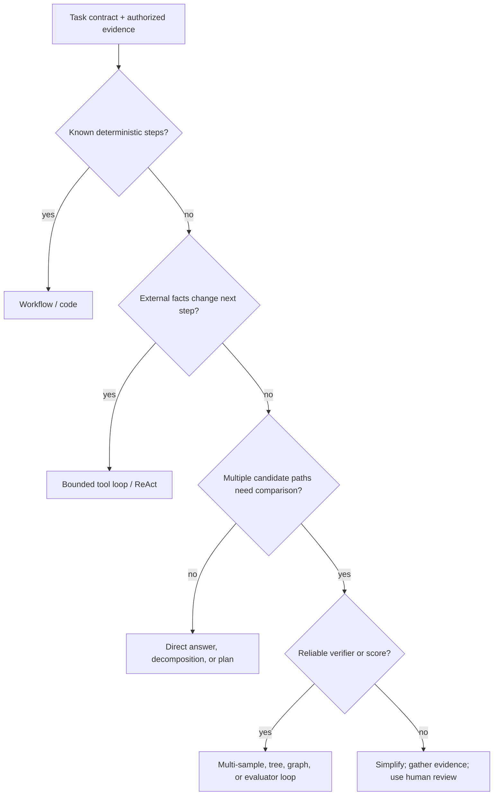
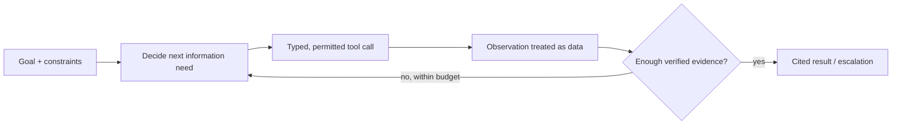

# 06 — Reasoning-Oriented Prompting

**Level:** Intermediate · **Estimated time:** 75–120 min · **Prerequisites:** Reasoning and workflow foundations from Courses 01–05

## Learning Objectives

- **Compare Reasoning Strategies:** Evaluate direct, sampled, and verifier-assisted approaches without requiring private chain-of-thought.
- **Measure Token Trade-offs:** Measure the output-token, latency, and cost effects of each approach on the target model.
- **Request Verifiable Artifacts:** Use a typed schema for concise evidence checks, reason codes, and the recommended action.
- **Evaluate Outcomes:** Compare task accuracy, evidence support, abstention, latency, and cost against a direct baseline.

## Scenario

An on-call engineer must triage two synthetic incidents without letting a plausible but unsafe action bypass application controls.

## Core Concepts & Workflow

Reasoning-oriented prompting changes how a model approaches a multi-step task, but extra visible tokens and field order do not guarantee better reasoning. For operational work, request concise, externally checkable evidence or intermediate artifacts rather than private chain-of-thought. Measure whether those artifacts improve the final task outcome, and keep authorization and execution in trusted application code.


## Deep dive

### Learning outcomes

By the end of this lesson, you can:

1. Recognize when a direct answer, deterministic workflow, or structured reasoning method is appropriate.
2. Explain and apply the major reasoning families: chains, plans, samples, verification, programs, tools, trees, graphs, and teams.
3. Design a safe, bounded experiment for a reasoning method.
4. Separate model-generated hypotheses from retrieved facts and application-authorized actions.
5. Evaluate the final outcome, evidence support, and trajectory—not only a polished rationale.

### 1. Choose the smallest reasoning architecture

Start with the task's uncertainty and verification surface, not a technique name.



#### Technique map

| Method family | Main idea | Best fit | Essential control |
| --- | --- | --- | --- |
| Direct / zero-shot | One constrained answer | Simple, well-defined task | Output validator and evaluation baseline |
| Chain-of-thought | Worked intermediate reasoning | Small, multi-step symbolic or analytic task | Do not treat rationale as proof |
| Decomposition / planning | Named subproblems and dependencies | Known stages or prerequisites | Validate each artifact/stage |
| Self-consistency | Independent candidates then aggregate | Verifiable answer with real ambiguity | Budget and external check |
| Verification / critique | Check a candidate against a rubric or inverse test | A clear correctness criterion exists | Independent/deterministic verifier where possible |
| PAL / program of thought | Translate reasoning to executable program | Calculation, tables, logic | Sandboxed code and testable result |
| ReAct / tool reasoning | Decide, act, observe, update | Current evidence changes the path | Typed tools, permission checks, stop budget |
| Tree / graph search | Explore, score, prune, merge alternatives | Planning/search with a trustworthy scorer | Bounded search and score calibration |
| Debate / specialist team | Separate perspectives or evidence owners | Distinct, verifiable specialties improve a baseline | Ownership, handoff schema, coordinator and cap |
| Reasoning-model budget | Allocate more internal test-time computation selectively | Difficult tasks with a measured quality payoff | Evaluate effort, cost, latency, and evidence |

### 2. Direct reasoning and zero-shot chain-of-thought

#### What it is

A direct prompt asks for the answer under constraints. Zero-shot chain-of-thought (often prompted as “think step by step”) asks the model to generate intermediate steps without demonstrations. Few-shot chain-of-thought adds worked examples with intermediate reasoning.

#### When it helps

Use a direct response first when the task is simple and the output can be verified. Add a reasoning prompt only after an evaluation shows a multi-step failure such as missing a condition, confusing quantities, or skipping an explicit constraint.

#### Northstar example: policy eligibility

```text
Use only the stated facts and approved policy excerpt.

Policy: A return is eligible within 30 days if the item is unopened. Missing facts
must be marked unknown.
Facts: Purchased 12 days ago. Customer says the package is still sealed.

State each policy condition as satisfied, unsatisfied, or unknown. Then return:
{"eligible":"yes|no|unknown", "conditions":[...], "evidence":[...]}
```

This is preferable to “reason carefully about whether the customer deserves a return.” The prompt names the evidence, condition states, and output contract.

#### Limits

- A chain may be plausible but invalid; do not ask a user to trust it as proof.
- Long rationales consume output budget and can leak sensitive process detail.
- On current reasoning-capable models, a short task contract plus a verifiable output can outperform elaborate hand-authored reasoning prompts. Benchmark your actual model/task.

#### Use case

Eligibility, arithmetic word problems with clear inputs, or troubleshooting checklists where each condition can be recorded. For current external facts, retrieve or call an authorized tool first; do not reason from model memory.

**Research:** [Chain-of-Thought Prompting](https://arxiv.org/abs/2201.11903) and [Large Language Models are Zero-Shot Reasoners](https://arxiv.org/abs/2205.11916).

### 5. Self-consistency and multi-sample selection

#### What it is

Generate several independent candidate answers or solutions, then select/aggregate using a rule. The original self-consistency method uses diverse reasoning paths and majority voting for tasks with a discrete answer.

```text
candidates → deterministic/source-aware validation → select supported candidate
                        └→ none valid → abstain or escalate
```

#### Why majority is not truth

Independent samples can help with genuinely ambiguous, internally verifiable tasks. But model samples often share the same missing fact or false assumption. Five unsupported claims agreeing with each other are still unsupported.

#### Northstar example: classify an ambiguous request

Generate three label candidates for “Checkout failed, but I see a charge.” Then:

1. Reject labels not in the enum.
2. Check each evidence quote against the user message.
3. If candidates disagree or evidence is insufficient, select `unknown` and route to human triage.
4. Never use “two of three said refund” to issue a payment-related conclusion.

#### Budgeted pseudocode

```python
MAX_SAMPLES = 3

def select_supported(candidates, validator):
    valid = [candidate for candidate in candidates if validator(candidate)]
    if not valid:
        return {"decision": "unknown", "reason": "no supported candidate"}
    # For a discrete, validated label, frequency is a tie-breaker—not evidence.
    return max(valid, key=lambda candidate: valid.count(candidate))
```

#### Use cases and limits

Use for low-side-effect classification, math with an external check, or structured decisions with a clear validator. Avoid where latency/cost are tight, answers are open-ended, samples are correlated, or an external source can answer directly.

**Research:** [Self-Consistency Improves Chain of Thought Reasoning](https://arxiv.org/abs/2203.11171).

### 6. Verification, critique, reflection, and revision

#### What they are

These patterns generate a candidate, then evaluate it before revising or selecting it:

- **Self-verification:** test a proposed answer through reverse questions, constraints, or checks.
- **Critique → revise / Self-Refine:** identify concrete defects against a rubric, then make bounded repairs.
- **Reflexion:** retain feedback or experience from an attempt to guide a later attempt.
- **External verification:** use tests, calculators, schemas, policy rules, source entailment, or human review.

#### The verifier hierarchy

Prefer the most objective verifier available:

| Claim type | Stronger verifier | Weaker fallback |
| --- | --- | --- |
| Arithmetic or transformation | Deterministic program or calculator | Independent model check |
| API/code behavior | Test suite, type checker, sandbox | Rubric review |
| Policy fact | Current authoritative source and citation check | Human domain review |
| Writing quality | Calibrated rubric + human sample | Same-model self-critique |
| High-impact action | Authorization/policy engine + human approval | Never prompt-only approval |

#### Example: draft, critique, revise

```text
Draft: Answer from the approved policy excerpts and cite each material claim.

Critique rubric:
1. Is every policy claim supported by the cited excerpt?
2. Does the answer distinguish a known rule from an unknown account fact?
3. Does it propose an action outside approved support authority?

Revision: Repair only listed failures. Preserve correct citations and do not add facts.
```

#### Important limitation

Models can repeat their own errors and endorse weak reasoning. Research on self-verification finds that models may struggle to reliably identify logical fallacies; self-critique is a useful signal, not a guarantee. Calibrate it against human labels and use deterministic/external verification whenever possible.

#### Use cases

Structured drafting, code review with tests, source-grounded summaries, and configuration validation. Do not add a critique loop merely for style; it can increase latency, invent defects, and amplify confident mistakes.

**Research:** [Self-Verification](https://arxiv.org/abs/2212.09561), [Self-Refine](https://arxiv.org/abs/2303.17651), [Reflexion](https://arxiv.org/abs/2303.11366), and [a critical analysis of self-verification](https://arxiv.org/abs/2311.07954).

### 7. Program-aided language models and program of thought

#### What they are

**PAL** and **Program of Thoughts (PoT)** ask a model to translate natural language into a program or symbolic representation, then delegate calculation/execution to a runtime. This separates language understanding from deterministic computation.

#### Example: calculate refund eligibility amount

```text
Interpret the approved fee rule and transaction values. Produce only a JSON
calculation plan with named inputs, formula, and assumptions. Do not execute
payment actions and do not invent missing values.
```

```python
from decimal import Decimal

def eligible_refund(subtotal: Decimal, restocking_rate: Decimal) -> Decimal:
    """Deterministic calculation after policy and values are independently verified."""
    return subtotal * (Decimal("1") - restocking_rate)

assert eligible_refund(Decimal("100.00"), Decimal("0.15")) == Decimal("85.0000")
```

#### Safe implementation pattern

1. Ask the model for a constrained representation or approved function call, not arbitrary shell code.
2. Parse it into an allow-listed AST, DSL, or structured schema.
3. Run it in a sandbox with resource limits and no secrets/network by default.
4. Return result plus the verified inputs and formula.
5. Keep money movement, database writes, and authorization in application code.

#### Use cases

Arithmetic, table transformations, data-quality checks, test generation, and formal constraints. Avoid arbitrary generated code execution, even when the model is “only calculating.”

**Research:** [PAL](https://arxiv.org/abs/2211.10435) and [Program of Thoughts](https://arxiv.org/abs/2211.12588).

### 8. ReAct: reason, act, observe, update

#### What it is

ReAct interleaves a decision with a permitted tool call and an observation. It is for tasks where the next step depends on current external evidence—not for fixed workflows with known steps.



#### Northstar example

```text
Goal: explain a rejected refund request without executing any account action.
Allowed tools: get_order_state(order_id), get_refund_decision(case_id),
retrieve_policy(query). All are read-only.
Stop: evidence is sufficient; no allowed tool can reduce uncertainty; or
2 steps / 3 tool calls / budget limit reached.
Escalate: conflicting evidence, permission failure, missing order ID, or any
request to change a refund decision.
```

#### Tool design matters more than eloquent reasoning

Avoid `admin_api(command)`. Define narrow tools with typed arguments, expected error states, ownership, authorization, rate limits, and idempotency. Validate tool output before it enters the next prompt; a tool response can be stale, malformed, or contain prompt-injection content.

#### Use cases and limits

Use a bounded ReAct loop for investigations, live research, troubleshooting, and dynamic workflows. Do not use it for a policy lookup or status report that a deterministic sequence can complete. See [RAG and tools](../../intermediate/10-evidence-grounded-prompting-and-rag-interfaces/README.md) and [Agentic prompts](../../../docs/08-agentic-prompts.md).

**Research:** [ReAct](https://arxiv.org/abs/2210.03629).

### 9. Tree of Thoughts and search over alternatives

#### What it is

Tree of Thoughts (ToT) creates partial solutions, evaluates them, prunes weak branches, and expands promising ones. It turns a single chain into bounded search.

#### Example: select a remediation plan

Northstar must choose among: clarify with customer, correct a shipping address, open a payment investigation, or escalate a policy conflict.

```text
Generate up to three materially different, permitted next-step plans.
Score each using only: evidence support, customer impact, reversibility,
required authority, and policy compliance. Reject any plan requiring an
unapproved account action. Select the highest supported plan or escalate.
```

#### Implementation outline

```text
generate K candidate states
  → validate hard constraints
  → score with deterministic rules / calibrated rubric
  → keep top B states
  → expand until terminal criterion or budget
  → return plan with evidence and rejected alternatives
```

#### What can go wrong

- Search grows exponentially without branch, depth, token, and time caps.
- A weak scorer selects fluent but unsafe plans.
- The model may create superficial variants, not real alternatives.
- Extra search is wasted when the answer is a simple tool call.

Use search only when the decision alternatives matter and the score can be checked. For high-impact plans, put human review after search rather than asking the model to approve itself.

**Research:** [Tree of Thoughts](https://arxiv.org/abs/2305.10601).

### 10. Graph of Thoughts and dependency-aware reasoning

#### What it is

Graph of Thoughts generalizes a chain or tree: partial outputs can be reused, merged, compared, or refined across a dependency graph. It can fit tasks with overlapping evidence or multiple constraints.

#### Example: reconcile a support case

```text
Nodes: order status, payment status, policy clause, customer request,
         uncertainty, permitted next action.
Edges: supports, conflicts_with, requires, blocks.
```

Instead of re-reading every artifact in every branch, the system can store a verified evidence node and connect multiple candidate plans to it. This is a system architecture, not merely a diagram in a prompt.

#### When to use it

Multi-hop entity relations, compliance analysis with explicit dependencies, and complex planning that reuses verified intermediate results. A graph can improve traceability but raises orchestration and state-management cost. Use a chain first unless branching/merging is measured to improve the outcome.

**Research:** [Graph of Thoughts](https://arxiv.org/abs/2308.09687) and [knowledge-graph prompting with MindMap](https://arxiv.org/abs/2308.09729).

### 11. Debate, specialists, and multi-agent reasoning

#### What it is

Several agents or roles analyze a problem from distinct responsibilities, then hand verified artifacts to a coordinator. Debate is not automatically more accurate; it increases context, latency, and correlated failure risk.

#### Northstar team design

```text
Order specialist: verified order timeline only.
Policy specialist: current approved policy clauses only.
Payments specialist: transaction state only.
Analyst: map claims to evidence and propose a response.
Risk reviewer: challenge unsupported claims or unapproved actions.
Coordinator: resolve conflict, apply stop rules, and escalate when needed.
```

#### The handoff contract

```json
{
  "objective": "resolve refund explanation",
  "allowed_sources": ["order-api", "policy-index"],
  "evidence": [{"source_id":"policy-202", "claim":"..."}],
  "unknowns": ["payment settlement state"],
  "proposed_next_step": "ask for order ID",
  "confidence": "bounded, not a probability"
}
```

#### Use it only after a baseline

Compare the team with a single agent and deterministic workflow on success, evidence support, coordination messages, tool calls, latency, cost, and escalation quality. Specialize when each role has a distinct evidence boundary or tool set—not because more names sound more capable.

See [Agentic prompts](../../../docs/08-agentic-prompts.md) and [Cost and latency engineering](../../../docs/13-cost-latency-engineering.md).

### 12. Reasoning models and test-time compute

Modern reasoning-capable models may internally allocate more computation to hard tasks. The practical lesson is not to demand long visible chains. Instead:

1. Define the task, constraints, required evidence, and output format.
2. Select a reasoning/effort configuration only where evaluation shows a quality gain.
3. Measure task success, evidence support, output completeness, latency, total token use, and cost.
4. Reserve high-effort configurations for tasks where the marginal gain changes a business or safety outcome.
5. Keep tools, permission checks, source selection, and final validation outside the model's internal reasoning.

Reasoning effort is a resource budget like retries or search depth. It may improve difficult planning or code review, but it can also increase latency and cost with no measurable benefit on routine classification. See [Model-aware guidance](../../../docs/16-model-aware-guidance.md) and [Cost and latency engineering](../../../docs/13-cost-latency-engineering.md).

### 13. End-to-end guided experiment

Compare four designs for this request: “My refund was rejected. Explain why.”

| Design | What it tests | Expected limitation |
| --- | --- | --- |
| Direct answer | Baseline clarity | May invent policy/account facts. |
| Decomposed workflow | Fact extraction + authorized retrieval + condition check | Best baseline for known steps. |
| ReAct loop | Dynamic evidence path | Added tool/loop cost; needs a stop rule. |
| Multi-sample/critic | Candidate selection or review | Needs a strong verifier; may multiply cost. |

#### Run the exercise

1. Create ten cases: clear approval, clear denial, missing order ID, conflicting policy version, injection-like retrieved text, and insufficient evidence.
2. Define expected evidence, forbidden claims, allowed tools, and expected escalation for each.
3. Implement the decomposed workflow first and measure outcome/evidence/latency/cost.
4. Add **one** reasoning technique. Do not combine methods until you know what changed the result.
5. Compare traces, not just final prose: Were facts retrieved? Were tools repeated? Did the system abstain correctly?
6. Promote a technique only if it clears hard safety checks and materially improves the chosen metric.

The existing self-contained [evaluation notebook](../../advanced/14-prompt-evaluation/14_prompt_evaluation.ipynb) provides a credential-free starting point. Extend it with trajectory fields such as `method`, `model_calls`, `tool_calls`, `verification_result`, `latency_ms`, and `estimated_cost`.

### Common failure modes

| Failure | Why it happens | Repair |
| --- | --- | --- |
| Long rationale, wrong answer | Reasoning text is treated as proof. | Retrieve evidence or use an external verifier. |
| Consensus on a hallucination | Samples share a missing premise. | Validate claims against source/tool output; allow abstention. |
| Tree-search explosion | Branching has no budget or meaningful scorer. | Set depth/branch/time/cost caps; use a simpler workflow. |
| Endless agent loop | “Investigate until certain” has no stopping condition. | Add explicit steps, tools, budget, and escalation thresholds. |
| Critic rubber-stamps draft | Same model sees the same evidence and bias. | Use deterministic checks, independent review, or calibrated judge. |
| Generated code performs an action | Program reasoning is confused with authority. | Sandbox execution; separate proposal from execution. |
| Multi-agent theatre | Roles duplicate each other and exchange assertions. | Give distinct evidence/tool ownership; compare to single-agent baseline. |

### Production checklist

- [ ] A direct deterministic or single-pass baseline exists.
- [ ] The chosen method addresses a measured multi-step or search failure.
- [ ] Every intermediate artifact has a schema, provenance, or deterministic check.
- [ ] Model-generated hypotheses are not stored as verified facts.
- [ ] External evidence and tools are authorized, typed, validated, and treated as data.
- [ ] Search, retries, samples, tools, messages, tokens, time, and cost have explicit budgets.
- [ ] Evaluation includes normal, ambiguous, insufficient-evidence, adversarial, and regression cases.
- [ ] The release decision considers outcome, evidence, safety, latency, and cost.

### State of the art and references

#### Foundational and practical methods

- [Chain-of-Thought Prompting](https://arxiv.org/abs/2201.11903)
- [Large Language Models are Zero-Shot Reasoners](https://arxiv.org/abs/2205.11916)
- [Least-to-Most Prompting](https://arxiv.org/abs/2205.10625)
- [Self-Consistency](https://arxiv.org/abs/2203.11171)
- [Plan-and-Solve Prompting](https://arxiv.org/abs/2305.04091)
- [PAL: Program-aided Language Models](https://arxiv.org/abs/2211.10435) and [Program of Thoughts](https://arxiv.org/abs/2211.12588)
- [ReAct](https://arxiv.org/abs/2210.03629)

#### Search, verification, and reflection

- [Tree of Thoughts](https://arxiv.org/abs/2305.10601) and [Graph of Thoughts](https://arxiv.org/abs/2308.09687)
- [Self-Verification](https://arxiv.org/abs/2212.09561) and its [limitations in logical reasoning](https://arxiv.org/abs/2311.07954)
- [Self-Refine](https://arxiv.org/abs/2303.17651) and [Reflexion](https://arxiv.org/abs/2303.11366)
- [The Prompt Report](https://arxiv.org/abs/2406.06608) — a broad technique taxonomy.

#### Continue the course

- [Context engineering](../../intermediate/08-context-engineering/README.md) for selecting authorized evidence.
- [RAG and tools](../../intermediate/10-evidence-grounded-prompting-and-rag-interfaces/README.md) for retrieval and tool boundaries.
- [Prompt security](../../intermediate/13-prompt-security-and-untrusted-content/README.md) for untrusted content and tool safety.
- [Evaluation](../../../docs/07-evaluation.md), [Agentic prompts](../../../docs/08-agentic-prompts.md), and [Technique catalog](../../beginner/05-prompt-patterns-and-technique-selection/README.md) for deployment decisions.

## Technology Landscape and State of the Art

**Foundational:** Adding "think step by step" to the end of a plain-text prompt.

**Current State of the Art:**
1. **Structured evidence artifacts:** Typed schemas can require observations, cited evidence IDs, proposed checks, and a conclusion. The structure makes outputs parseable; it does not make hidden reasoning auditable or correct.
2. **Reasoning-capable models:** Some models use additional internal computation before returning an answer. Capability, latency, and cost vary by model and task, so evaluate the observable result and do not request private reasoning traces.
3. **Critique and revision:** A bounded second pass can compare a draft with an explicit rubric and repair confirmed defects. Treat the critique as another model output to validate, not as proof.

## Lab walkthrough

The [notebook](06_reasoning_oriented_prompting.ipynb) compares a direct incident response with a typed recommendation containing observable evidence checks. It measures exact root-cause and action outcomes, then demonstrates that a deterministic risk gate can override an optimistic model verifier.

The [notebook](06_reasoning_oriented_prompting.ipynb) keeps each experiment visible: it prints the rendered request, recorded response, parsed value, and deterministic assertion. Replay is offline by default; live mode is opt-in.

## Exercises

1. Edit the relevant cases in `fixtures/cases.json` and rerun the notebook; compare the course metric or invariant with the recorded baseline.
2. Change one prompt, policy, or budget variable in `lab06.py`; inspect the visible request, response, and deterministic gate.
3. Add a regression case for the failure mode described in the Deep dive and keep the application-side control explicit.

## Checkpoint

1. What application-side invariant does this course measure?
2. Which fixture-backed case demonstrates the boundary or failure mode?
3. What trade-off should you explain before promoting the change?

## Production Best Practices

- **Measure the trade-off:** Extra output tokens can increase latency and cost. Compare the strategy with a direct baseline on the exact task.
- **Validate observable artifacts:** Field order does not establish reasoning quality. Check evidence statements, reason codes, and final outcomes independently.
- **Minimize sensitive logging:** Record sanitized evidence IDs, decisions, metrics, and errors. Do not require or store private chain-of-thought.

## Further reading

- https://arxiv.org/abs/2201.11903
- https://arxiv.org/abs/2203.11171
- https://arxiv.org/abs/2205.10625
- https://arxiv.org/abs/2205.11916
- https://arxiv.org/abs/2210.03629
- https://arxiv.org/abs/2211.10435
- https://arxiv.org/abs/2211.12588
- https://arxiv.org/abs/2212.09561
- https://arxiv.org/abs/2303.11366
- https://arxiv.org/abs/2303.17651
- https://arxiv.org/abs/2305.04091
- https://arxiv.org/abs/2305.10601
- https://arxiv.org/abs/2308.09687
- https://arxiv.org/abs/2308.09729
- https://arxiv.org/abs/2311.07954
- https://arxiv.org/abs/2406.06608
