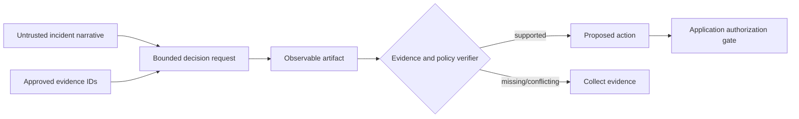

# 06 — Reasoning-Oriented Prompting

## Learning objectives

After this course, you can distinguish private model reasoning from observable
decision artifacts, select a reasoning scaffold from measured task difficulty,
compare direct, decomposed, verified, self-consistent, and adaptive approaches,
and define budgets and terminal conditions for a production reasoning path.

## Why this matters

An incident recommendation can sound decisive while depending on unverified
evidence. Asking for more explanation does not establish support. Teams need
observable artifacts—evidence identifiers, assumptions, checks, candidate
decisions, and a terminal outcome—that can be validated without treating a
generated rationale as ground truth.

**Scenario.** Northstar’s incident desk must select `rollback`,
`escalate_database`, `scale_capacity`, `rotate_credentials`,
`collect_evidence`, or `monitor` from untrusted incident narratives and approved
telemetry.

**Experimental question.** When does extra inference-time reasoning improve a
decision, and when does verification or deterministic routing outperform more
samples and more tokens?

**Success criteria.** Compare five strategies on 24 sliced incidents. Report
decision accuracy, evidence support, safe escalation, calls, estimated tokens,
latency, and artifact coverage. Demonstrate that majority agreement can preserve
a shared unsupported assumption, then recover with verified evidence.

**Non-goals and safety boundary.** The lab does not expose or request private
chain-of-thought, claim that its transparent simulator represents a provider
model, or authorize an operational action. Every action is a proposal; identity,
permissions, evidence access, and side effects remain application controls.

## Prerequisites and progression

Complete [Course 05](../../beginner/05-prompt-patterns-and-technique-selection/README.md).
You should be able to define a frozen evaluation and choose a no-model or
deterministic path. [Course 07](../07-task-decomposition-and-workflow-prompting/README.md)
turns selected artifacts into typed multi-stage workflows.

## Mental model

Reasoning is not synonymous with verbose prose. The product boundary is the
validated decision, not the model’s hidden computation or a plausible story
about how it arrived there.

## Foundations and theory

### Explicit reasoning scaffolds

Chain-of-thought prompting showed that intermediate natural-language steps can
improve some multi-step benchmark results for sufficiently capable models.
Self-consistency samples multiple paths and selects a common answer, trading
additional inference for potential quality gains. These are empirical
techniques, not universal laws: results depend on model, task, prompt, decoding,
and evaluation design.

Current reasoning-capable models may perform internal reasoning without verbose
prompt scaffolds. Official OpenAI guidance recommends simple, direct prompts,
specific end goals, and zero-shot first; it warns that “think step by step” can
be unnecessary or counterproductive. Treat model-native reasoning effort and
explicit scaffolds as versioned experimental variables.

### Observable artifacts versus chain-of-thought

An observable artifact contains fields the application can evaluate:

- proposed action and terminal state;
- approved evidence identifiers;
- externally checkable assumptions;
- checks performed and validation results;
- uncertainty or human-review requirement; and
- model, contract, dataset, and configuration versions.

It does not require a private token-by-token rationale. A generated explanation
can be useful communication, but it is not automatically faithful to the
model’s computation and must not substitute for evidence validation.

### Verification and correlated error

Let five sampled candidates vote for an action. Majority vote reduces some
independent errors, but it cannot validate a shared false premise. If several
paths consume the same unverified database alert, agreement amplifies the same
mistake. Verification adds a different signal: whether the selected action is
supported by approved evidence.

## Internal mechanics

The lab exposes a small decision lifecycle:

1. parse the narrative as untrusted data;
2. enumerate candidate signals without treating them as verified;
3. select only approved evidence identifiers;
4. map evidence to a bounded candidate action;
5. verify that the action follows from the selected evidence;
6. return `collect_evidence` for missing or conflicting support; and
7. route explicit thresholds and terminal health checks to deterministic code.

Every strategy produces a typed `DecisionArtifact`. The notebook compares the
artifact and result, never hidden reasoning.

## Architecture patterns

| Pattern | Best fit | Strength | Main risk | First metric |
| --- | --- | --- | --- | --- |
| Direct request | clear bounded task | one call, low latency | lexical shortcut, unsupported action | supported decision rate |
| Observable decomposition | uncertain evidence mapping | assumptions and checks visible | unverified input may still contaminate plan | slice accuracy |
| Planner + verifier | complex decision with checkable evidence | separates proposal from support | extra calls and correlated model errors | verified task success |
| Self-consistency | stochastic task with diverse useful paths | can reduce independent sampling error | high cost; majority can share bias | gain per extra sample |
| Adaptive router | mixed simple/complex portfolio | uses code for explicit rules | routing mistakes and operational complexity | end-to-end quality/cost |

Use the smallest pattern that passes the frozen gate. A planner/verifier is not
automatically safer if both stages see the same poisoned source or use the same
unsupported assumptions.

## Technology landscape and state of the art

**Established:** direct task contracts, typed outputs, deterministic checks,
evidence validation, and held-out evaluation. **Model-dependent:** explicit
chain-of-thought examples, self-consistency, reflection, and configurable
reasoning effort. **Emerging:** adaptive test-time compute, learned routers, and
process supervision. **Research frontier:** training models to reason internally
at token positions, such as Quiet-STaR, and reliable verification of open-ended
reasoning. Open problems include calibration, faithful explanations, correlated
verifier errors, compute allocation, and evaluation under distribution shift.

Frameworks can package planners and evaluators, but Course 06 implements the
primitive directly. Use an orchestration framework only when state, retries,
durability, or observability justify it; Course 07 covers that boundary.

## Worked experiment

The [dataset](../../../data/reasoning/incidents.jsonl) contains 24 incidents
across clear, boundary, deterministic, security, missing-evidence, conflicting,
injection, urgent, and recovered slices. Each case separates reported signals
from verified signals. Some cases have a deterministic capacity or terminal
health rule.

The [notebook](reasoning_oriented_prompting.ipynb) compares:

1. `direct`: a shallow decision from narrative keywords;
2. `decomposed`: explicit hypothesis/signal mapping without verification;
3. `planner_verifier`: proposal plus approved-evidence check;
4. `self_consistency`: five correlated candidates and majority vote; and
5. `adaptive`: deterministic rules where available, verified reasoning
   elsewhere.

The reusable [`lab.py`](lab.py) records candidate decisions, evidence IDs,
checks, assumptions, calls, token estimates, and measured local latency.

## Evaluation and failure modes

Use a frozen suite and inspect both aggregate metrics and slices:

- decision accuracy and evidence-supported decision rate;
- correct `collect_evidence` behavior;
- calls and estimated/provider-reported tokens;
- end-to-end latency and cost per successful decision;
- artifact/schema coverage; and
- release-blocking unauthorized or unsupported actions.

| Failure | Why it happens | Mitigation |
| --- | --- | --- |
| fluent unsupported action | narrative mistaken for evidence | approved evidence IDs + verifier |
| repeated wrong majority | correlated candidates share premise | independent evidence check |
| circular critic | planner and verifier restate each other | deterministic criteria or heterogeneous signal |
| unbounded reflection | no stop condition | call/token/time budget + terminal states |
| private rationale logged | observability boundary misunderstood | log structured decisions, not chain-of-thought |
| simple threshold sent to model | technique overuse | deterministic router |
| explanation accepted as authorization | prompt/application boundary confused | external identity and policy gate |

## Optional live provider path

The notebook runs offline by default. For one typed integration check, each
learner exports their own `OPENAI_API_KEY`, explicitly sets
`PROMPT_COURSE_PROVIDER=openai`, and follows the
[root setup instructions](../../../README.md). The live prompt requests the
bounded artifact and explicitly avoids private chain-of-thought. One response is
not an evaluation; a live benchmark requires a budgeted frozen suite and pinned
model/configuration records.

## Production upgrade

| Notebook | Production |
| --- | --- |
| local JSONL | versioned development, held-out, safety, and regression suites |
| reported/verified lists | authorized telemetry adapters with provenance |
| local deterministic rules | versioned policy engine with unit and boundary tests |
| synthetic calls/tokens | provider usage, reasoning-token, cost, and latency telemetry |
| one verifier | independent evidence/policy checks and calibrated escalation |
| printed artifacts | privacy-aware trace store with model/contract/context versions |
| manual comparison | shadow/canary gate, SLOs, alerting, and rollback |

Set maximum calls, output tokens, wall time, and retries. Make terminal outcomes
explicit. Cache only safe, version-compatible artifacts. Keep tools idempotent,
validate every boundary, and require application authorization before effects.

## When not to use reasoning scaffolds

Do not add decomposition or self-consistency when a direct request already
passes, an explicit deterministic rule solves the task, evidence is absent, or
latency/cost constraints dominate. Do not request chain-of-thought for routine
tasks or treat verbose explanations as audit proof.

## Exercises

1. Add a stale-but-verified signal and define the correct terminal outcome.
2. Make planner and verifier consume different evidence views; measure whether
   supported decision rate changes.
3. Add a confidence-aware router that buys extra calls only on ambiguous cases.
4. Replace estimated tokens with provider usage metadata in a budgeted live run.
5. Design a release gate that rejects any unsupported action even when aggregate
   accuracy improves.

**Advanced challenge.** Implement adaptive self-consistency with an early-stop
rule, then compare quality, calibration, calls, and latency against the fixed
five-sample strategy. Test on held-out and shifted incident slices.

## References

- [Chain-of-Thought Prompting Elicits Reasoning in Large Language Models](https://arxiv.org/abs/2201.11903)
- [Self-Consistency Improves Chain of Thought Reasoning in Language Models](https://arxiv.org/abs/2203.11171)
- [ReAct: Synergizing Reasoning and Acting in Language Models](https://arxiv.org/abs/2210.03629)
- [Quiet-STaR: Language Models Can Teach Themselves to Think Before Speaking](https://arxiv.org/abs/2403.09629)
- [OpenAI reasoning best practices](https://developers.openai.com/api/docs/guides/reasoning-best-practices)
- [OpenAI reasoning models guide](https://developers.openai.com/api/docs/guides/reasoning)
