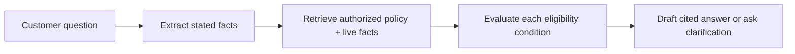

# 07 — Task Decomposition and Workflow Prompting

**Level:** Intermediate · **Estimated time:** 75–120 min · **Prerequisites:** Course 06 and basic Python functions

## Learning Objectives

- **Break Down Complex Tasks:** Deconstruct a massive, multi-step prompt into a pipeline of narrow, specialized prompts.
- **Design State Machines:** Orchestrate data flow between models using explicit programmatic states.
- **Implement Verification Gates:** Build steps that double-check the output of previous steps before proceeding.
- **Mitigate Compounding Errors:** Prevent hallucinations early in a pipeline from destroying the final output.

## Scenario

A support workflow must extract an order, apply a deterministic refund policy, and draft only when the workflow has enough information.

## Core Concepts & Workflow

LLMs struggle with long lists of complex instructions (e.g., "Read this 100-page document, extract all names, format them as XML, cross-reference them with this other document, and then write a summary"). When given too many tasks at once, models suffer from "attention dilution" and will silently skip instructions.

The solution is Task Decomposition. Instead of one massive prompt, you build a workflow of smaller, highly constrained prompts. 
1. **Model A** extracts the names.
2. **Model B** cross-references the list.
3. **Model C** writes the summary.
By separating the concerns, you can use smaller, faster models for simple steps, apply programmatic verification between steps, and isolate failures to specific nodes in your pipeline.


## Deep dive

### 3. Task decomposition

#### What it is

Decomposition turns one broad request into small, named artifacts. It is a workflow pattern before it is an agent pattern. The sequence should make dependencies inspectable, not create ceremonial model calls.



#### Step-by-step design

1. Name the final decision and the evidence it requires.
2. Split only on genuine dependency boundaries: extract, retrieve, calculate, validate, decide, communicate.
3. Define a schema and owner for each intermediate artifact.
4. Make deterministic steps deterministic—validation, filtering, arithmetic, and authorization do not need an LLM.
5. Test failures at each stage as well as the final output.

#### Northstar pattern

```text
Stage 1 — extract: identify order ID, request type, and stated facts.
Stage 2 — obtain: call authorized order and policy read tools.
Stage 3 — evaluate: compare facts to explicit policy conditions.
Stage 4 — communicate: produce a cited explanation or a focused question.
```

#### When not to use it

Do not split “format a status line” into five model calls. If the stages are fully known, use a deterministic workflow. If an intermediate result is never inspected, validated, or reused, it is likely needless fragmentation.

### 4. Least-to-most and plan-and-solve

#### What they are

**Least-to-most prompting** solves a hard task through prerequisite subproblems, feeding each answer forward. **Plan-and-solve** separates “make a plan” from “execute the plan,” which can reduce missing steps in zero-shot reasoning.

#### Example: diagnose an order exception

```text
First list the minimum questions needed to decide whether this is a shipping,
payment, or policy issue. Do not answer them from memory.

Then, for each question:
- name the authoritative source or tool;
- label the result verified, conflicting, or unknown;
- stop if no permitted evidence can resolve it.

Finally, recommend the next safe support action.
```

#### Engineering controls

- Validate the plan against allowed tools and data before execution.
- Cap plan steps and tool calls. Plans can sprawl.
- Treat a plan as a hypothesis, not an authorization artifact.
- Re-plan only when an observation invalidates the plan; do not loop by default.

#### Use cases

Constraint-heavy diagnosis, configuration migrations, educational problem solving, and multi-condition policy analysis. Avoid it for free-form creative work, or when direct retrieval plus a single answer is enough.

**Research:** [Least-to-Most Prompting](https://arxiv.org/abs/2205.10625) and [Plan-and-Solve Prompting](https://arxiv.org/abs/2305.04091).

## Technology Landscape and State of the Art

**Foundational:** Writing one massive prompt with 20 bullet points of instructions and hoping the model follows them all.

**Current State of the Art:**
1. **Graph-Based Orchestration:** Frameworks like **[LangGraph](https://langchain-ai.github.io/langgraph/)** model complex LLM workflows as state machines (graphs). Each node is a specific prompt or function, and edges determine the conditional routing based on the output.
2. **Multi-Agent Frameworks:** Tools like **[CrewAI](https://www.crewai.com/)** and **[Microsoft AutoGen](https://microsoft.github.io/autogen/)** formalize decomposition by assigning specific "personas" and "tools" to distinct agents that collaborate to solve the decomposed tasks.
3. **Map-Reduce Patterns:** For massive documents, state-of-the-art workflows use Map-Reduce: splitting the document into chunks, summarizing each chunk in parallel, and then passing the summaries to a final "Reduce" model.

## Lab walkthrough

The [notebook](07_task_decomposition_and_workflow_prompting.ipynb) demonstrates decomposing a complex summarization and extraction task. Instead of asking a single model to do everything, it chains together three separate Google GenAI SDK calls, passing the structured output of step 1 directly into the context of step 2.

The [notebook](07_task_decomposition_and_workflow_prompting.ipynb) keeps each experiment visible: it prints the rendered request, recorded response, parsed value, and deterministic assertion. Replay is offline by default; live mode is opt-in.

## Exercises

1. Edit the relevant cases in `fixtures/cases.json` and rerun the notebook; compare the course metric or invariant with the recorded baseline.
2. Change one prompt, policy, or budget variable in `lab07.py`; inspect the visible request, response, and deterministic gate.
3. Add a regression case for the failure mode described in the Deep dive and keep the application-side control explicit.

## Checkpoint

1. What application-side invariant does this course measure?
2. Which fixture-backed case demonstrates the boundary or failure mode?
3. What trade-off should you explain before promoting the change?

## Production Best Practices

- **Beware Latency:** Chaining 5 model calls together means the user waits for 5 sequential network requests. Use streaming where possible, or use parallelization for independent sub-tasks.
- **Programmatic Glue:** Do not use an LLM to route data between steps if a simple Python `if/else` statement will work. 
- **Graceful Degradation:** If step 2 in a 5-step pipeline fails, the system should catch the error and either retry safely or return a clear error to the user, rather than passing hallucinated garbage to step 3.

## Further reading

- https://arxiv.org/abs/2201.11903
- https://arxiv.org/abs/2203.11171
- https://arxiv.org/abs/2205.10625
- https://arxiv.org/abs/2205.11916
- https://arxiv.org/abs/2210.03629
- https://arxiv.org/abs/2211.10435
- https://arxiv.org/abs/2211.12588
- https://arxiv.org/abs/2212.09561
- https://arxiv.org/abs/2303.11366
- https://arxiv.org/abs/2303.17651
- https://arxiv.org/abs/2305.04091
- https://arxiv.org/abs/2305.10601
- https://arxiv.org/abs/2308.09687
- https://arxiv.org/abs/2308.09729
- https://arxiv.org/abs/2311.07954
- https://arxiv.org/abs/2406.06608
