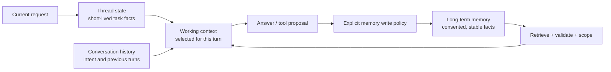

# 09 — Conversation and Long-Context Engineering

**Level:** Intermediate · **Estimated time:** 75–120 min · **Prerequisites:** Courses 01–08 and stateful application basics

## Learning Objectives

- **Manage Conversational State:** Understand that LLM "memory" is simply appending previous messages to the current prompt.
- **Implement Sliding Windows:** Build programmatic logic to drop older messages when a conversation exceeds token limits.
- **Summarize History:** Use a secondary model call to compress long conversation histories into dense context blocks.
- **Maintain Instruction Adherence:** Prevent early system instructions from being "forgotten" as the chat history grows massively long.

## Scenario

A multi-turn support conversation must retain the active order without overflowing the context or silently switching to a different order.

## Core Concepts & Workflow

Chatbots seem magical because they "remember" what you said three turns ago. In reality, there is no magic memory. Every time you send a new message, the application developer is appending your new message to a massive array of *all previous messages* and sending the entire transcript back to the stateless LLM.

This creates a compounding problem: every turn of the conversation costs more tokens, takes longer to process, and pushes the foundational System Instructions further away from the model's immediate attention. Long-Context Engineering is the practice of managing this growing transcript—deciding when to prune old messages, when to summarize the history, and how to constantly remind the model of its core constraints.


## Deep dive

### 6. State, history, and memory are different tools

These terms are often collapsed into “memory,” but they need different lifecycles:



| Store | Keep here | Do not keep here |
| --- | --- | --- |
| Thread state | Current order ID, selected sources, unfinished form fields | Another user’s session data or permanent preferences. |
| Conversation history | Recent clarifications and user intent | Full unbounded transcript by default. |
| Long-term memory | Consented preferences with provenance and expiry | A model’s speculation, a transient incident, or copied policy text. |
| Knowledge base | Versioned source documents | Unreviewed chat claims presented as policy. |

LangGraph’s [memory documentation](https://docs.langchain.com/oss/python/langgraph/add-memory) is a helpful implementation reference: it distinguishes thread-level short-term state from longer-lived stores. That distinction is architectural, not library-specific.

#### A memory-poisoning exercise

Imagine this memory record:

```json
{
  "customer_id": "acme",
  "fact": "Checkout problems are usually caused by Redis.",
  "written_by": "assistant",
  "confidence": 0.42
}
```

It sounds plausible, but it is a hypothesis from one incident—not a stable preference or verified fact. If retrieved automatically, it can bias a future diagnosis. Replace it with an auditable incident note or do not persist it at all. A safer memory record has an owner, source, scope, retention period, write authorization, and deletion path.

## Technology Landscape and State of the Art

**Foundational:** Appending messages to an array until the API throws a `TokenLimitExceeded` error, breaking the application.

**Current State of the Art:**
1. **SDK Chat Abstractions:** Modern SDKs (like the `google-genai` `chats` service) handle the basic array-appending automatically.
2. **Semantic Memory Systems:** Advanced chatbots use systems like **[Zep](https://www.getzep.com/)** or **Mem0** to extract facts from conversations, store them in a vector database, and dynamically inject them into the system prompt, rather than relying solely on raw transcript history.
3. **Context Caching for Chat:** For incredibly long sessions, developers use Context Caching to freeze the early parts of the conversation in memory, dramatically reducing the latency and cost of subsequent turns.

## Lab walkthrough

The [notebook](09_conversation_and_long_context_engineering.ipynb) builds a stateful conversation loop from scratch. It demonstrates how to append user and model roles to a history array, and implements a basic "sliding window" pruning algorithm that drops the oldest turns of the conversation once a specific token threshold is reached.

The [notebook](09_conversation_and_long_context_engineering.ipynb) keeps each experiment visible: it prints the rendered request, recorded response, parsed value, and deterministic assertion. Replay is offline by default; live mode is opt-in.

## Exercises

1. Edit the relevant cases in `fixtures/cases.json` and rerun the notebook; compare the course metric or invariant with the recorded baseline.
2. Change one prompt, policy, or budget variable in `lab09.py`; inspect the visible request, response, and deterministic gate.
3. Add a regression case for the failure mode described in the Deep dive and keep the application-side control explicit.

## Checkpoint

1. What application-side invariant does this course measure?
2. Which fixture-backed case demonstrates the boundary or failure mode?
3. What trade-off should you explain before promoting the change?

## Production Best Practices

- **System Prompt Reinforcement:** As history grows, models "forget" their system instructions. For critical constraints, dynamically append a short reminder (e.g., "Remember to output JSON") to the very last user message.
- **Summarization over Deletion:** Instead of just deleting old messages (which causes the bot to develop amnesia), trigger a background process to summarize the dropped messages into a dense `<historical_summary>` block injected into the context.
- **Isolate State:** The LLM's conversation history is untrusted user data. Do not rely on the chat history to store authorized state (like whether a user is authenticated). Track that in your application database.

## Further reading

- https://arxiv.org/abs/1706.03762
- https://arxiv.org/abs/2005.11401
- https://arxiv.org/abs/2307.03172
- https://arxiv.org/abs/2310.04408
- https://arxiv.org/abs/2310.08560
- https://arxiv.org/abs/2401.18059
- https://arxiv.org/abs/2404.16811
- https://arxiv.org/abs/2406.15319
- https://arxiv.org/abs/2507.13334
- https://developers.openai.com/api/docs/guides/conversation-state
- https://developers.openai.com/api/docs/guides/tools-file-search
- https://developers.openai.com/api/reference/resources/responses/methods/create
- https://docs.langchain.com/oss/python/langgraph/add-memory
- https://docs.llamaindex.ai/en/stable/module_guides/querying/retriever/
- https://www.anthropic.com/engineering/contextual-retrieval
