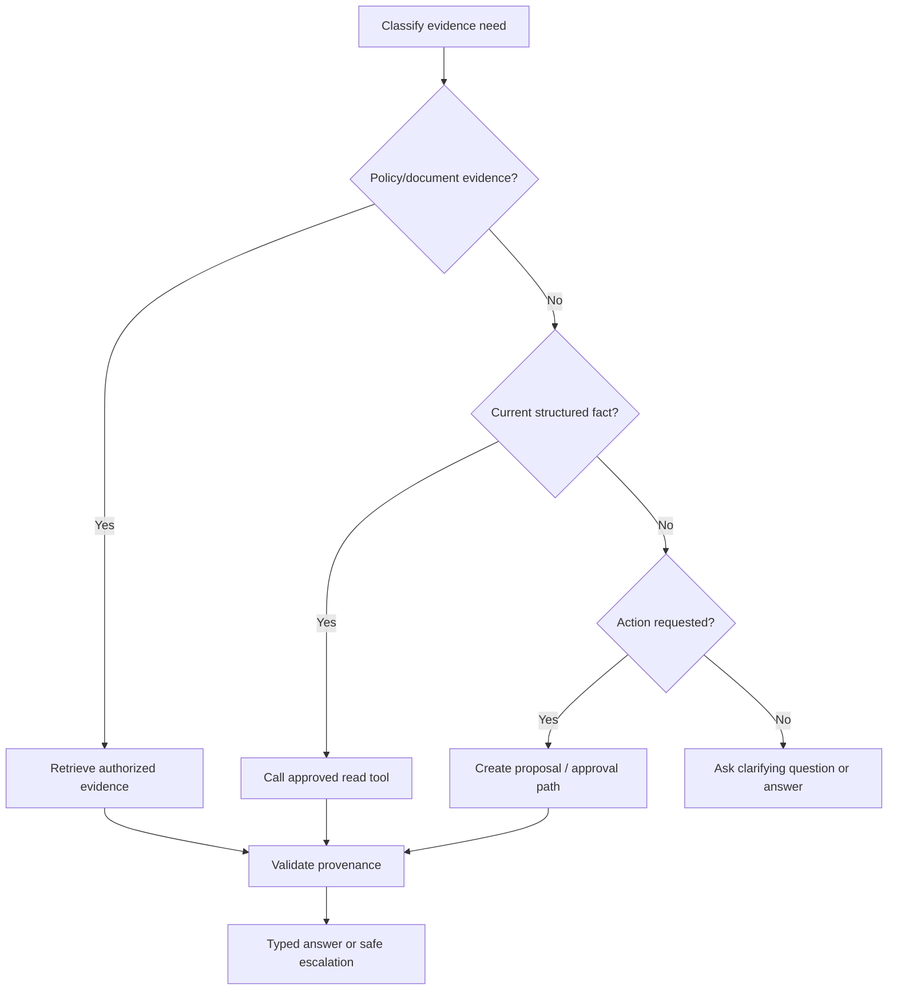

# 11 — Tool Calling and Tool Interface Design

**Level:** Intermediate · **Estimated time:** 75–120 min · **Prerequisites:** Courses 01–10 and typed Python interfaces

## Learning Objectives

- **Understand Tool Mechanics:** Learn that models do not "call" APIs; they generate JSON payloads that the application executes.
- **Design Tool Schemas:** Write clear, descriptive function signatures (tools) that the model can understand and select.
- **Implement Execution Loops:** Build the application code that catches the tool call, executes the Python function, and returns the result to the model.
- **Secure Tool Execution:** Recognize the extreme dangers of giving LLMs write-access to databases or execution environments.

## Scenario

A support assistant may request a read-only order tool, but validation, tenant authorization, and execution remain application responsibilities.

## Core Concepts & Workflow

LLMs are trapped in a text box. They cannot query a live database, check the current weather, or send an email. Tool Calling (also known as Function Calling) provides an escape hatch.

You provide the model with a list of available tools, defined as JSON schemas (e.g., `get_weather(location: string)`). When the user asks "What's the weather in Tokyo?", the model realizes it needs external data. Instead of generating a text response, it generates a structured `ToolCall` payload. 

Crucially, the model *pauses*. It is the **Application's job** to catch that payload, actually execute the Python `get_weather` function, and append the `ToolResponse` back to the conversation history so the model can read it and generate a final human-readable answer.


## Deep dive

### 6. Tool interfaces: live facts and bounded actions

#### A narrow read tool

```python
from typing import Literal


def get_order_status(actor: dict, order_id: str) -> dict:
    """Return only the caller tenant's current order state. Read-only."""
    validate_order_id(order_id)
    require_permission(actor, action="read_order", resource=order_id)
    order = load_order_for_tenant(order_id, actor["tenant_id"])
    return {
        "status": order.status,
        "last_updated": order.last_updated.isoformat(),
        "source": f"orders:{order.id}",
    }
```

This service does not accept arbitrary query language, return unrelated account fields, or execute a state change. The caller identity comes from application authentication—not model output.

#### Bad and better tool surfaces

```python
# Bad: combines unbounded read, write, and administrative authority.
def admin_api(command: str) -> str: ...

# Better: independent, typed, bounded responsibilities.
def search_tickets(actor: dict, order_id: str, limit: Literal[1, 3, 5]) -> list[dict]: ...
def calculate_delivery_date(shipped_at: str, service_level: Literal["standard", "express"]) -> str: ...
def create_refund_proposal(actor: dict, order_id: str, reason: str, evidence_ids: list[str]) -> dict: ...
```

`create_refund_proposal` should return an approval artifact, not issue money. Separate **read**, **propose**, **approve**, and **execute**. Authorization, resource scope, audit, rate limits, idempotency, and transaction limits belong inside the service.

#### Error and retry policy

| Result | Correct behavior |
| --- | --- |
| `not_found` | Ask for corrected identifier; do not invent account state |
| Read timeout | Retry once only if budget/deadline permit; then escalate |
| Write timeout | Do not blindly retry unless idempotency establishes no duplicate effect |
| Permission denied | Stop/escalate; never retry with broader authority |
| Invalid arguments | Return structured validation error; allow one safe correction |
| Contradictory data | Preserve sources, state conflict, route to owner/review |

The [OpenAI tools guide](https://developers.openai.com/api/docs/guides/tools) covers current hosted tools, function calling, tool search, and remote MCP integration. These interfaces let a model request work; they do not grant permission or remove the need for application-side validation.

### 7. Evidence-first prompting and tool routing



A useful agent/workflow decision set is `answer`, `retrieve`, `read_tool`, `calculate`, `ask_clarifying_question`, and `escalate`. Give every option a precondition:

- policy claim → at least one allowed current evidence item;
- order lookup → valid ID and authorized tenant;
- calculation → typed inputs and deterministic implementation;
- external action → explicit user intent plus application authorization and approval;
- uncertainty/conflict → escalation instead of speculative tool calls.

### 8. Evaluate retrieval and tool trajectories

#### RAG evaluation

| Layer | Questions | Metrics/fixtures |
| --- | --- | --- |
| Corpus | Is source current, complete, authorized, and parsed correctly? | revision coverage, stale-source rate, parse failure |
| Retrieval | Did the evidence set contain useful, permitted sources? | recall/precision, tenant-isolation tests, freshness |
| Selection | Did top context include the best small evidence set? | redundancy, reranker lift, citation coverage |
| Generation | Is answer useful and supported? | faithfulness, answer relevance, human rubric |
| Operations | Is it affordable and fast? | p95 latency, index lag, cost per successful task |

[RAGAS](https://arxiv.org/abs/2309.15217), [ARES](https://arxiv.org/abs/2311.09476), and [RAGChecker](https://arxiv.org/abs/2408.08067) provide useful evaluation perspectives. Calibrate their scores against expert review in your domain before using any as a release gate.

#### Tool evaluation

Record the final answer **and** the trajectory.

```json
{
  "task": "Resolve delayed-delivery question",
  "trajectory": ["get_order_status", "retrieve_policy"],
  "arguments_valid": true,
  "forbidden_actions": 0,
  "retries": 0,
  "tool_calls": 2,
  "latency_ms": 870,
  "estimated_cost": 0.004,
  "task_success": true
}
```

Test `not_found`, permission denial, timeout, malformed results, stale policy, contradictory sources, prompt injection in document/tool result, and attempted cross-tenant lookup. An answer that looks right after an unsafe tool attempt is still a failure.

### Best practices and anti-patterns

| Do | Why | Do not | Why not |
| --- | --- | --- | --- |
| Use direct APIs for live facts | Source-of-truth data stays scoped/current | RAG over stale exports | Retrieves an approximation of a fact |
| Filter before ranking | Prevents unauthorized context reaching model | Filter after generation | Data may already be exposed |
| Preserve citations/revisions | Supports review and source updates | Send anonymous snippets | Cannot verify/fix claims |
| Establish a retrieval baseline | Complexity must earn its keep | Assume hybrid/reranking always improves RAG | It can worsen quality or cost |
| Use narrow typed tools | Makes choices and validation clear | Expose an admin command | Broad authority and ambiguous errors |
| Separate proposal from execution | Enables authorization and review | Let model perform effects directly | No safe control point |
| Bound retries and tool calls | Controls loops and duplicate effects | Retry every error | Can increase cost or duplicate writes |
| Evaluate trajectory and answer | Detects unsafe/wasteful paths | Grade final prose only | Hides forbidden attempts |

## Technology Landscape and State of the Art

**Foundational:** Trying to use regex to parse model text outputs like `Action: get_weather, Location: Tokyo`.

**Current State of the Art:**
1. **Native Function Calling:** Providers (like the **Google GenAI SDK** and OpenAI) have fine-tuned their models specifically for tool use. You pass Python functions directly to the SDK, and the API natively enforces the generation of exact JSON arguments.
2. **Parallel Tool Calling:** SOTA models can realize they need multiple pieces of information at once and emit several tool calls in a single generation step (e.g., calling `get_weather("Tokyo")` and `get_weather("Kyoto")` simultaneously).
3. **Agentic Frameworks:** Tools like **LangChain** and **Semantic Kernel** provide massive libraries of pre-built tools (web searchers, SQL executors, GitHub integrators) that can be immediately bound to an LLM.

## Lab walkthrough

The [notebook](11_tool_calling_and_tool_interface_design.ipynb) walks through the complete Tool Calling loop using the Google GenAI SDK. It defines a mock Python function, registers it as a tool with the model, simulates the model pausing to request the tool execution, and demonstrates the application returning the tool result for the final synthesis.

The [notebook](11_tool_calling_and_tool_interface_design.ipynb) keeps each experiment visible: it prints the rendered request, recorded response, parsed value, and deterministic assertion. Replay is offline by default; live mode is opt-in.

## Exercises

1. Edit the relevant cases in `fixtures/cases.json` and rerun the notebook; compare the course metric or invariant with the recorded baseline.
2. Change one prompt, policy, or budget variable in `lab11.py`; inspect the visible request, response, and deterministic gate.
3. Add a regression case for the failure mode described in the Deep dive and keep the application-side control explicit.

## Checkpoint

1. What application-side invariant does this course measure?
2. Which fixture-backed case demonstrates the boundary or failure mode?
3. What trade-off should you explain before promoting the change?

## Production Best Practices

- **Human-in-the-Loop for Writes:** Never give a model a tool that performs a destructive or irreversible action (like `drop_database` or `send_email`) without pausing the workflow to require explicit human approval (HITL).
- **Idempotency:** LLMs will frequently hallucinate arguments, retry failed calls, or get stuck in loops calling the same tool. Tool execution must be safe to run multiple times (idempotent).
- **Document the Schema:** The model relies on the `description` fields of your tool parameters. "get_user_id" is bad. "Looks up a user's ID based on their exact email address" is a good tool description.

## Further reading

- https://arxiv.org/abs/2004.04906
- https://arxiv.org/abs/2004.12832
- https://arxiv.org/abs/2005.11401
- https://arxiv.org/abs/2210.03629
- https://arxiv.org/abs/2212.10496
- https://arxiv.org/abs/2212.10528
- https://arxiv.org/abs/2302.04761
- https://arxiv.org/abs/2309.15217
- https://arxiv.org/abs/2310.11511
- https://arxiv.org/abs/2311.09476
- https://arxiv.org/abs/2401.15884
- https://arxiv.org/abs/2401.18059
- https://arxiv.org/abs/2402.19473
- https://arxiv.org/abs/2408.08067
- https://developers.openai.com/api/docs/guides/tools
- https://docs.llamaindex.ai/
- https://github.com/pgvector/pgvector
- https://microsoft.github.io/graphrag//query/overview/
- https://microsoft.github.io/graphrag/index/overview/
- https://qdrant.tech/documentation/
- https://weaviate.io/developers/weaviate
- https://www.elastic.co/guide/en/elasticsearch/reference/current/semantic-search.html
