# 12 — Multimodal Prompt Engineering

## Learning Objectives
- **Integrate Non-Text Modalities:** Pass images, video, and audio directly into the model context.
- **Understand Multimodal Alignment:** Grasp how modern models natively process pixels and waveforms without OCR or speech-to-text translation layers.
- **Anchor Multimodal Prompts:** Use text to direct the model's attention to specific spatial or temporal aspects of the media.
- **Evaluate Vision/Audio Tasks:** Design test cases to measure the accuracy of bounding box extraction or audio transcription.

## Core Concepts & Workflow

Historically, interacting with images or audio required brittle "glue" pipelines: an OCR model extracted text from an image, or a Speech-to-Text model transcribed audio, and *then* the text was sent to the LLM. 

Modern foundational models (like Gemini 1.5) are natively multimodal. They process the raw image patches or audio waveforms directly. This means they can understand spatial relationships (where an object is in a photo), visual tone, and audio emotion—nuances that are completely lost in text translation. Multimodal prompt engineering involves interleaving media objects directly alongside text instructions to ground the model's spatial and temporal reasoning.

## Technology Landscape and State of the Art

**Foundational:** Using OCR (Tesseract) to scrape text from a PDF, losing all layout and formatting, and passing the text to an LLM.

**Current State of the Art:**
1. **Native Multimodal Models:** Models like **Gemini 1.5 Pro** and **GPT-4o** accept interleaved text, images, video, and audio in a single API call.
2. **Spatial Grounding:** SOTA models can output coordinates. You can prompt a model to "Return the [y_min, x_min, y_max, x_max] bounding box for the red car."
3. **Video Processing:** With massive context windows, entire 1-hour videos can be uploaded. The model samples frames and audio concurrently, allowing prompts like "Give me a timestamped summary of every time the CEO speaks."

## Lab and Production

### The Lab
The [notebook](12_multimodal_prompt_engineering.ipynb) demonstrates passing an image (or a simulated media object) to the Google GenAI SDK. It highlights the power of spatial prompting by asking the model to not just describe the image, but to extract specific data based on visual layout, enforcing the output via a strict Pydantic schema.

### Production Best Practices
- **Cost and Latency:** Images, and especially video, consume massive amounts of tokens. A 1-minute video can consume hundreds of thousands of tokens, massively increasing latency and cost.
- **Media Pre-processing:** Resize images to the minimum resolution required for the task. Do not send 4K images to an LLM if a 512x512 image contains the necessary information.
- **Anchor the Attention:** Do not just upload a video and say "analyze." Provide text anchors: "Look at the top right quadrant of the image at timestamp 0:45 and describe the gauge."
