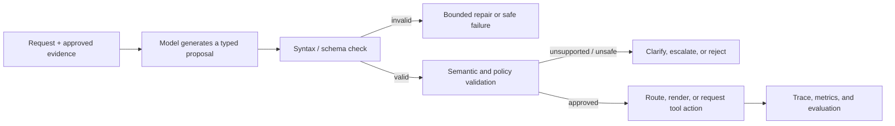
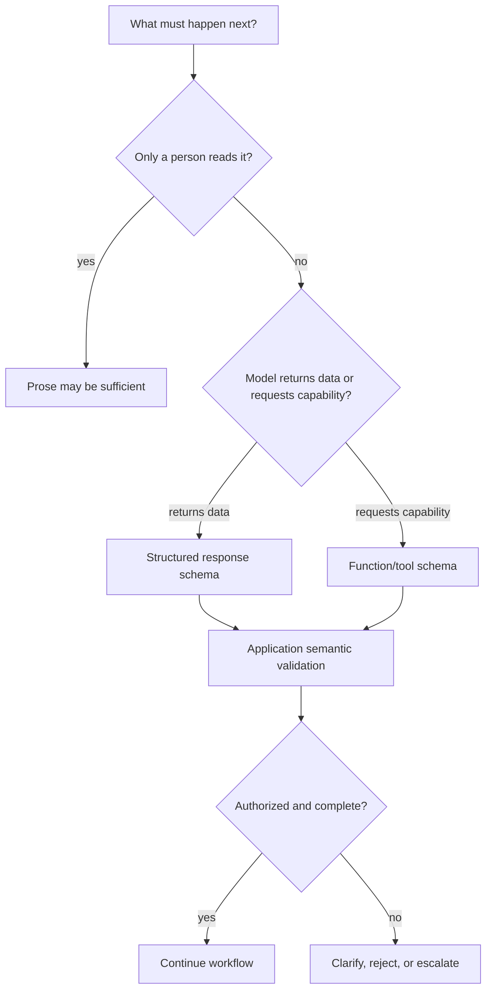
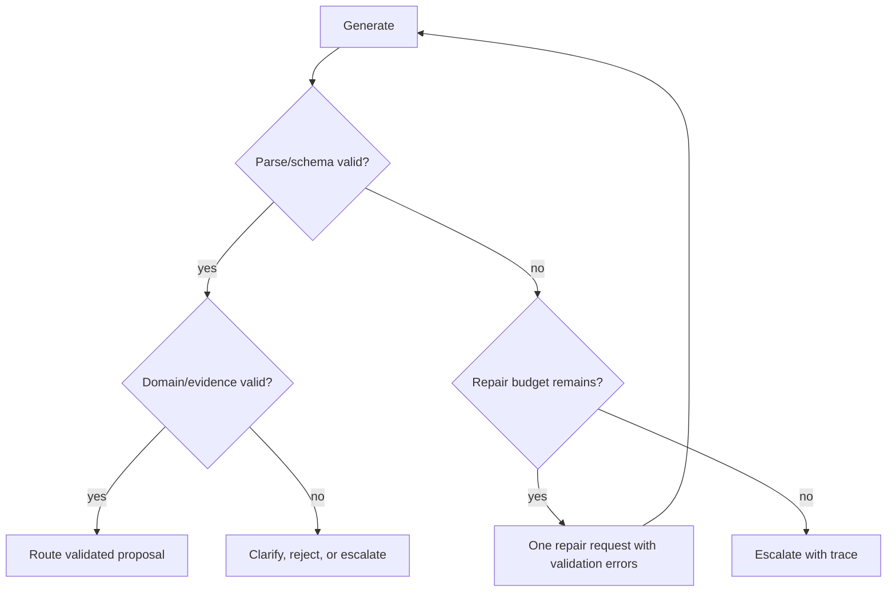

# Structured outputs: turn model responses into dependable interfaces

Natural language is excellent for people and weak as a software interface. An answer such as _“This looks like a refund issue; probably ask for the order number”_ may be useful to a support agent, but a workflow cannot reliably route, validate, audit, or measure it. Structured output turns a model response into a **typed proposal** that software can inspect before it has any downstream effect.

This is not the same as asking a model to “return JSON.” JSON is syntax. A dependable interface also needs a contract, generation constraints when available, runtime validation, semantic checks, versioning, observability, and a safe failure path.

This module uses **Northstar**, a fictional subscription service. The system must classify a customer case, prepare a customer-facing draft, cite its evidence, and decide whether a specialist review is required. The same engineering pattern applies to document extraction, UI generation, evaluation records, agent handoffs, API request proposals, and tool results.

## Learning outcomes

By the end, you should be able to:

- distinguish valid JSON, schema-valid data, semantically valid data, and authorized actions;
- choose between a structured model response and a function/tool call;
- design small, versioned, discriminated schemas that make safe outcomes explicit;
- validate at both the model boundary and the application boundary;
- build bounded repair and escalation flows for malformed, incomplete, refused, or unsafe output;
- evaluate an output contract using structural, semantic, and operational measures; and
- select technologies such as JSON Schema, Pydantic, Zod, constrained decoding, and provider-native structured-output APIs with clear trade-offs.

## 1. The core idea: a model proposes; the application decides

Structured output creates a boundary between probabilistic generation and deterministic software. The model can propose a case classification or tool arguments; the application decides whether the proposal conforms to the contract and whether it is allowed to proceed.



The pipeline has four increasingly strong guarantees:

| Level | What it proves | What it does **not** prove |
| --- | --- | --- |
| Parseable JSON | A JSON parser can read it. | Required keys, allowed values, factual support, or permission. |
| Schema-valid data | The response fits a declared shape. | The facts are true or the action is permitted. |
| Semantically valid proposal | Domain rules and evidence checks pass. | A side effect has been approved or executed safely. |
| Authorized action | Application policy permits the validated request. | That the model should decide the business policy. |

> **Key principle:** structured output is a reliability tool, not an authorization mechanism. A model can return a perfectly valid `{"action": "refund"}` object that must still be rejected because the requester lacks permission, evidence is insufficient, or human approval is required.

## 2. JSON mode, schema-constrained output, and function calls

These patterns solve different problems. Do not pick one because it is the most familiar.

| Pattern | Use it when | Guarantee | Typical failure |
| --- | --- | --- | --- |
| Prose | A human is the only consumer and no automation depends on fields. | None beyond model behavior. | Parsers guess at headings or phrasing. |
| JSON mode | You need machine-readable JSON but cannot use a stronger contract. | Usually valid JSON, provider-specific edge cases remain. | Missing keys and invented enum values. |
| Schema-constrained response | The model must return data your application or UI consumes. | Shape adheres to a supported schema subset. | Semantically wrong but well-formed data. |
| Function/tool call | The model needs to request an application capability. | Tool arguments can conform to a schema. | Valid arguments invoke an unauthorized action. |
| Grammar/constrained decoding | You run or host a generation stack with a grammar/schema engine. | Tokens are constrained to a language/format. | Constraint hurts content quality or does not express domain rules. |

OpenAI’s current [Structured Outputs guide](https://developers.openai.com/api/docs/guides/structured-outputs) makes the same practical distinction: use a structured response format when the model’s answer itself must be consumed as data, and use function calling when it must bridge to application capabilities. In both cases, retain application-side validation.

### A decision rule



## 3. Design a contract before writing a prompt

Start from the next deterministic consumer. What precise data does it need? Which outcomes are safe when facts are missing? Which values must never be supplied by the model?

For Northstar, avoid a vague object with optional fields whose meaning changes per case. Use a discriminated union: an answer supported by evidence, a clarification request, or an escalation. Each variant says what downstream code can do safely.

```python
from typing import Annotated, Literal, Union
from pydantic import BaseModel, Field, HttpUrl, field_validator


class Evidence(BaseModel):
    source_id: str = Field(min_length=3, max_length=120)
    excerpt: str = Field(min_length=1, max_length=700)


class AnswerCase(BaseModel):
    kind: Literal["answer"]
    intent: Literal["refund", "shipping", "account"]
    customer_draft: str = Field(min_length=1, max_length=1_200)
    evidence: list[Evidence] = Field(min_length=1, max_length=4)
    needs_human: Literal[False]


class ClarificationCase(BaseModel):
    kind: Literal["clarify"]
    missing_fields: list[Literal["order_id", "request_date", "delivery_date"]] = Field(min_length=1)
    customer_draft: str = Field(min_length=1, max_length=700)
    needs_human: Literal[False]


class EscalationCase(BaseModel):
    kind: Literal["escalate"]
    reason: Literal["conflicting_policy", "exception", "insufficient_evidence", "safety_review"]
    evidence: list[Evidence] = Field(default_factory=list, max_length=4)
    needs_human: Literal[True]


CaseBrief = Annotated[
    Union[AnswerCase, ClarificationCase, EscalationCase],
    Field(discriminator="kind"),
]


class CaseResponse(BaseModel):
    case: CaseBrief
```

This schema makes an important design choice: it does **not** include a `refund_amount` or `execute_refund` field. A response format should represent the lowest-risk next step. A separate authorized service calculates amounts and a separate approval workflow handles money movement.

### Contract design checklist

- Choose stable, descriptive field names. Schema keys are developer-facing instructions too; ambiguous names such as `status` or `data` conceal meaning.
- Use enums for closed routing decisions, but keep them small. Do not encode an entire knowledge taxonomy in a 500-value enum.
- Make absence explicit: use `null`, a `clarify` variant, or an `escalate` variant instead of invented defaults.
- Put domain constraints close to the boundary: string length, numeric range, cardinality, identifier format, and required relationships.
- Prefer a discriminated union over a single object with many optional, mutually exclusive fields.
- Keep the schema versioned and backwards-compatible where possible. Consumers need a migration plan, not a surprise field rename.

## 4. Schema generation is not business validation

Most schema engines can validate types, enums, lengths, and object shape. They cannot prove that a policy excerpt supports a refund claim, that an order belongs to the user, or that a cancellation is authorized.

```python
from datetime import date


APPROVED_SOURCE_IDS = {"policy/refunds-v3#window", "orders/55"}


def validate_case_semantics(case: AnswerCase, *, today: date) -> None:
    source_ids = {item.source_id for item in case.evidence}
    unknown = source_ids - APPROVED_SOURCE_IDS
    if unknown:
        raise ValueError(f"Output cited unauthorized or unknown sources: {sorted(unknown)}")

    if case.intent == "refund" and "policy/refunds-v3#window" not in source_ids:
        raise ValueError("A refund answer needs current policy evidence.")

    # In a real service, verify excerpt offsets/version and order ownership here.
    # Do not trust a model-provided date, source ID, or eligibility flag on its own.
```

Think in layers:

| Validation layer | Examples | Owner |
| --- | --- | --- |
| Transport | JSON parses, content type is correct | API client/server |
| Structural | Required fields, enums, arrays, no unexpected keys | Schema engine |
| Domain | Order exists, requested fields have valid relationships | Application service |
| Evidence | Source exists, is visible, current, and supports claim | Retrieval/policy layer |
| Authorization | Actor may request/approve/execute this operation | Identity and policy layer |
| Safety | Amount/country/rate/approval limits are satisfied | Workflow and controls |

## 5. A guided build: case briefs for the Northstar support desk

The goal is to build an interface that works on normal, incomplete, and adversarial requests without credentials. Run the linked lab and notebook as you progress.

### Step 1 — model the required outcomes

Write three fixtures before calling a model:

```python
VALID_POLICY_QUESTION = {
    "message": "What is the refund window?",
    "expected_kind": "answer",
    "required_sources": {"policy/refunds-v3#window"},
}

MISSING_ORDER = {
    "message": "Refund my purchase.",
    "expected_kind": "clarify",
    "required_missing_fields": {"order_id"},
}

CONFLICTING_POLICY = {
    "message": "The old policy says 30 days; can I use it?",
    "expected_kind": "escalate",
    "expected_reason": "conflicting_policy",
}
```

This step prevents the common failure of designing the schema around one happy-path answer.

### Step 2 — start with a small, explicit schema

Avoid mirroring your entire database. The model does not need an internal account object to answer a policy question. Start with the contract above and generate the portable JSON Schema that a provider or API gateway can consume:

```python
import json
from pydantic import TypeAdapter


case_schema = TypeAdapter(CaseBrief).json_schema()
print(json.dumps(case_schema, indent=2))
```

Pydantic’s [JSON Schema documentation](https://docs.pydantic.dev/latest/concepts/json_schema/) explains how Python models can generate JSON Schema. The JSON Schema specification itself is a language-neutral contract; its [Core and Validation specifications](https://json-schema.org/specification) are the primary reference when you exchange schemas across services.

### Step 3 — give the model instructions and contrastive examples

Examples demonstrate a decision boundary; they are not a substitute for validation. Keep them varied and close to real ambiguity.

```text
SYSTEM
Return one CaseBrief object. Use only the supplied approved evidence.
If a required fact is absent, return kind="clarify". If approved sources conflict,
return kind="escalate". Do not infer order ownership or policy exceptions.

EXAMPLE A — general policy question
User: What is the refund window?
Evidence: policy/refunds-v3#window says requests must be made within 14 days of delivery.
Result: {"kind":"answer", "intent":"refund", ...}

EXAMPLE B — missing required fact
User: Refund my purchase.
Evidence: current policy only.
Result: {"kind":"clarify", "missing_fields":["order_id"], ...}
```

Do not include many near-identical examples. Add examples for missing data, conflicting evidence, and out-of-scope requests; keep a held-out evaluation set that never enters the prompt.

### Step 4 — use provider-native constraint when available

Provider-native structured output can eliminate many formatting retries. Here is an **optional** OpenAI adapter; keep its credential/configuration outside the deterministic lab.

```python
"""Optional adapter. Requires OPENAI_API_KEY and a compatible SDK/model."""
from openai import OpenAI


def generate_case_brief(system_instruction: str, user_message: str) -> CaseBrief:
    client = OpenAI()
    response = client.responses.parse(
        model="gpt-5.6",
        input=[
            {"role": "system", "content": system_instruction},
            {"role": "user", "content": user_message},
        ],
        text_format=CaseResponse,
    )
    if response.output_parsed is None:
        raise RuntimeError("No structured response was returned.")
    return response.output_parsed.case
```

Use this only after checking current SDK and model compatibility in the [official guide](https://developers.openai.com/api/docs/guides/structured-outputs). The same architecture works with any provider or self-hosted constrained-decoding engine: generate against a supported schema, parse, then run independent domain and policy checks.

### Step 5 — validate an intentionally bad response

```python
from pydantic import TypeAdapter, ValidationError


bad_response = {
    "kind": "answer",
    "intent": "payment",  # not an allowed route
    "customer_draft": "Your refund is approved.",
    "evidence": [],        # no evidence for a policy/action claim
    "needs_human": False,
}

try:
    TypeAdapter(CaseBrief).validate_python(bad_response)
except ValidationError as error:
    print(error.errors())
```

Then create a response that passes the schema but cites `policy/refunds-v1#window`. Structural validation should pass; semantic validation should reject the retired source. This is the difference between a typed object and a trustworthy decision.

### Step 6 — render, route, or request an action

Only now should downstream code branch on `kind`:

```python
def route_case(case: CaseBrief) -> str:
    if isinstance(case, ClarificationCase):
        return "ask_customer"
    if isinstance(case, EscalationCase):
        return "human_review_queue"
    validate_case_semantics(case, today=date.today())
    return "render_supported_answer"
```

Notice what is absent: no `refund()` call. Returning a structured answer is not a license to create a financial side effect. If an action is needed, expose a narrow tool with its own authorization, approval, idempotency, and audit rules.

## 6. Repair, refusal, truncation, and safe failure

Malformed output is a normal integration event; hiding it is not reliability. A safe repair policy is bounded, observable, and conservative.



```python
MAX_REPAIRS = 1


def parse_with_bounded_repair(raw_outputs: list[dict]) -> CaseBrief:
    """Deterministic illustration: a real repair call belongs behind an adapter."""
    adapter = TypeAdapter(CaseBrief)
    for attempt, raw in enumerate(raw_outputs, start=1):
        try:
            return adapter.validate_python(raw)
        except ValidationError as error:
            if attempt > MAX_REPAIRS:
                raise RuntimeError("Case brief invalid after bounded repair") from error
            # Log error details and request a corrected object only; do not silently coerce.
    raise RuntimeError("No output supplied")
```

Handle these outcomes separately in traces and user-facing behavior:

| Outcome | What to do |
| --- | --- |
| Schema invalid | One bounded repair, then safe escalation/failure. |
| Refusal | Preserve refusal as a typed outcome; do not parse it as normal data. |
| Truncated/incomplete output | Do not parse partial JSON as a completed decision; retry only if policy allows. |
| Schema valid but unsupported | Reject/clarify/escalate with evidence trace. |
| Tool arguments valid but action forbidden | Deny at authorization layer and explain next safe step. |
| Network/provider error | Apply normal infrastructure retry/backoff policy, separate from output repair. |

OpenAI’s structured-output guide documents that JSON mode and schema-constrained output differ, and it calls out incomplete and refusal outcomes that applications must handle. Other providers and self-hosted engines expose different status fields; normalize them into your own error taxonomy.

## 7. Function calls: a contract for proposals, not permission slips

For a tool request, model the minimal capability. This is dangerous:

```json
{ "name": "admin_api", "arguments": { "command": "do anything" } }
```

This is more reviewable:

```json
{
  "name": "create_refund_review",
  "description": "Create a review request; never issue a refund.",
  "strict": true,
  "parameters": {
    "type": "object",
    "properties": {
      "order_id": { "type": "string" },
      "reason": { "type": "string" },
      "evidence_source_ids": {
        "type": "array",
        "items": { "type": "string" }
      }
    },
    "required": ["order_id", "reason", "evidence_source_ids"],
    "additionalProperties": false
  }
}
```

The tool handler must still verify the requester, order ownership, source visibility, rate limits, and whether a review is appropriate. In OpenAI’s current [function-calling strict-mode documentation](https://developers.openai.com/api/docs/guides/function-calling#strict-mode), strict schemas have compatibility requirements such as required fields and disabled additional properties. Treat those as provider contract requirements, not as universal JSON Schema rules.

## 8. Technology and state-of-the-art map

Structured generation has moved from brittle “please output JSON” prompts toward grammar/schema-constrained generation and typed SDK helpers. The hard problem has also become clearer: syntax can be constrained, but factuality, authorization, and complex cross-field business rules need external validation.

| Technology / method | Strength | Use it when | Watch for |
| --- | --- | --- | --- |
| [JSON Schema](https://json-schema.org/specification) | Language-neutral structural contract | Services, APIs, provider schemas, cross-language tooling | Validator/provider supports only a subset. |
| [Pydantic](https://docs.pydantic.dev/latest/) | Python types, runtime validation, JSON Schema generation | Python apps and labs | Add explicit domain/evidence validation beyond models. |
| [Zod](https://zod.dev/) | TypeScript-first runtime schemas and inferred types | TypeScript apps/frontends | TypeScript types alone do not validate runtime data. |
| Provider-native Structured Outputs | Convenient constrained schema generation | You use a compatible managed model/API | Model/schema support and refusal/incomplete semantics vary. |
| Function/tool calling | Typed requests to application capabilities | An agent or assistant must ask to do work | Tool schema does not grant permission. |
| Grammar-constrained decoding | Format enforcement in self-hosted/open-weight stacks | You control inference or need constrained formats | Latency, grammar expressiveness, and semantic degradation. |
| Guardrail/validation frameworks | Shared parsing, retry, and validation patterns | You need reusable adapters across models | Avoid hiding approval and business logic in framework hooks. |

Relevant research is increasingly evaluating not only format validity but efficiency and semantic quality under constraints:

- [Generating Structured Outputs from Language Models: Benchmark and Studies](https://arxiv.org/abs/2501.10868) studies real-world JSON schemas and constrained decoding.
- [JSONSchemaBench](https://openreview.net/pdf/87f0994dff5f854cb02110866e3c61a8e14c80f2.pdf) evaluates constrained decoding efficiency, coverage, and quality.
- [Good-Enough Structured Generation: A Case Study on JSON Schema](https://openreview.net/pdf?id=p84kZ3ZFux) examines practical gaps between formal constraints and production schemas.
- [The Prompt Report](https://arxiv.org/abs/2406.06608) is a broad reference for prompt-engineering techniques, including format and example-based prompting.

Read these as design inputs, not proof that any one decoder or library will work best for your traffic. Test with your schemas, language mix, error budget, and safety controls.

## 9. Evaluate the contract, not only the answer

Use an evaluation set with normal, incomplete, ambiguous, malformed, adversarial, and policy-changing cases. Test the output object and the workflow it enables.

| Dimension | Example metric | Why it matters |
| --- | --- | --- |
| Structural reliability | Schema-valid rate; parse failure rate | Measures interface stability. |
| Routing correctness | Correct `kind` and enum on held-out cases | A valid wrong route is a real defect. |
| Grounding | Claim-to-evidence support; invalid-source rate | Prevents citation-shaped hallucinations. |
| Safe uncertainty | Correct clarification/escalation rate | Rewards not pretending to know. |
| Security | Forbidden fields/actions accepted; injection-resistance rate | Tests boundary controls. |
| Operations | P50/P95 latency, tokens, repair rate, cost per valid outcome | Reveals hidden retry costs. |
| Change safety | Contract compatibility and fixture regression rate | Prevents schema changes from breaking consumers. |

```python
def score_case(actual: CaseBrief, expected_kind: str, allowed_sources: set[str]) -> dict:
    score = {"correct_kind": actual.kind == expected_kind, "uses_only_allowed_sources": True}
    if isinstance(actual, (AnswerCase, EscalationCase)):
        selected = {e.source_id for e in actual.evidence}
        score["uses_only_allowed_sources"] = selected.issubset(allowed_sources)
    return score
```

Do not optimize only for `schema_valid_rate`. A system that always returns a valid but empty answer object can score perfectly on structure while failing users. For a full methodology, continue to [Evaluation](07-evaluation.md); for production rollouts and trace design, see [PromptOps](09-promptops.md).

## 10. Best practices and anti-patterns

### Do

- Design from the downstream consumer and safe failure modes, not from a sample model response.
- Keep schemas narrow, named, versioned, and attached to fixtures/tests.
- Use a schema-constrained response for model-returned data and a tool schema for capability requests.
- Keep model-facing and application-facing schema validation; they address different failures.
- Use discriminated variants for answer, clarification, refusal, and escalation paths.
- Require source IDs or evidence for claims where grounding matters, then verify them independently.
- Bound repair attempts, track them, and make escalation a normal product path.
- Separate tool arguments from authorization, approval, idempotency, and side-effect execution.

### Avoid

- Treating JSON mode as proof of schema adherence or factual truth.
- Encoding important business policy solely in a prompt or field description.
- Adding an `execute`, `admin`, or free-form `command` field when a narrow proposal suffices.
- Coercing unknown enums or silently dropping invalid fields to make workflows continue.
- Returning an empty evidence list for a supposedly grounded answer.
- Making a schema so large that it mirrors every internal service and becomes impossible to evolve.
- Retrying malformed output indefinitely or hiding refusal/incomplete response states.
- Assuming a provider’s supported JSON Schema subset matches every validator’s subset.

## 11. Run the practical material

- Run [Lab 02 — structured outputs](../labs/02_structured_outputs.py) for a deterministic contract/validation exercise.
- Work through [Notebook 02 — structured outputs](../notebooks/02_structured_outputs.ipynb) for the Northstar scenario, examples, invalid fixtures, and reflection prompts.
- Continue with [Context engineering](03-context-engineering.md) to decide which approved evidence belongs in a structured result.
- Continue with [RAG and tools](04-rag-tools.md) for retrieval and tool contracts, and [Prompt security](06-prompt-security.md) for injection and boundary controls.

## Reflection questions

1. What is the first deterministic consumer of your model’s output, and what does it actually need?
2. Which values should be closed enums, which require free text, and which should never be model-supplied?
3. Can every schema-valid output either proceed safely or enter a typed clarification/escalation path?
4. What semantic checks prove that a model-provided citation, identifier, or tool argument is legitimate?
5. How will you detect an increase in repairs, incomplete output, or correct-looking but incorrect routing after a schema change?

---

Structured outputs are most valuable when they make uncertainty and failure visible. A good contract gives the model a clear way to say **answer**, **ask**, or **escalate**—and gives the application the final say over every consequential step.
