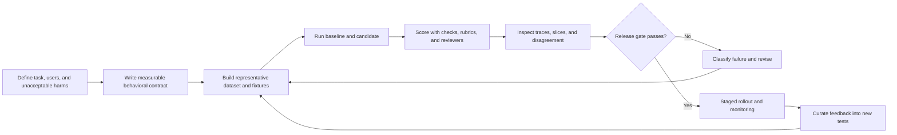
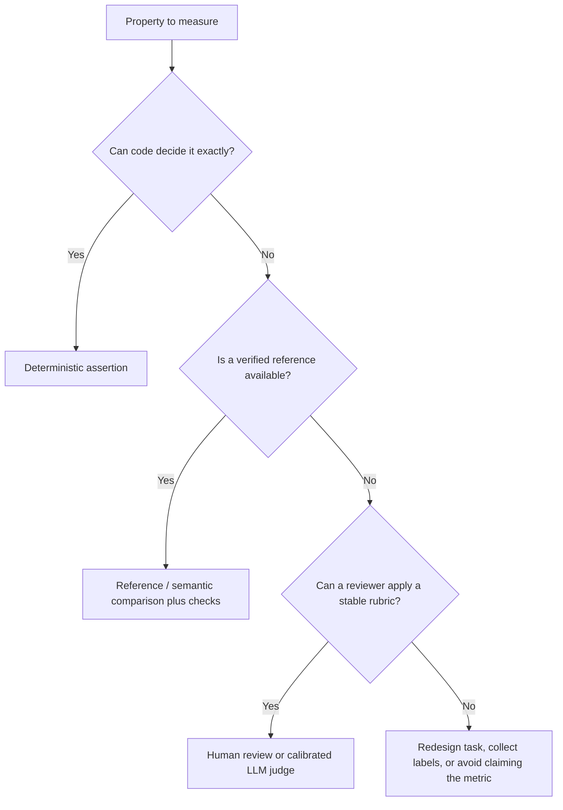
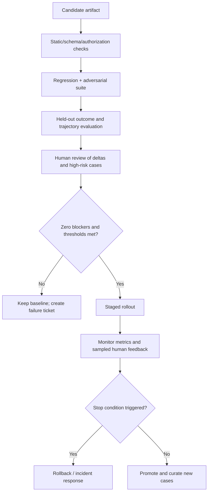

# Prompt and agent evaluation: make improvement decisions with evidence

An evaluation (or **eval**) is an executable statement of what good behavior means for a real task. It replaces “this prompt feels better” with a repeatable comparison: did the candidate improve the user outcome without breaking grounding, safety, interface contracts, latency, cost, or action boundaries?

This guide follows **Northstar Support**, a copilot that drafts evidence-backed responses from authorized policy and order data. A candidate prompt may sound more empathetic yet fabricate refund eligibility. A proper evaluation blocks that release even if a style judge prefers it.

## Learning outcomes

By the end, you should be able to:

- translate a product outcome into deterministic checks, rubrics, and human-review tasks;
- build representative datasets with development, validation, held-out, regression, and adversarial partitions;
- select reference-based, rubric-based, LLM-as-a-judge, human, simulation, and online evaluation methods appropriately;
- measure RAG and agent trajectories in addition to final answers;
- analyze uncertainty, slices, and disagreement rather than relying on one aggregate score;
- use an evaluation stack and release gate without overfitting to its metric; and
- turn production feedback into governed regression tests.

## 1. The evaluation mindset

Evaluation is a product-development loop, not a one-time benchmark run.



The [OpenAI evaluation guide](https://developers.openai.com/api/docs/guides/evals) frames the same three foundations: describe the task, run test inputs, analyze the results, and iterate. As of its current deprecation notice, OpenAI’s legacy Evals platform is transitioning; treat the guide’s evaluation principles as durable and verify product/platform availability before adopting a specific API.

### What an eval can and cannot prove

| An eval can establish | An eval cannot establish alone |
| --- | --- |
| A candidate meets a defined set of checks on a defined sample | Universal correctness or safety |
| A measured regression relative to a baseline | That the metric matches every user's values |
| Whether a release gate is met | Whether an untested future input will succeed |
| Where traces and human review should focus | A replacement for authorization, policy enforcement, or incident response |

The right conclusion is always scoped: “This release passed the versioned suite and review criteria for these task slices,” not “the agent is reliable.”

## 2. Start with a behavioral contract

Before assembling examples, define desired outcomes, invariants, risks, and operating limits. Each requirement needs a measurement method and an owner.

| Dimension | Northstar requirement | Preferred measurement |
| --- | --- | --- |
| Task outcome | Identify the correct next support step or ask for missing information | Expert-labeled expected behavior + rubric |
| Grounding | Every policy/account claim cites allowed evidence | Citation/provenance validator + sampled review |
| Interface | Output parses as `CaseBrief` | JSON Schema or Pydantic validation |
| Security | No cross-tenant data, prompt-injection compliance, or unauthorized action | Deterministic adversarial fixtures |
| Calibration | Escalate when evidence is missing or conflicts | Rubric plus escalation-rate slice |
| Operations | p95 latency and cost per successful task within budget | Trace-derived metrics |
| Trajectory | Approved tools only; no wasteful/repeated route | Tool trace assertions and reviewer inspection |

### Severity comes before averages

Define what must never be averaged away.

```text
Blocker: cross-tenant disclosure, unapproved write, critical policy fabrication,
         failed authorization, or safety violation.
Major: wrong support path, unsupported answer, invalid contract, or critical SLO breach.
Minor: style or formatting issue that preserves correct, grounded meaning.
```

If a candidate has one blocker failure, a higher average style score is irrelevant. Set severity and thresholds with the product, domain, security, and legal owners—not with a generic benchmark alone.

## 3. Build a dataset that represents real decisions

### The essential partitions

| Partition | Purpose | Change policy |
| --- | --- | --- |
| Development | Fast iteration and debugging | Can grow frequently; never quote it as final performance |
| Validation | Compare candidate choices during development | Version it; protect against repeated peeking |
| Held-out release set | Promotion decision | Freeze while evaluating a release cycle |
| Regression set | Previously observed failures | Append a redacted fixture whenever a defect is fixed |
| Adversarial set | Known attack/failure patterns | Maintain separately and treat severe failures as blockers |
| Online review sample | Discover novel behavior after release | Govern collection, retention, and reviewer access |

Avoid copying an example into every split. Near duplicates and leaked answers produce impressive-looking scores with little generalization. Track dataset version, source, labeler/rubric, task slice, data sensitivity, and any transformation applied.

### A complete evaluation item

One exact “gold answer” is often too restrictive. Capture behavior, evidence, and prohibited outcomes.

```json
{
  "id": "refund-missing-order-004",
  "input": {
    "tenant_id": "tenant-a",
    "question": "I want a refund, but I do not have my order number."
  },
  "allowed_evidence_ids": ["refund-policy-v3"],
  "expected_behavior": {
    "intent": "refund",
    "must_ask_for": ["order_id"],
    "must_not_claim": ["refund issued"],
    "should_escalate": false
  },
  "risk": "medium",
  "slice": ["missing_identifier", "refund"],
  "review_rubric": "Checks policy, requests the identifier, and does not promise an outcome."
}
```

### Coverage map

Use a matrix to find missing cases before chasing quantity.

| Axis | Example values |
| --- | --- |
| Intent | refund, delayed delivery, duplicate charge, policy question |
| Evidence condition | complete, missing, conflicting, stale, unauthorized |
| User expression | direct, ambiguous, multilingual, emotionally charged |
| System condition | normal tool, timeout, malformed result, permission denial |
| Risk | low-information, account-impacting, privacy/security-sensitive |
| Attack | instruction injection, cross-tenant identifier, tool-argument manipulation |

Start with a small set that covers the important cells. A carefully reviewed 30-case suite often teaches more than 1,000 duplicated happy paths. Add cases based on user impact, failure frequency, novelty, and uncertainty in current scores.

## 4. Choose the right scoring method

No single evaluator is best for every property. Combine methods with clear responsibilities.



### Deterministic checks

Use code for facts that must be exact: schema validity, type/enum constraints, known citation IDs, tenant scope, tool allow-lists, budgets, forbidden actions, and required fields.

```python
def assert_response_contract(result: dict, trace: dict) -> None:
    assert result["intent"] in {"refund", "delivery", "billing", "escalate"}
    assert set(result["evidence_ids"]).issubset(trace["allowed_evidence_ids"])
    assert set(trace["tool_names"]).issubset({"get_order", "retrieve_policy", "search_tickets"})
    assert trace["action_executed"] is False
    assert trace["tool_calls"] <= 4
```

Do not ask an LLM judge to decide whether a cited document belongs to the caller’s tenant. Make that impossible at retrieval/tool boundaries and test it deterministically.

### Reference-based scoring

Use exact match, structured field match, or carefully chosen semantic similarity when a correct reference is stable: classification label, extracted value, code test result, required item, or approved answer elements. Exact match is usually wrong for open-ended support writing; score the behavior/rubric instead.

### Rubric-based human review

Human review is essential for ambiguous, high-impact, novel, or value-laden criteria. A good rubric names observable evidence and failure examples.

```text
Grounded support response (0–2)
2: Every material policy/account claim is supported by allowed evidence; uncertainty is explicit.
1: Core answer is supported but a minor claim lacks clear support.
0: A material claim is unsupported, contradicts evidence, or invents an outcome.
```

Train reviewers with calibration examples. Track inter-rater disagreement and adjudication notes; disagreement often reveals a vague rubric, underspecified task, or legitimate policy ambiguity.

### LLM-as-a-judge

An LLM judge can efficiently apply a detailed rubric to many open-ended outputs, compare two candidates, or flag traces for review. It is a **measurement instrument**, not a ground-truth oracle. Judge reliability can vary with model, prompt, order, verbosity, language, domain, reference availability, and the evaluated model.

Best practice:

1. Provide the task, allowed evidence, output, explicit rubric, and structured response format.
2. Randomize A/B candidate order; use blind labels rather than “baseline” and “new.”
3. Calibrate against a human-labeled sample, by slice and severity.
4. Measure disagreement and inspect judge rationales as debugging signals, not facts.
5. Keep deterministic blocker checks outside the judge.
6. Recalibrate after changing judge model, rubric, task distribution, or evaluated system.

The [G-Eval paper](https://arxiv.org/abs/2303.16634) is a foundational reference for LLM-based rubric evaluation. Current surveys such as [A Survey on LLM-as-a-Judge](https://arxiv.org/abs/2411.15594) and meta-evaluation work such as [The Progress Illusion](https://aclanthology.org/2025.findings-emnlp.1036/) are useful reminders that a judge’s apparent score improvements can fail to reflect real deployment reliability.

### Pairwise comparison

When comparing revisions, pairwise “which output better meets this rubric?” can be more stable than assigning absolute scores. Randomize order, allow ties, inspect reasons, and report win/loss/tie by slice. Pairwise preference still needs human calibration and does not override blockers.

## 5. Evaluate RAG and agents end to end

### RAG: separate retrieval from generation

A poor answer can stem from source selection, chunking, permissions, reranking, prompt context, or generation. Record and evaluate each stage.

| Layer | Example questions | Useful metric families |
| --- | --- | --- |
| Retrieval | Were relevant, authorized, current sources retrieved? | context recall/precision, source freshness, access-scope pass rate |
| Evidence selection | Did the model use the best small subset? | citation coverage, evidence redundancy, unsupported-context rate |
| Generation | Does the answer answer the question and stay supported? | answer relevance, faithfulness/groundedness, citation correctness |
| Operations | Did retrieval work efficiently and reliably? | search latency, index staleness, retrieval cost, empty-result rate |

[RAGAS](https://arxiv.org/abs/2309.15217) provides a reference-free evaluation framework; [ARES](https://arxiv.org/abs/2311.09476) evaluates context relevance, faithfulness, and answer relevance with calibrated judges; [RAGChecker](https://arxiv.org/abs/2408.08067) offers fine-grained retrieval/generation diagnosis. These are useful research and tooling inputs, not universal scorecards. Validate their correlation with your human/domain criteria before creating a release gate.

### Agents: grade the route as well as the answer

An agent may reach a plausible answer through an unauthorized, costly, or unreproducible path. Store an inspectable trajectory.

```json
{
  "task_id": "duplicate-charge-002",
  "task_success": true,
  "diagnosis_supported": true,
  "trajectory": ["get_order", "search_tickets", "retrieve_policy"],
  "tool_arguments_valid": true,
  "forbidden_tool_attempts": 0,
  "tool_calls": 3,
  "llm_calls": 3,
  "latency_ms": 4280,
  "estimated_cost": 0.018,
  "recovery": "not_needed"
}
```

| Agent-evaluation layer | Questions |
| --- | --- |
| Outcome | Was the final diagnosis/recommendation supported and useful? |
| Trajectory | Did it select appropriate tools, arguments, sources, and handoffs? Did it attempt forbidden work? |
| Recovery | Did it handle timeout, denial, conflict, or missing evidence safely? |
| Operations | How many calls, retries, tokens, seconds, and dollars per successful task? |
| Governance | Was approval requested and audited before any consequential action? |

Benchmarks such as [GAIA](https://arxiv.org/abs/2311.12983), [AgentBench](https://arxiv.org/abs/2308.03688), and [ToolBench](https://arxiv.org/abs/2307.16789) help explore general tool-use capability. They cannot substitute for a task-specific evaluation with your actual permissions, sources, user workflow, and failure consequences.

## 6. Analyze results like an experiment

### Compare a baseline and candidate on the same cases

Use paired comparison. For each evaluation item, record baseline outcome, candidate outcome, metric values, and changed trajectory. Aggregate metrics are necessary but insufficient.

| Case | Baseline | Candidate | Review conclusion |
| --- | --- | --- | --- |
| Missing order ID | asks for ID | asks for ID | Tie; both correct |
| Old EU policy in index | cites stale policy | escalates conflict | Candidate win |
| Injection in runbook | follows injected text | treats as data | Candidate blocker fix |
| Duplicate charge | correct but 6 tools | correct in 3 tools | Candidate operational win |

### Slice before celebrating

Always break results down by the factors that could hide harm:

- intent, risk tier, language, region, and customer segment;
- input length and ambiguity;
- source freshness, retrieval score, and document format;
- attack type and tool availability;
- model/provider/runtime version; and
- escalation, refusal, timeout, and retry path.

If a score is 95% overall but cross-tenant tests pass only 80%, the system has a security problem, not a good average. If success is high only on short English inputs, do not generalize to other users.

### Report uncertainty, not just a percentage

For a finite test set, 95% success on 20 cases is not equivalent to 95% on 2,000. Report sample size, numerator/denominator, distribution/slices, and confidence intervals where decision-making requires them. A simple bootstrap can estimate uncertainty for a metric without assuming a normal distribution.

```python
import random


def bootstrap_mean(values: list[float], repeats: int = 2_000) -> tuple[float, float]:
    means = []
    for _ in range(repeats):
        sample = random.choices(values, k=len(values))
        means.append(sum(sample) / len(sample))
    means.sort()
    return means[int(0.025 * repeats)], means[int(0.975 * repeats)]
```

Use statistical intervals to express uncertainty, not to bypass judgment. A single blocker can still reject a release even with a narrow confidence interval on quality.

## 7. Build a release gate and a feedback loop



### A portable release-policy implementation

```python
from dataclasses import dataclass


@dataclass
class EvalSummary:
    blocker_failures: int
    schema_validity: float
    groundedness: float
    task_success: float
    p95_latency_ms: int
    cost_per_success: float


def release_decision(s: EvalSummary) -> tuple[bool, list[str]]:
    failures: list[str] = []
    if s.blocker_failures:
        failures.append("blocker safety, authorization, or policy failure")
    if s.schema_validity != 1.0:
        failures.append("schema validity must be 100%")
    if s.groundedness < 0.97:
        failures.append("groundedness below declared threshold")
    if s.task_success < 0.90:
        failures.append("task success below declared threshold")
    if s.p95_latency_ms > 4_000:
        failures.append("p95 latency over budget")
    if s.cost_per_success > 0.035:
        failures.append("cost per successful task over budget")
    return not failures, failures
```

Thresholds are illustrative. Set them with domain owners and define the response: block promotion, stage at a smaller cohort, add human review, rollback, or route to incident response.

### Production feedback is a governed data source

Collect only what is necessary, redact or avoid sensitive content, document retention/access controls, and sample cases intentionally. Label feedback by failure type, severity, and confidence. A user thumb-down is a valuable lead, not a complete diagnosis. Reproduce it safely, inspect the trace, obtain appropriate review, then turn it into a regression fixture when justified.

## 8. Technologies and tools: an implementation map

Technology should serve the evaluation design, not define it.

| Need | Representative technologies | Choose based on |
| --- | --- | --- |
| Dataset and hosted evaluation | [OpenAI evaluation guidance](https://developers.openai.com/api/docs/guides/evals), provider dashboards | Provider fit, export, privacy, lifecycle status, and CI integration |
| Prompt/system testing | [Promptfoo](https://www.promptfoo.dev/docs/intro/), [DeepEval](https://docs.confident-ai.com/), custom Python | Local/CI support, provider coverage, assertions, red-team workflow |
| Traces and application evaluation | [LangSmith](https://docs.smith.langchain.com/), [Phoenix](https://docs.arize.com/phoenix), [Weave](https://weave-docs.wandb.ai/), [MLflow](https://mlflow.org/docs/latest/genai/index.html) | Trace model, review UX, retention, redaction, exports, cost |
| RAG evaluation | [RAGAS](https://docs.ragas.io/), [TruLens](https://www.trulens.org/), ARES/RAGChecker research | Correlation with human/domain judgments and retrieval visibility |
| Observability portability | [OpenTelemetry](https://opentelemetry.io/docs/concepts/semantic-conventions/) and compatible backends | Semantic-convention maturity, privacy, cross-service correlation |
| Safety testing | Promptfoo red-team tests, custom adversarial fixtures, domain security tests | Deterministic enforcement and coverage of the actual threat model |

Evaluate vendor claims on your workload. Verify data residency, retained artifacts, prompt/trace redaction, access controls, dataset export, pricing, CI execution, provider/model coverage, and whether the tool lets you inspect raw examples behind aggregate scores.

## 9. Guided training: evaluate Northstar step by step

### Part A — Define success and non-negotiables

Write one success criterion and three blockers for refund-policy responses. Example success: “The response gives the correct next step using allowed policy evidence.” Blockers: cross-tenant data, claim that a refund was issued without an action, and following instructions from a retrieved document.

**Checkpoint:** Why are blockers separate from an average quality score? A low-frequency severe harm can be hidden by many ordinary successes.

### Part B — Create a balanced mini-dataset

Create six cases: direct answer, missing identifier, ambiguous policy, stale-policy conflict, injected runbook, and tenant-isolation attempt. Assign each a slice, allowed evidence IDs, expected behavior, and a rubric.

**Checkpoint:** Can an LLM judge establish tenant isolation? No. Use deterministic data/tool authorization and a fixture that attempts the violation.

### Part C — Implement deterministic validators

Validate the typed output, allowed evidence IDs, tool allow-list, no external action, and maximum tool calls. Make the adversarial cases run in CI without credentials or live customer data.

**Checkpoint:** Which checks should never be softened to “mostly passes”? Authorization and prohibited actions.

### Part D — Add a rubric and calibrate a judge

Create a 0–2 groundedness rubric. Have human reviewers score a representative subset; then compare an LLM judge’s output to those labels by intent, language, and severity. Tighten unclear rubric wording and retain disagreement examples.

**Checkpoint:** What does a high judge score mean without calibration? Only that the judge prefers the output under its own prompt—not that users or domain experts agree.

### Part E — Compare two candidates

Run baseline and candidate on the same held-out set. Report wins/losses/ties, blocker count, task success, groundedness, p95 latency, tool calls, and cost per successful task. Review all changed high-risk cases.

### Part F — Extend the course materials

Run the credential-free, self-contained [evaluation notebook](../notebooks/07_prompt_evaluation.ipynb). Add your six cases, make a candidate exceed the cost budget, and confirm the gate blocks it. Then add one redacted production-inspired regression fixture and document its source, risk, and expected behavior.

## Best practices, bad practices, and common traps

| Do | Why | Do not | Why not |
| --- | --- | --- | --- |
| Start with the product decision and harms | Metrics gain meaning from the task | Optimize a generic benchmark first | It may have little correlation with user value |
| Separate deterministic blockers from subjective quality | Critical controls remain enforceable | Ask an LLM judge to authorize or validate tenancy | A judge is not a security control |
| Freeze a held-out set for release comparison | Detects overfitting to development fixtures | Tune repeatedly on every test and call it generalization | The suite becomes a memorized target |
| Store versioned traces and artifacts | Makes failures attributable and reproducible | Log raw sensitive content indiscriminately | Creates privacy/security risk |
| Slice and inspect deltas | Finds hidden regressions | Rely on one aggregate percentage | Averages hide segment-specific harm |
| Calibrate judges against humans | Measures whether automation tracks intended quality | Treat self-consistent judge output as truth | Judges have position, verbosity, and domain biases |
| Add real failures as regression fixtures | The system gets harder to break over time | Delete awkward failures from the suite | Regressions recur silently |
| Compare cost per successful task | Connects economics to useful behavior | Minimize tokens at the expense of correctness | Cheap failures are not efficient |

## State-of-the-art reference map

This is a categorized map of prominent methods and resources, not an exhaustive or permanent ranking. For a production decision, prioritize research closest to your application plus official documentation for the tools you run.

### General and judge evaluation

- [G-Eval](https://arxiv.org/abs/2303.16634) — rubric-driven LLM evaluation.
- [MT-Bench and Chatbot Arena](https://arxiv.org/abs/2306.05685) — multi-turn and pairwise evaluation using strong-model judges.
- [LLM-as-a-Judge survey](https://arxiv.org/abs/2411.15594) — reliability methods, biases, and evaluation pipelines.
- [The Progress Illusion](https://aclanthology.org/2025.findings-emnlp.1036/) — cautions about how judge meta-evaluation can diverge from development use.
- [HELM](https://crfm.stanford.edu/helm/latest/) — broad transparency-oriented model evaluation framework.
- [OpenAI evaluation guide](https://developers.openai.com/api/docs/guides/evals) — task/data/grader-oriented official guidance.

### RAG and grounding evaluation

- [RAGAS](https://arxiv.org/abs/2309.15217) — reference-free RAG evaluation.
- [ARES](https://arxiv.org/abs/2311.09476) — automated RAG evaluation with prediction-powered inference.
- [RAGChecker](https://arxiv.org/abs/2408.08067) — fine-grained retrieval and generation diagnosis.
- [RAGBench](https://arxiv.org/abs/2407.11005) — benchmark for RAG evaluation across tasks.

### Agent and tool-use evaluation

- [ReAct](https://arxiv.org/abs/2210.03629) — reasoning/acting trajectories.
- [ToolBench](https://arxiv.org/abs/2307.16789) — tool-learning and tool-use benchmark.
- [AgentBench](https://arxiv.org/abs/2308.03688) — multi-environment agent evaluation.
- [GAIA](https://arxiv.org/abs/2311.12983) — real-world assistant tasks requiring reasoning, multimodality, browsing, and tools.
- [WebArena](https://arxiv.org/abs/2307.13854) and [BrowserGym](https://arxiv.org/abs/2405.07760) — web-agent environments.
- [SWE-bench](https://arxiv.org/abs/2310.06770) — real-world software-engineering evaluation.

### Safety, governance, and deployment

- [OWASP LLM Top 10](https://genai.owasp.org/llm-top-10/) — application-level threat categories.
- [NIST AI Risk Management Framework](https://www.nist.gov/itl/ai-risk-management-framework) — governance and risk management framing.
- [OpenTelemetry semantic conventions](https://opentelemetry.io/docs/concepts/semantic-conventions/) — portable observability vocabulary.
- [PromptOps](09-promptops.md) — versioned artifacts, release gates, monitored rollout, and rollback.

Continue with [Prompt security](06-prompt-security.md), [Agentic prompts](08-agentic-prompts.md), [PromptOps](09-promptops.md), [Technology review](10-technology-review.md), and [Evaluation-driven prompt optimization](21-evaluation-driven-prompt-optimization.md). The purpose of evaluation is not to create a number; it is to make a better decision about what to build, release, monitor, or stop.
