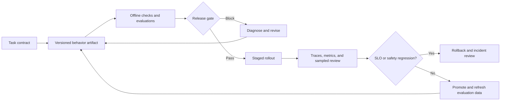
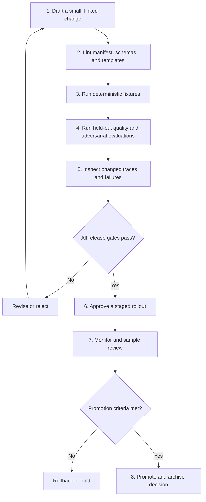
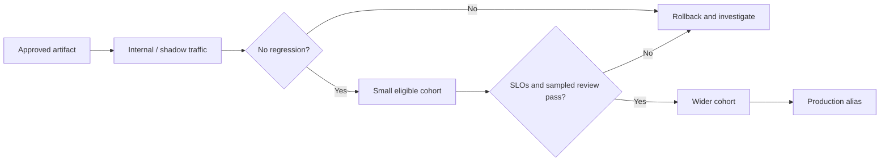
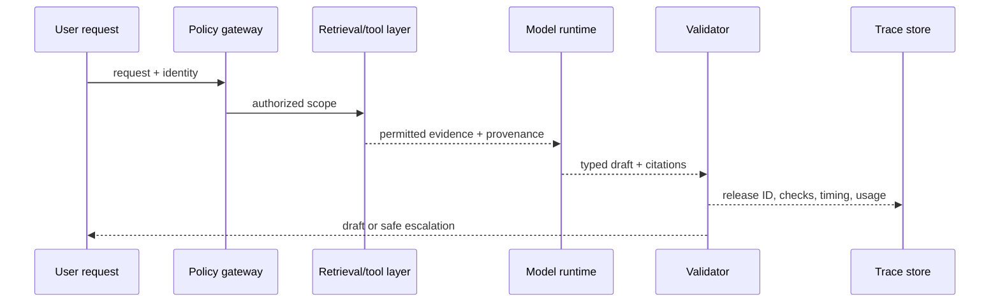

# PromptOps: operate prompts as evaluated, observable product behavior

**PromptOps** is the delivery and operating discipline for model behavior. It applies software delivery ideas—versioning, tests, controlled rollout, observability, ownership, and rollback—to the whole AI behavior contract, not merely to a system-prompt string.

This guide uses the running **Northstar Support** scenario. Northstar drafts evidence-backed support responses from authorized policy and order data. A candidate prompt may improve tone while quietly increasing unsupported claims, selecting the wrong tool, or exceeding a latency budget. PromptOps makes that change visible and reviewable before it becomes a customer incident.

## Learning outcomes

By the end, you should be able to:

- define a versioned release artifact for an LLM application;
- design offline, pre-production, and production feedback loops;
- write measurable quality, safety, cost, and latency release gates;
- use traces to diagnose a regression without collecting unnecessary customer data;
- choose an appropriate prompt registry, evaluation, and observability approach; and
- execute a staged rollout and rollback with named owners and evidence.

## 1. The PromptOps mental model

A prompt is executable product policy. It determines what evidence a model considers, how it formats output, whether it calls a tool, and when it should defer. Consequently, a change to the prompt, model, context policy, tool schema, examples, retrieval configuration, or output validator can change the user experience.



This is not a claim that prompts behave deterministically. It is an approach for making uncertain behavior **measurable, bounded, attributable, and recoverable**.

### What PromptOps is—and is not

| PromptOps is | PromptOps is not |
| --- | --- |
| A lifecycle for behavior-changing AI artifacts | A GUI for editing prompt text |
| An evidence-based release decision | A promise that a high eval score proves safety |
| A way to preserve context, model, tool, and evaluation lineage | An excuse to route authorization through a system prompt |
| A feedback loop that converts real failures into tests | Continuous production experimentation without consent, limits, or review |

The [OpenAI eval-driven system design guide](https://developers.openai.com/cookbook/examples/partners/eval_driven_system_design/receipt_inspection) makes the same central point: production improvement requires a loop that begins with measurable task outcomes, then uses traces and fresh examples to expand evaluation coverage.

## 2. Define the deployable behavior artifact

### Version more than the prompt

The smallest useful release unit is a **behavior artifact**: everything that can materially affect a response or action. Store source-controlled files together where practical, and emit their immutable IDs in every trace.

```text
prompt template
  + model/provider configuration
  + output JSON Schema and application validators
  + context/retrieval policy and knowledge revision
  + examples and tool descriptions
  + tool allow-list, approval policy, and policy-engine version
  + evaluation dataset, rubrics, and thresholds
  + runtime configuration (timeouts, token budgets, retry limits)
```

### A concrete release manifest

Keep the manifest human-readable and machine-checkable. This example is deliberately provider-neutral; an adapter translates it to the selected API.

```yaml
id: northstar-support-brief
release: 2026-08-09.2
prompt_revision: git:4a71c2d
model:
  provider: provider-adapter
  name: approved-model-alias
  parameters:
    temperature: 0
    max_output_tokens: 700
context:
  policy_index_revision: policies-2026-08-07
  tenant_filter_required: true
  max_evidence_items: 5
interface:
  output_schema: schemas/case_brief.v3.json
  validator_revision: git:1c9e6aa
tools:
  allow: [get_order, retrieve_policy]
  approval_required: [send_customer_message, change_refund]
evaluation:
  dataset: evals/support-regression.v12.jsonl
  rubric_revision: git:db91e43
  required_gates: [schema, tenant_isolation, groundedness, cost, latency]
runtime:
  max_tool_calls: 3
  timeout_seconds: 12
  retry_limit: 1
```

The exact storage mechanism is a product choice:

- **Git plus CI** is often enough for an early product: reviewable diffs, pull-request checks, tags, and ordinary rollback.
- A **prompt registry** helps teams centrally version templates, metadata, aliases, and promotion states. For example, [MLflow Prompt Registry](https://mlflow.org/docs/latest/genai/prompt-registry/index.html) connects immutable prompt versions with evaluation and tracing. Evaluate governance, exportability, access controls, and whether registry aliases are auditable.
- A **feature flag/configuration service** can target an already-approved release to a small cohort. Do not use it to bypass code review or evaluation.

### Exercise: identify an incomplete artifact

Northstar changes `"Be friendly"` to a longer tone instruction and switches to a newer model. The team records only the prompt text. What is missing?

1. The model/version and parameters, so the change cannot be reproduced.
2. The output and context-policy versions, so a regression cannot be attributed.
3. The evaluation data and thresholds, so “better” has no defined meaning.
4. The approval/policy configuration, so the action boundary could change unnoticed.

All four are missing. Treat this as an unreleasable change, not a documentation gap to fill later.

## 3. Build a behavior contract before a pipeline

Release automation should enforce a product contract, not generic “AI quality.” Write requirements in a form that can become a fixture, assertion, dashboard, or human-review task.

| Contract dimension | Northstar requirement | Evidence |
| --- | --- | --- |
| Task success | The response resolves the stated policy question or escalates uncertainty | Expert-labeled cases and review rubric |
| Groundedness | Every policy claim maps to retrieved, allowed evidence | Citation-ID validator plus sampled review |
| Security | No cross-tenant source appears; instructions in documents are treated as data | Isolation and injection fixtures |
| Interface | Output always parses as `CaseBrief` | JSON Schema/Pydantic validation |
| Operations | p95 below 4 seconds; cost below the declared budget | Trace metrics over representative load |
| Agency | The system drafts; it does not send or alter accounts | Tool-call assertions and policy audit events |

Avoid a single blended score. A high average can conceal a critical data leak or forbidden action. Classify failures by severity:

- **Blocker:** privacy breach, cross-tenant evidence, unsafe action, critical policy fabrication, invalid authorization.
- **Major:** wrong answer, unsupported recommendation, broken schema, or SLO violation on an important path.
- **Minor:** wording/style defect with correct, grounded content.

Only a release with zero blockers should be eligible for promotion. The business owner—not an automatic judge—sets the acceptable major/minor error budget.

## 4. The release pipeline, step by step



### Step 1 — Make a small hypothesis

Write the intended effect before editing. Example:

> Adding an explicit “cite every policy rule and escalate if no permitted source supports it” instruction will reduce unsupported policy claims without increasing p95 latency by more than 10%.

This prevents a vague request such as “make the assistant more reliable” from turning into an unreviewable prompt rewrite. Change one meaningful variable at a time when diagnosing: prompt wording, retrieval policy, model, tool description, output schema, or runtime limit.

### Step 2 — Run static and deterministic checks

Static checks validate files without asking a model: required manifest fields, valid JSON/YAML, template-variable coverage, schema compatibility, tool allow-lists, secret scanning, and link/data revision existence.

Deterministic fixtures validate invariants that must never depend on an LLM judge.

```python
def assert_trace_invariants(trace: dict) -> None:
    assert trace["release_id"] == "northstar-support-brief:2026-08-09.2"
    assert trace["tenant_id"] == trace["request_tenant_id"]
    assert set(trace["tool_names"]).issubset({"get_order", "retrieve_policy"})
    assert all(citation["id"] in trace["retrieved_evidence_ids"]
               for citation in trace["citations"])
    assert trace["action_executed"] is False
```

### Step 3 — Run offline evaluation suites

Use separate datasets for development, release comparison, and post-release investigation. A minimal suite should include:

- ordinary successful cases;
- ambiguous cases that should ask a question or escalate;
- previous bugs (each becomes a regression fixture);
- adversarial content such as prompt injection in retrieved text;
- tool timeouts, malformed records, and absent evidence; and
- cases segmented by language, customer tier, document type, or risk class where relevant.

Compare the candidate against the current production baseline on the **same** held-out cases. Preserve raw outputs and traces where your data policy permits. [OpenAI Evals](https://developers.openai.com/api/docs/guides/evals) and [Promptfoo](https://www.promptfoo.dev/docs/intro/) are examples of tools that can structure repeatable evaluations; use the tool that fits your providers, CI environment, data controls, and review workflow.

### Step 4 — Review deltas, not just dashboards

Automated metrics select where to look; they do not eliminate expert review. Sample:

- all blocker or major failures;
- all cases whose result changes relative to the baseline;
- high-impact customer segments;
- low-confidence/evidence-poor outputs; and
- a random sample of apparent successes.

Ask reviewers to compare the model response, evidence supplied, citations, tool sequence, version manifest, and rubric. A better-looking answer that cites an obsolete policy is a regression.

### Step 5 — Apply an explicit gate

```python
from dataclasses import dataclass


@dataclass
class ReleaseMetrics:
    blocker_failures: int
    groundedness: float
    task_success: float
    p95_latency_ms: int
    cost_per_success: float


def can_release(m: ReleaseMetrics) -> tuple[bool, list[str]]:
    reasons = []
    if m.blocker_failures:
        reasons.append("blocker safety or authorization failure")
    if m.groundedness < 0.97:
        reasons.append("groundedness below 0.97")
    if m.task_success < 0.90:
        reasons.append("task success below 0.90")
    if m.p95_latency_ms > 4_000:
        reasons.append("p95 latency over 4 seconds")
    if m.cost_per_success > 0.035:
        reasons.append("cost per successful task over budget")
    return (not reasons, reasons)
```

Thresholds above are examples, not universal targets. Establish them from user harm, business impact, baseline performance, and operating budget. For a medical, financial, or account-changing task, human review or a deterministic system may be required regardless of score.

## 5. Staged rollout: learn safely from production

Offline evaluation cannot cover every real input. Production rollout should therefore be gradual, reversible, privacy-aware, and bounded by predeclared stop conditions.



### Rollout choices

| Method | Best for | Guardrail |
| --- | --- | --- |
| Shadow evaluation | Compare a candidate without showing output to customers | Do not send shadow outputs to tools with side effects |
| Canary cohort | Small, low-risk, consented/eligible traffic segment | Predeclare cohort, duration, stop threshold, and owner |
| A/B experiment | Measuring a user outcome where alternatives are ethically appropriate | Randomize carefully; do not experiment on high-risk decisions |
| Feature flag | Fast rollback of an already approved artifact | Log assignment and ensure the old release remains available |

Do not use production traffic as a free training set. Apply minimization, redaction, retention limits, access controls, and consent/legal requirements before storing prompts, retrieved content, tool results, or human feedback.

## 6. Observability: make each answer explainable enough to operate

A trace should connect one user request to its release artifact, context selection, model calls, tool calls, validation, policy decisions, outcome, and cost/latency. This is the minimum evidence needed to distinguish a model regression from a retrieval failure, tool outage, bad source revision, or policy denial.



### A practical trace record

```json
{
  "trace_id": "tr_9ea1",
  "release_id": "northstar-support-brief:2026-08-09.2",
  "request_class": "return-policy",
  "request_tenant_id": "tenant-42",
  "model": {"provider": "provider-adapter", "name": "approved-model-alias"},
  "context": {"policy_revision": "policies-2026-08-07", "evidence_ids": ["eu-return-v3"]},
  "tools": [{"name": "retrieve_policy", "duration_ms": 81, "outcome": "ok"}],
  "validation": {"schema": "pass", "citations": "pass", "authorization": "pass"},
  "outcome": {"type": "draft", "human_feedback": null},
  "usage": {"input_tokens": 812, "output_tokens": 241, "latency_ms": 1180},
  "redaction_version": "telemetry-v4"
}
```

Use a consistent telemetry vocabulary where possible. [OpenTelemetry semantic conventions](https://opentelemetry.io/docs/concepts/semantic-conventions/) make traces and metrics easier to correlate across services; GenAI conventions continue to evolve, so pin instrumentation versions and review their stability before making them a hard external contract.

### Metrics that answer operational questions

| Question | Signals | Common diagnosis |
| --- | --- | --- |
| Did quality regress? | Task success, groundedness, escalation rate, human corrections | Prompt/model/context change or source drift |
| Did the system become expensive? | Input/output tokens, cached tokens, tool calls, cost per success | Context bloat, retries, model routing, or looping tools |
| Did it become slow? | p50/p95/p99 latency by stage | Provider, retrieval, tool, queue, or retry bottleneck |
| Is it safe? | Blocked tool calls, auth denials, injection detections, cross-tenant test failures | Boundary/policy defect; treat as security incident when appropriate |
| Can we explain a complaint? | Release ID, evidence IDs, tool arguments, validation outcome | Missing lineage or over-redacted telemetry |

Never log raw secrets, credentials, payment data, or unnecessary customer content just to improve debuggability. Prefer stable IDs, classification tags, hashes, redacted excerpts, and access-controlled trace views.

## 7. Detect drift and convert feedback into better tests

Drift is a change in the environment that invalidates an assumption: policy updates, new document templates, new customer vocabulary, provider model behavior changes, tool API changes, or shifts in the mix of requests. A dashboard alert is useful only if it routes to an owner and a response playbook.

```text
Signal changes → sample traces → classify failure → reproduce safely
    → add regression fixture → decide prompt/context/tool/model change
    → evaluate candidate → release or reject → monitor again
```

### Example: a groundedness regression

1. The weekly sample finds three responses citing a superseded EU returns policy.
2. The operator checks the trace: the prompt is unchanged; `policy_index_revision` is old.
3. The incident is assigned to the knowledge-source owner, not “the model team.”
4. The team fixes index freshness, adds a fixture with the old and new revisions, and requires that the newest authorized revision wins.
5. The candidate is evaluated and released through the normal gate.

This turns a production surprise into a durable product test. The [MLflow prompt-evaluation workflow](https://mlflow.org/docs/latest/genai/eval-monitor/running-evaluation/prompts/) is one current example of linking prompt versions, datasets, scores, and traces; the same lifecycle can be implemented with source control and a different observability stack.

## 8. Prompt optimization is an experiment, not an autopilot

Tools such as [DSPy](https://dspy.ai/) can search over prompt/program variants. Optimization is valuable when the task is well specified and the scoring signal represents real value. It is dangerous when a weak judge, tiny dataset, or opaque search process becomes the definition of “better.”

Use this sequence:

1. Freeze a held-out evaluation set and blocker tests.
2. Define a primary objective and non-negotiable constraints.
3. Optimize only on development data; preserve a record of candidate artifacts.
4. Run the held-out suite and inspect changed traces.
5. Require the normal release gate and human approval.
6. Monitor the rollout; keep the prior release ready.

```python
objective = {
    "maximize": "task_success",
    "constraints": {
        "blocker_failures": 0,
        "groundedness_min": 0.97,
        "p95_latency_ms_max": 4_000,
        "cost_per_success_max": 0.035,
    },
    "held_out_set": "support-regression.v12.jsonl",
}
```

The optimizer must not modify authorization policies, tool scopes, retention settings, or approval requirements. Those are application controls with separate security ownership.

## 9. Technology review: choose only what the operating model needs

| Need | Start with | Consider when scale/complexity justifies it | Verify before adoption |
| --- | --- | --- | --- |
| Artifact versioning | Git, pull requests, tags, CI | Prompt registry such as MLflow | Immutable revisions, export, access control, alias audit trail |
| Offline evaluation | JSONL fixtures plus Python assertions | OpenAI Evals, Promptfoo, custom evaluator platform | Held-out data, CI support, provider coverage, redaction |
| Trace/debug view | Structured logs with trace IDs | LangSmith, Phoenix, Weave, MLflow, OpenTelemetry backend | Data residency, retention, export, sampling, cost |
| Controlled rollout | Deploy/version configuration with rollback | Feature flags and experiment platform | Cohort targeting, assignment logging, emergency disable path |
| Policy enforcement | Application checks and IAM | OPA/central policy engine | Enforcement happens before data/tool access, decision is auditable |

The best early PromptOps stack is often small: Git, a repository eval suite, structured logs, a clear deployment/rollback command, and named owners. Add a registry or platform when manual coordination, cross-team reuse, analysis volume, or audit requirements create a measured problem.

## 10. Guided training: ship a Northstar candidate safely

### Part A — Write the hypothesis and manifest

Create `northstar-support-brief:2026-08-09.2`. Add one explicit evidence rule: *Every policy conclusion must cite an allowed source; if no source supports it, escalate.* Record the model alias, schema, policy revision, dataset, and runtime limits in the manifest.

**Checkpoint:** Can you reconstruct the exact behavior without reading a deployment chat message? If not, the manifest is incomplete.

### Part B — Add fixtures before changing the prompt

Create five cases: an ordinary return, an ambiguous policy exception, a document containing prompt injection text, a cross-tenant reference, and missing evidence. For each, define deterministic assertions and a reviewer rubric.

**Checkpoint:** Which assertion must be deterministic? Tenant isolation, citation IDs, tool allow-list, and action approval. Do not delegate these to an LLM judge.

### Part C — Compare baseline and candidate

Run both artifacts against the same held-out cases. Produce a table like:

| Metric | Baseline | Candidate | Gate |
| --- | ---: | ---: | --- |
| Blocker failures | 0 | 0 | Must remain 0 |
| Groundedness | 0.94 | 0.98 | ≥ 0.97 |
| Task success | 0.91 | 0.92 | ≥ 0.90 |
| p95 latency | 3.2 s | 3.6 s | ≤ 4.0 s |
| Cost per success | $0.028 | $0.032 | ≤ $0.035 |

**Checkpoint:** Promote only if the candidate passes every gate. An improvement to tone cannot compensate for a blocker failure.

### Part D — Simulate a post-release regression

Set the context revision to an obsolete policy in a test environment. Confirm that the trace shows the revision and source IDs, the evaluation fails, the alert has an owner, and the rollback selects the prior approved artifact.

**Reflection:** Was this a prompt failure, retrieval failure, or release-process failure? The answer determines the fix and the owner.

### Part E — Run the course lab

Run [the PromptOps capstone notebook](../notebooks/09_promptops_capstone.ipynb) and its credential-free [Python lab](../labs/09_promptops_capstone.py). First establish a passing candidate, then raise its cost above the declared budget and observe the release gate block it. Extend the lab by adding a tenant-isolation blocker and a trace field for `policy_index_revision`.

## 11. Rollback and incident response runbook

A prompt history without a tested recovery path is not operational resilience. Every release should name:

1. **Trigger:** the measurable stop condition—for example, any blocker, p95 above budget for 15 minutes, or a human-review threshold.
2. **Decision owner:** the on-call/product/security owner who can halt or rollback.
3. **Mechanism:** a documented flag, alias, deployment command, or configuration rollback that is access-controlled.
4. **Target:** the known-good artifact version, not “the previous prompt” remembered by a person.
5. **Verification:** deterministic smoke tests, a small eval slice, and metric confirmation after rollback.
6. **Communication:** affected teams, customer-support guidance, and an incident record when impact warrants it.

If a release exposes unauthorized data or executes an unapproved action, prioritize containment and incident response over prompt tuning. Preserve only the necessary, access-controlled forensic evidence and follow your organization’s security process.

## Operating checklist

- Can a trace identify the exact prompt, model, schema, context revision, tools, policy, and eval suite?
- Are blocker failures impossible to average away in a composite score?
- Are test data, production samples, and reviewer feedback governed by a retention/redaction policy?
- Can a reviewer reproduce a release comparison and inspect changed traces?
- Is staged rollout bounded by eligibility, duration, metrics, and a named owner?
- Has the rollback mechanism been exercised, not merely described?
- Does every production failure create or improve a regression fixture?

## Further learning and state-of-the-art references

- [OpenAI: Eval-driven system design](https://developers.openai.com/cookbook/examples/partners/eval_driven_system_design/receipt_inspection) — an end-to-end, evaluation-centred production lifecycle.
- [OpenAI Evals guide](https://developers.openai.com/api/docs/guides/evals) — official evaluation guidance.
- [Promptfoo documentation](https://www.promptfoo.dev/docs/intro/) — prompt/system evaluation and testing tooling.
- [MLflow Prompt Registry](https://mlflow.org/docs/latest/genai/prompt-registry/index.html) and [prompt evaluation](https://mlflow.org/docs/latest/genai/eval-monitor/running-evaluation/prompts/) — version, evaluate, trace, and promote prompt artifacts.
- [OpenTelemetry semantic conventions](https://opentelemetry.io/docs/concepts/semantic-conventions/) — common telemetry vocabulary; review GenAI convention stability before committing to it.
- [DSPy](https://arxiv.org/abs/2310.03714) — programming and optimization for language-model pipelines.
- [The Prompt Report](https://arxiv.org/abs/2406.06608) — survey of modern prompting methods and terminology.
- [OWASP LLM Top 10](https://genai.owasp.org/llm-top-10/) and [NIST AI RMF](https://www.nist.gov/itl/ai-risk-management-framework) — security and governance references.

Continue with [prompt evaluation](07-evaluation.md), [agentic prompts](08-agentic-prompts.md), [evaluation-driven prompt optimization](21-evaluation-driven-prompt-optimization.md), [cost and latency engineering](13-cost-latency-engineering.md), and [reliability and human-centred AI](19-reliability-and-human-centred-ai.md). PromptOps is the practice that connects their individual techniques into a system a team can safely improve.
