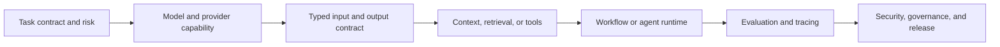
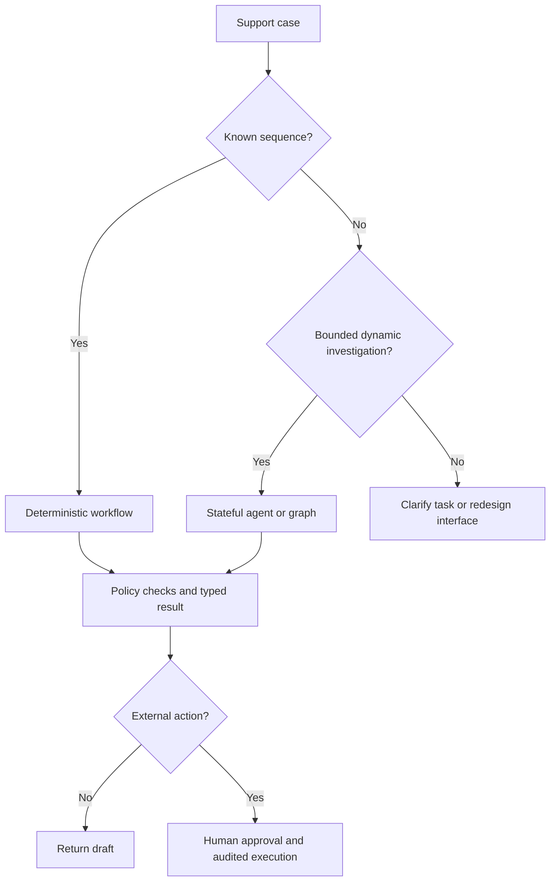

# Technology review: choose an AI application stack by evidence and control

Technology choice is part of prompt engineering because a prompt only works inside a larger contract: which model receives it, which context it sees, which tools it can call, how its output is checked, and who can approve a consequential action. This guide is deliberately **provider-aware but provider-neutral**. It teaches the questions that should survive a framework migration.

The running scenario is **Northstar Support**: a copilot drafts evidence-backed responses to customer cases. It may read tenant-authorized policy and order data, but it may not change an account or send a customer message without a separate approval path.

## Learning outcomes

By the end, you should be able to:

- select the smallest stack that can meet a measurable product contract;
- distinguish model capability, application control, and organizational governance;
- choose between direct lookup, search, retrieval, workflows, and agent orchestration;
- build typed and auditable boundaries around model output and tools; and
- compare technologies using representative evaluations instead of a polished demo.

## 1. Select in dependency order

Do not start with an agent framework or a vector database. Start with the job, then add a technology only when it solves a demonstrated requirement.



For every box, record: the requirement, the component that enforces it, the evidence that it works, the owner, and a failure mode. A vendor feature is not a control until it is configured, tested, monitored, and backed by a response procedure.

### The core stack map

| Layer | Main technologies | Use it when | Do not assume it provides |
| --- | --- | --- | --- |
| Model access | OpenAI, Anthropic, Gemini, cloud-hosted or self-hosted open-weight models | You need reasoning, generation, vision, or tool selection | Correctness, authorization, or a stable product interface |
| Typed contracts | JSON Schema, Pydantic, Zod, provider structured outputs | Another program, not just a human, consumes the result | Truth, source support, or policy compliance |
| Context and retrieval | SQL, APIs, full-text search, vector/hybrid search, rerankers, document parsers | The answer must use current or private evidence | Permission checks, freshness, or citations by itself |
| Tools and orchestration | Plain Python/TypeScript, OpenAI Agents SDK, LangGraph, Semantic Kernel, durable workflow engines | A process needs calls, state, routing, retries, or approval | Safe execution merely because a tool has a good description |
| Evaluation and observability | OpenAI Evals, Promptfoo, LangSmith, Phoenix, Weave, OpenTelemetry | You need repeatable quality and operational evidence | A complete definition of user value |
| Security and governance | IAM, policy engines, KMS/secret managers, audit logs, sandboxing, DLP | Data or actions have security, privacy, or compliance impact | That a system prompt can enforce access control |
| Serving and operations | Provider APIs, vLLM, TGI, SGLang, queues, caches, gateways | Scale, residency, availability, or unit economics justify it | Lower total cost without measuring operations |

## 2. Model providers and a portable model boundary

### What this layer does

A model provider supplies inference and model-specific capabilities: text and multimodal inputs, tool/function calling, structured output, batch processing, caching, and safety features. These change quickly, so treat provider documentation as the authority for current limits and behavior. The [OpenAI prompting guide](https://developers.openai.com/api/docs/guides/prompting), [Anthropic documentation](https://platform.claude.com/docs/en/home), and [Gemini API documentation](https://ai.google.dev/gemini-api/docs) are starting points, not interchangeable specifications.

### When to use managed APIs, cloud endpoints, or self-hosting

| Option | Use it when | Cost of the choice |
| --- | --- | --- |
| Managed model API | You want the fastest path to reliable inference and current platform features | Provider limits, data/governance review, and model migration work remain |
| Cloud-provider model endpoint | Your organization needs a particular cloud identity, network, region, or procurement boundary | More platform configuration and possible feature/version differences |
| Self-hosted open-weight model | License, residency, offline deployment, customization, or predictable high utilization justify operating inference | You own capacity, patching, performance, safety controls, observability, and incident response |

Do not select by a one-off benchmark. Run representative cases: simple answers, long-context cases, malformed input, low-confidence evidence, tool failures, and red-team prompts. Measure quality, refusal behavior where relevant, latency percentiles, rate-limit recovery, cost per successful task, and operational fit.

### Build an adapter, not provider logic throughout the product

Keep provider-specific request shapes behind a narrow interface. That makes model comparisons possible and stops a prompt, tool schema, or trace format from leaking across the codebase.

```python
from dataclasses import dataclass
from typing import Protocol


@dataclass
class ModelReply:
    text: str
    raw_response_id: str
    usage: dict[str, int]


class ModelClient(Protocol):
    def answer(self, *, instructions: str, user_input: str) -> ModelReply: ...


def draft_case_brief(client: ModelClient, case: str) -> ModelReply:
    return client.answer(
        instructions=(
            "Draft a support brief. Use only supplied evidence. "
            "State uncertainty explicitly and do not perform actions."
        ),
        user_input=case,
    )
```

An adapter does **not** mean every provider behaves identically. Put model-specific prompting notes, supported schemas, and fallback behavior in a capability matrix. Pin a model/version where the platform permits it, then re-run the evaluation suite before changing it.

## 3. Typed interfaces: JSON Schema, Pydantic, and Zod

### When this technology earns its place

Use a typed output contract whenever software routes, stores, grades, displays, or acts on model output. Provider structured-output features can constrain a response to a schema; [OpenAI's structured-output guide](https://developers.openai.com/api/docs/guides/structured-outputs) and [Gemini's structured-output guide](https://ai.google.dev/gemini-api/docs/structured-output) describe provider-specific support. In Python, [Pydantic](https://docs.pydantic.dev/latest/) validates data at the application boundary; in TypeScript, [Zod](https://zod.dev/) plays a similar role.

Schema conformance is necessary, not sufficient. A valid `answer` can still be wrong, unsupported, stale, or unauthorized. Pair parsing with semantic checks: citation IDs must exist, retrieved records must belong to the caller's tenant, and an escalation level must be allowed for the user and case.

```python
from pydantic import BaseModel, Field, field_validator


class CaseBrief(BaseModel):
    answer: str = Field(min_length=1, max_length=1_500)
    evidence_ids: list[str] = Field(min_length=1, max_length=5)
    confidence: float = Field(ge=0, le=1)
    escalation: bool

    @field_validator("evidence_ids")
    @classmethod
    def unique_evidence(cls, ids: list[str]) -> list[str]:
        if len(set(ids)) != len(ids):
            raise ValueError("Evidence IDs must be unique")
        return ids


def validate_brief(raw: dict, allowed_evidence: set[str]) -> CaseBrief:
    brief = CaseBrief.model_validate(raw)
    unknown = set(brief.evidence_ids) - allowed_evidence
    if unknown:
        raise PermissionError(f"Unretrieved or unauthorized evidence: {unknown}")
    return brief
```

Use versioned schemas for durable APIs. Add fields compatibly when possible, log parse failures without logging secrets, and define a repair/retry policy with a small bound. Never silently coerce a critical field such as an account ID, payment amount, or authorization decision.

## 4. Context and retrieval technologies

### Choose the least lossy data path

Retrieval is not synonymous with a vector database. The best context mechanism depends on the question.

| Data need | First choice | Add semantic retrieval when | Example |
| --- | --- | --- | --- |
| Exact live fact | Authorized API or SQL query | The user asks a broad semantic question over documents | Current order status |
| Small stable policy | Curated prompt or deterministic lookup | Policies become too large or change frequently | Return window |
| Large document corpus | Keyword/full-text search with metadata filters | Vocabulary mismatch or paraphrase causes misses | Support runbooks |
| Conceptual knowledge | Hybrid keyword + vector retrieval, then reranking | Precision at top-k is insufficient | “How do I resolve a delayed payout?” |
| Tables, images, scans | Structured extraction, OCR, and provenance-preserving chunks | A model must compare text and visual/table evidence | Invoice exception review |

The original [Retrieval-Augmented Generation paper](https://arxiv.org/abs/2005.11401) established the evidence-grounding pattern. Later work such as [HyDE](https://arxiv.org/abs/2212.10496) explores query transformations, but a sophisticated retrieval method is not a reason to skip access control or evaluation.

### Technology choices

- **Relational and document stores** are usually best for authoritative records and exact filters. Keep source-of-truth ownership clear.
- **Full-text engines** such as [Elasticsearch](https://www.elastic.co/guide/en/elasticsearch/reference/current/semantic-search.html) or OpenSearch are strong when exact words, facets, filters, and ranking explainability matter.
- **Vector search** options include [pgvector](https://github.com/pgvector/pgvector), [Qdrant](https://qdrant.tech/documentation/), [Weaviate](https://docs.weaviate.io/), and managed services such as [Pinecone](https://docs.pinecone.io/). Use them where semantic similarity improves recall over controlled chunks and metadata.
- **Hybrid retrieval and reranking** often improve precision: retrieve broadly with lexical and semantic signals, then use a reranker to choose a small evidence set. Measure this on your corpus; it is not automatically better.
- **Frameworks such as [LlamaIndex](https://docs.llamaindex.ai/)** can accelerate ingestion, indexing, and retrieval experiments. They do not replace a data ownership, deletion, or authorization design.

### Security-critical retrieval example

Filter access before ranking, preserve source metadata, and give the model only the allowed results. Never retrieve across all tenants and try to hide records afterward.

```python
def retrieve_policy(query: str, *, tenant_id: str, user_id: str) -> list[dict]:
    filters = {"tenant_id": tenant_id, "visibility": "support"}
    candidates = hybrid_search(query=query, filters=filters, limit=20)
    authorized = [c for c in candidates if can_read(user_id, c["document_id"])]
    return rerank(query=query, documents=authorized)[:5]
```

Return document IDs, titles, revision dates, and excerpts with the answer. Test isolation with adversarial queries that name another tenant, use ambiguous identifiers, or try to override the system instruction inside a document.

## 5. Tools, protocols, and orchestration

### Start with ordinary code

For a known sequence—fetch an order, retrieve the applicable policy, format a response—plain functions and a deterministic workflow are easiest to test. Add a model decision only where ambiguity is genuinely useful. Add an agent loop only when the route or tool sequence cannot be enumerated and that flexibility improves measured results.



### Managed agent SDKs

The [OpenAI Agents SDK](https://openai.github.io/openai-agents-python/) is useful when a managed loop, typed tools, handoffs, guardrails, sessions, and tracing reduce implementation work. Its value is not that it makes an agent safe by default: the application still owns authorization, tool scopes, approval, and evaluation. OpenAI's [agent improvement loop](https://developers.openai.com/cookbook/examples/agents_sdk/agent_improvement_loop) is a useful example of treating prompts, tools, routing, validation, and traces as one testable harness.

### Explicit stateful orchestration

Use [LangGraph](https://docs.langchain.com/oss/python/langgraph/overview) when a long-running process needs explicit state, conditional paths, persistence, interruption, or recovery. Its [persistence model](https://docs.langchain.com/oss/python/langgraph/persistence) checkpoints state and supports resumable human review. That additional power is valuable for a claim investigation or approval workflow, and needless for a two-step formatting task.

### Enterprise plugin integration

[Semantic Kernel](https://learn.microsoft.com/en-us/semantic-kernel/concepts/kernel) is a reasonable choice where its service/plugin model fits an existing Microsoft or multi-language application. Its [plugins](https://learn.microsoft.com/en-us/semantic-kernel/concepts/plugins/) can package native code, OpenAPI-described operations, and MCP servers. Model-visible descriptions are still security-sensitive interfaces: expose narrow, well-documented functions and keep authorization in the invoked service.

### Protocols and durable workflow engines

MCP and OpenAPI can standardize tool interfaces across clients and languages. They are interoperability mechanisms, **not trust boundaries**. Verify server identity, scopes, data handling, input validation, and egress permissions before exposing a remote tool. For long-running deterministic business processes, a workflow engine such as Temporal or an application queue may be a better fit than an agent framework: it gives retries, durable state, and auditability without delegating routing to a model.

| Need | Smallest useful technology | Escalate when |
| --- | --- | --- |
| One safe lookup | Typed function | The sequence varies based on evidence |
| Known multi-step process | Ordinary workflow code or durable workflow engine | Model must select among bounded investigations |
| Stateful investigation with pauses | LangGraph or equivalent stateful runtime | Multiple independent specialists materially improve the result |
| Model/tool loop with managed tracing and handoffs | OpenAI Agents SDK or equivalent | You need explicit durable graph semantics or enterprise plugin integration |
| Existing enterprise service/plugin ecosystem | Semantic Kernel | A thin function adapter would be easier and sufficient |

## 6. Evaluation, tracing, and prompt optimization

### Evaluation is a product technology, not a final test

Use an eval stack from the first prototype. [OpenAI Evals](https://developers.openai.com/api/docs/guides/evals) supports systematic evaluation design; [Promptfoo](https://www.promptfoo.dev/docs/intro/) is useful for provider comparisons, assertions, and CI-style tests; [LangSmith](https://docs.smith.langchain.com/) connects traces and evaluation for LangChain/LangGraph ecosystems; [Arize Phoenix](https://docs.arize.com/phoenix) and [Weave](https://weave-docs.wandb.ai/) provide additional tracing/evaluation options.

Select tools by exportability, privacy controls, dataset/rubric support, local/CI execution, trace correlation, price, and whether reviewers can reproduce a failed run. Do not centralize sensitive prompts and production data in an observability product without a retention and redaction review.

```python
evaluation_case = {
    "id": "eu-refund-window-004",
    "input": "Can this EU order be returned after 31 days?",
    "allowed_sources": ["policy-return-eu-v3"],
    "must_include": ["30 days", "escalate"],
    "must_not_include": ["invented exception"],
    "max_latency_ms": 4_000,
}
```

Score more than the final prose:

- **Outcome:** accuracy, completeness, grounding, usefulness, calibration, and safety.
- **Trajectory:** selected sources/tools, arguments, retries, unnecessary calls, and attempted forbidden actions.
- **Operations:** latency percentiles, tokens, cache behavior, failure/retry rate, and **cost per successful task**.

Use held-out cases. Calibrate any LLM-as-judge against human labels, analyze disagreements, and keep deterministic checks for properties such as JSON validity, citation IDs, tenant scope, and prohibited actions. [RAGAS](https://arxiv.org/abs/2309.15217) is useful background on retrieval-generation evaluation dimensions, but its metrics should be validated for your domain rather than adopted blindly.

### Prompt/program optimization

[DSPy](https://dspy.ai/) treats prompts and modules as optimizable programs; [Promptfoo](https://www.promptfoo.dev/) can compare variants against a test set. Use optimization only after writing the task contract and evaluation suite. Split train, development, and held-out evaluation sets; preserve safety and style assertions; inspect the resulting prompt; and repeat tests after a model change. Otherwise an optimizer can overfit to a narrow judge or teach the system to exploit your metric.

## 7. Security, authorization, and governance technologies

Prompt instructions are advisory. Controls for identity, data access, and external effects must live outside the model.

| Control | Typical technologies | What to verify |
| --- | --- | --- |
| Identity | OIDC/OAuth, workload identity, service accounts | User and workload identity reach every data/tool call |
| Authorization | Application policy, RBAC/ABAC, [Open Policy Agent](https://www.openpolicyagent.org/docs/latest/) | Decision is enforced before retrieval/action and logged |
| Secrets | Cloud secret manager, KMS, Vault | No keys in prompts, notebooks, traces, or client-side code |
| Action containment | Narrow APIs, scopes, sandboxes, approval queues | Model cannot bypass a high-risk approval path |
| Monitoring | Immutable audit events, redacted traces, alerts | Events link request, identity, policy decision, tool call, and outcome |
| Risk process | [NIST AI RMF](https://www.nist.gov/itl/ai-risk-management-framework), [OWASP LLM Top 10](https://genai.owasp.org/llm-top-10/) | Threat model, tests, owners, and incident response are maintained |

```python
def authorize_action(actor: dict, action: str, resource: dict) -> None:
    decision = policy_engine.evaluate(
        subject=actor["id"], action=action, resource=resource
    )
    audit_log.write({"actor": actor["id"], "action": action, "allow": decision.allow})
    if not decision.allow:
        raise PermissionError("Policy denied action")
    if action in {"send_customer_message", "change_refund"}:
        raise RequiresHumanApproval(action)
```

The model can propose a structured action request; it should never be the authority that grants itself permission. Threat-model retrieved text and tool responses as untrusted input. Restrict outbound network access, validate tool arguments, redact sensitive telemetry, and test prompt injection, cross-tenant retrieval, and confused-deputy scenarios.

## 8. Serving, performance, and self-hosted inference

Managed APIs are the default for a new course project because they remove significant inference operations. Consider self-hosted serving only when data residency, custom model selection, traffic volume, latency control, or offline requirements justify the operational burden. Technologies such as [vLLM](https://docs.vllm.ai/) and [Hugging Face Text Generation Inference](https://huggingface.co/docs/text-generation-inference/index) address efficient serving; the [vLLM paper](https://arxiv.org/abs/2309.06180) explains its PagedAttention approach.

Before migrating, measure the complete workload: prompt length distribution, concurrency, output length, peak traffic, warm-up behavior, model upgrades, GPU utilization, retry traffic, and on-call cost. Optimize the system before the model call: remove redundant context, cache stable retrieval results where policy allows, batch offline work, stream user-visible output, and route simple tasks to a smaller acceptable model. See [cost and latency engineering](13-cost-latency-engineering.md) for a guided experiment.

## 9. Guided build: Northstar Support, in three stages

### Stage 1 — A safe, testable baseline

Build a provider adapter, a `CaseBrief` schema, a deterministic authorized policy lookup, a small golden dataset, and a trace record. The copilot returns a draft with source IDs. There is no agent and no vector database yet.

**Why this is enough:** the task sequence is known, policy is authoritative, and a human sends the final message.

### Stage 2 — Add retrieval only after measuring a gap

If policy vocabulary varies and full-text lookup misses relevant passages, add hybrid retrieval with tenant/visibility filters before search, revision metadata, and reranking. Add eval cases for paraphrases, stale revisions, misleading documents, and unauthorized records.

**Decision checkpoint:** did grounded answer quality improve enough to justify index freshness, deletion, and authorization operations?

### Stage 3 — Add controlled dynamic investigation

If a case requires choosing among order history, policy, outage status, and a ticket system, introduce a bounded tool loop or explicit state graph. Define tool schemas, maximum calls, timeout/retry behavior, trace requirements, and a human approval gate for any action.

**Decision checkpoint:** compare the agentic path with the deterministic baseline on quality, latency, cost, and safety. Keep the simpler architecture for cases where it wins.

## 10. Procurement and architecture checklist

Before adopting a technology, answer these questions in writing:

1. Which user outcome or risk does it improve, and what baseline proves the gap?
2. Where do identity and tenant filters execute—before retrieval and before tool execution?
3. Can the component export or delete data, prompts, traces, and embeddings as required?
4. How are model and dependency versions pinned, evaluated, rolled back, and audited?
5. What happens on malformed output, timeout, rate limit, stale index, policy denial, or provider outage?
6. Which data is retained, where, for how long, and how is telemetry redacted?
7. What is the real cost per successful task, including retrieval, retries, tracing, storage, and people?
8. Can you reproduce a production failure locally or in a safe environment without exposing customer data?
9. What is the exit path if the provider, framework, or hosted index no longer fits?

## Common anti-patterns

| Anti-pattern | Why it fails | Better choice |
| --- | --- | --- |
| Selecting an agent framework before defining the task | Complexity becomes the architecture. | Start with a workflow and representative test set. |
| Treating structured output as semantic correctness | Valid JSON can still be ungrounded or unsafe. | Validate evidence, policy, and domain invariants after parsing. |
| Adding vector search to every task | Retrieval adds freshness, scope, and ranking failure modes. | Use direct APIs or deterministic lookup where they suffice. |
| Treating MCP/tool descriptions as an authorization system | A model can propose calls outside a user's rights. | Enforce scopes and approval in the service that performs the action. |
| Choosing by demo quality alone | Demos conceal edge cases, costs, and recovery behavior. | Compare on held-out traces, red-team cases, latency, and cost per success. |
| Self-hosting because token price looks lower | Hardware and operations can dominate the bill. | Model the full utilization and reliability envelope first. |

## Further learning and state-of-the-art references

- [The Prompt Report](https://arxiv.org/abs/2406.06608) — broad survey of prompting techniques and terminology.
- [Retrieval-Augmented Generation for Knowledge-Intensive NLP Tasks](https://arxiv.org/abs/2005.11401) — foundational RAG paper.
- [Precise Zero-Shot Dense Retrieval without Relevance Labels (HyDE)](https://arxiv.org/abs/2212.10496) — query-transformation retrieval research.
- [RAGAS](https://arxiv.org/abs/2309.15217) — evaluation dimensions for retrieval-augmented generation.
- [OpenAI Evals guide](https://developers.openai.com/api/docs/guides/evals) and [agent improvement loop](https://developers.openai.com/cookbook/examples/agents_sdk/agent_improvement_loop) — current official evaluation and trace-to-improvement guidance.
- [LangGraph overview](https://docs.langchain.com/oss/python/langgraph/overview) and [persistence](https://docs.langchain.com/oss/python/langgraph/persistence) — explicit stateful orchestration and resumable review.
- [OWASP LLM Top 10](https://genai.owasp.org/llm-top-10/) and the [NIST AI RMF](https://www.nist.gov/itl/ai-risk-management-framework) — risk and control references.

Continue with [RAG and tool prompting](04-rag-tools.md), [PromptOps](08-promptops.md), [Evaluation-driven prompt optimization](21-evaluation-driven-prompt-optimization.md), and [Cost and latency engineering](13-cost-latency-engineering.md). The technology decision is sound only when it supports the task contract those guides make measurable.
