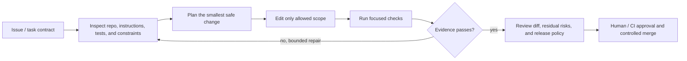
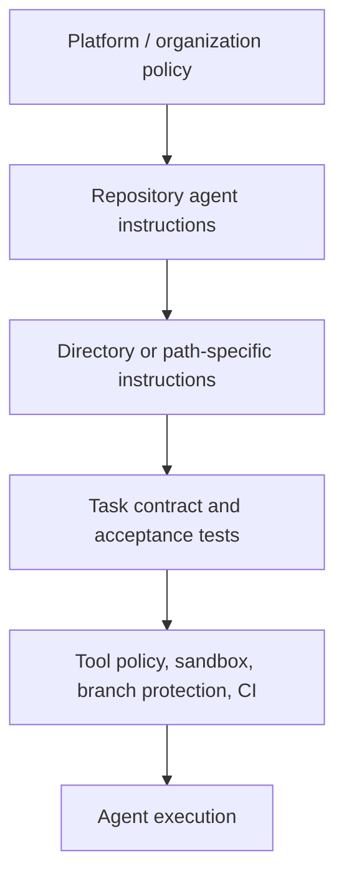
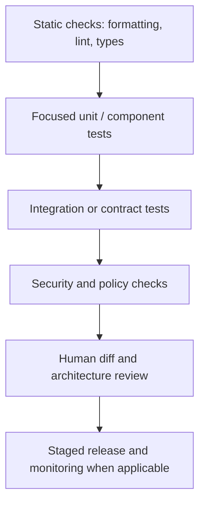

# Prompt engineering for coding agents: from issue to verified change

Coding agents are best understood as **software-change systems**, not autocomplete with shell access. They interpret a request, inspect a repository, make hypotheses, edit files, run tools, observe failures, and produce a diff that someone must be able to review and ship safely. Their output is not “some code”: it is a bounded, verified change with evidence and residual risk.

This lesson teaches a portable workflow first, then shows how current major coding-agent products expose it differently. Product capabilities change quickly; the durable practice is to encode repository knowledge, constrain authority, verify behavior, and review the result.

> **Non-negotiable boundary:** agent instructions can guide behavior, but they cannot replace branch protection, access control, secret isolation, sandboxing, code review, CI, migration policy, or deployment approvals.

## Learning outcomes

By the end, you can:

1. Turn an ambiguous engineering request into a testable change contract.
2. Choose direct edit, plan-first execution, or an isolated/background task based on risk and scope.
3. Give an agent only the context, tools, permissions, and time budget needed for the task.
4. Design a verification loop that uses tests and diffs as evidence, not an agent's confidence.
5. Adapt the same workflow to Codex, Claude Code, GitHub Copilot, Gemini CLI, and Cursor without locking the repository to one product.

## 1. The coding-agent mental model

An effective agent loop is explicit. The model can propose and execute within granted bounds; the repository and delivery system decide what is actually acceptable.



The minimum useful state for an agent is:

```text
Goal + scope + repository facts + allowed tools + acceptance tests
+ change budget + stop/escalation rules + required final report
```

If a task has known, deterministic steps, prefer a normal script or workflow. Use an agent when it must inspect unfamiliar code, choose among bounded repair options, or iteratively interpret test feedback. [Agentless](https://arxiv.org/abs/2407.01489) is a valuable reminder that a simple localization → repair → validation pipeline can outperform unnecessary autonomous complexity on some issue-resolution tasks.

## 2. Start with a software-change contract

“Build authentication” hides architecture, data migration, security, compatibility, and release choices. A good task separates what is known from what must be discovered.

### Baseline request: too vague

```text
Add OIDC login to the service and make it secure.
```

The agent has no definition of the existing session model, identity provider, schema ownership, expected failure behavior, or deployment approval boundary. It may confidently invent all of them.

### Stronger contract

```text
Goal
Add OIDC login to the existing service. Preserve the public session API.

Discover before editing
Inspect the current auth module, configuration loader, auth tests, database migration
conventions, and deployment documentation. Report unknown decisions before implementation.

Scope and constraints
- Use the existing PostgreSQL users table; do not add a new identity store.
- Do not add secrets, tokens, or provider credentials to source, fixtures, logs, or docs.
- Do not change deployment, CI, dependencies, or unrelated modules without explicit approval.
- Existing session cookie behavior and API error shape must remain compatible.

Plan
Before editing, list affected files, proposed interfaces, migration need, tests, and
one risk per change. Stop for approval if the plan requires a broad refactor or dependency change.

Acceptance
- Tests cover successful login, expired/invalid token, role denial, and safe error response.
- Existing auth tests still pass.
- Run the documented unit and integration checks; report exact commands and outcomes.

Final report
Summarize changed files, behavioral change, test evidence, skipped checks, and residual risk.
Do not deploy, modify production state, or claim the feature is secure without review.
```

### Why this works

The contract establishes **invariants** (session API, secret handling), a discovery phase, a small-plan boundary, acceptance evidence, and an escalation condition. It does not force the agent to guess its way through ambiguity.

## 3. Step-by-step training: repair a Northstar endpoint safely

### Scenario

Northstar Support Copilot needs an audited `POST /refund-requests` endpoint. It may create a *request* for review but must never execute a refund. The request must be associated with the authenticated customer, use an idempotency key, and expose no internal payment data.

### Step 1 — classify the task and risk

| Question | Northstar answer | Design implication |
| --- | --- | --- |
| Is the desired behavior precise? | Mostly: create a review request, not a refund. | A plan-first, bounded change is suitable. |
| Does it touch a high-impact boundary? | Yes: customer identity and payment-adjacent data. | Human review and authorization tests are mandatory. |
| Are schema changes likely? | Possibly. | Agent must inspect migration conventions and stop for approval if needed. |
| Can tests verify it? | Yes. | Define tests before implementation and run them in CI. |

### Step 2 — ask for reconnaissance, not code

```text
Do not edit files yet. Inspect the route registration, authentication middleware,
request-validation patterns, refund domain model, existing idempotency handling,
and relevant tests. Return:
1. the likely files and symbols involved;
2. existing conventions we must preserve;
3. unknown decisions or risks;
4. the smallest testable plan.
```

This avoids an expensive and error-prone “search the entire repository then rewrite it” behavior. Good agents use repository search, tests, and local documentation as evidence, but their summary should identify files and symbols so a human can verify the claim.

### Step 3 — review a bounded plan

Require the plan to look like this:

```text
1. Add a `RefundRequestInput` validator with order ID and reason limits.
2. Reuse `require_authenticated_customer`; never accept a customer ID from the body.
3. Call `create_refund_request`, which writes an auditable pending record only.
4. Add tests for owner/non-owner, duplicate idempotency key, invalid reason, and no-execute invariant.
5. Run focused route/domain tests, then the existing auth suite.

Stop: if a database migration, payment-provider call, or dependency change is required.
```

An affected-files plan is not bureaucracy: it provides a scope budget. If implementation begins touching unrelated directories, stop and re-evaluate.

### Step 4 — encode acceptance in tests and validators

```python
def test_customer_can_create_pending_refund_request(client, customer, order):
    response = client.post(
        "/refund-requests",
        headers={"Idempotency-Key": "case-42"},
        json={"order_id": order.id, "reason": "Duplicate charge visible in statement"},
        as_user=customer,
    )
    assert response.status_code == 202
    assert response.json["status"] == "pending_review"
    assert payment_gateway.refund_calls == []  # proposal is not execution

def test_customer_cannot_request_refund_for_another_customers_order(client, customer, other_order):
    response = client.post(
        "/refund-requests",
        json={"order_id": other_order.id, "reason": "Please review this request"},
        as_user=customer,
    )
    assert response.status_code == 404  # avoid leaking existence of another customer's order
```

Tests are more valuable than an instruction such as “be secure.” The agent should add or adapt tests in the repository's style, but it must not weaken existing assertions simply to make the suite pass.

### Step 5 — verify and report evidence

The final report should be structured and falsifiable:

```text
Changed: api/refund_requests.py, domain/refund_requests.py, tests/test_refund_requests.py
Behavior: authenticated owner can create a pending, idempotent review request; no refund action is called.
Checks: pytest tests/test_refund_requests.py (pass); pytest tests/test_auth.py (pass)
Not run: full integration suite (requires local payment sandbox not available here)
Residual risk: migration was not required; payment-provider behavior remains intentionally out of scope.
Review requested: verify authorization semantics and the no-execute invariant.
```

“Done” is not evidence. A reviewable diff, exact test output, and explicit skipped checks are.

## 4. Coding-agent instruction hierarchy

Durable repository guidance should be version-controlled, concise, and scoped. It complements, rather than replaces, the task prompt.



### What belongs in a repository instruction file

- Repository map: major packages, ownership boundaries, generated files, and source-of-truth locations.
- Commands: deterministic setup, focused test, full test, lint, type check, and build commands.
- Code conventions that are non-obvious or locally important.
- Safety/release rules: migrations, dependencies, secrets, production access, generated artifacts, and protected files.
- Review expectations: tests required for a class of change, docs that must be updated, and a final-report format.

Avoid a giant restatement of generic style guidance. Long, stale instructions consume context and become another source of contradictions. Keep durable rules stable; put task-specific detail in the task contract.

## 5. Major coding-agent families: product-specific techniques

The table below is intentionally focused on practices with durable engineering value. Verify product behavior against the linked official documentation before adopting an operational workflow.

| Agent family | Useful product-specific mechanism | How to use it well | Guardrail |
| --- | --- | --- | --- |
| **OpenAI Codex** | Repository guidance through `AGENTS.md`; task-level plans, tools, tests, and review workflow. | Put reproducible commands, constraints, and review expectations in `AGENTS.md`; give a task contract with an explicit completion criterion. Ask for tests, relevant checks, and a final diff/risk review. | Do not treat tool approval as a substitute for branch protection or human code review. |
| **Claude Code** | `CLAUDE.md` project memory, plan mode, permission modes, and PR review. | Use plan-first for multi-file or unfamiliar work; keep `CLAUDE.md` concise with commands and local conventions; review the plan before allowing broad edits. | Permission modes grant operational authority; minimize it and avoid automatically approving high-impact commands. |
| **GitHub Copilot** | Repository/path-specific instructions and custom agent profiles. | Keep repo-wide rules in `.github/copilot-instructions.md`; put narrow instructions under `.github/instructions/`; create a custom agent only when its tool set and role are genuinely different. | Confirm which instruction files apply in the surface you use; support differs across IDE, cloud agent, and code review. |
| **Gemini CLI** | Project context through `GEMINI.md` and explicit context/memory controls. | Put project-specific commands, architecture boundaries, and verification rules in `GEMINI.md`; keep it focused and inspect active context when debugging behavior. | Project context is guidance, not permission to run arbitrary commands or expose secrets. |
| **Cursor** | Scoped `.cursor/rules`, `AGENTS.md` compatibility, and isolated background agents. | Prefer narrow path-scoped rules for different subsystems. Treat a background agent as a remote environment: give a deterministic install command, least GitHub permission, and an explicit branch/review handoff. | Background agents may execute commands and have network access; use isolated environments, restrict secrets, and review every branch. |

### Codex: portable guidance plus verifiable workflow

Current OpenAI guidance recommends defining the coding agent's role, giving structured tool-use examples where relevant, and requiring testing/validation. It also emphasizes planning and progress tracking for long-running work. The reusable pattern is:

```text
Read AGENTS.md and the nearest applicable repository docs first.
Inspect before editing. For changes spanning more than one subsystem, propose a plan.
Use the minimum tools and files needed. Run the documented focused checks.
Do not change dependencies, credentials, CI, migrations, or deployment configuration unless asked.
End with changed files, verification evidence, and residual risks.
```

See [OpenAI coding guidance](https://developers.openai.com/api/docs/guides/prompt-engineering#coding), [OpenAI code generation](https://developers.openai.com/api/docs/guides/code-generation#use-codex), and [Codex best practices](https://learn.chatgpt.com/guides/best-practices#improve-reliability-with-testing-and-review).

### Claude Code: plan mode and `CLAUDE.md`

Claude Code's project memory file is useful for durable project facts; plan mode is useful when a task's approach or blast radius is uncertain. Do not make either universal: a tiny, clear rename does not need a heavyweight planning cycle. A good `CLAUDE.md` makes commands and boundaries discoverable:

```markdown
# Repository guidance

## Commands
- Focused unit tests: `pytest tests/unit -q`
- Full validation: `make check`

## Boundaries
- `migrations/` requires human approval.
- Never log access tokens or customer payloads.
- The payment gateway is test-double only in local tests.
```

Sources: [Claude Code best practices](https://code.claude.com/docs/en/best-practices), [project memory overview](https://code.claude.com/docs/en), [permission modes](https://code.claude.com/docs/en/permission-modes), and [code review](https://code.claude.com/docs/en/code-review).

### GitHub Copilot: layered instructions and custom agents

Copilot supports repository-wide and path-specific instruction files as well as custom agent profiles. Use the smallest durable layer:

```text
.github/copilot-instructions.md                 # repository-wide conventions
.github/instructions/api.instructions.md        # API-specific validation and test rules
.github/agents/security-review.agent.md         # specialized role/tool profile, if justified
AGENTS.md                                       # portable agent guidance where supported
```

Put file patterns and clear scopes in path-specific guidance. A generic persona is not a custom agent; create one only when it needs a different approved tool set, workflow, or acceptance rubric. Sources: [Copilot custom instructions support](https://docs.github.com/en/copilot/reference/custom-instructions-support) and [Copilot custom agents](https://docs.github.com/en/copilot/concepts/agents/cloud-agent/about-custom-agents).

### Gemini CLI: `GEMINI.md` as focused project context

`GEMINI.md` can supply project-specific context. Favor short, operational information the agent cannot reliably infer: commands, generated-file policy, folder ownership, expected test workflow, and how to ask for approval. Keep secrets and long logs out of it. Sources: [GEMINI.md documentation](https://google-gemini.github.io/gemini-cli/docs/cli/gemini-md.html) and [Gemini CLI context/memory guidance](https://geminicli.com/docs/cli/tutorials/memory-management/).

### Cursor: scoped rules and remote-agent risk

Cursor rules can attach by path, which is useful when backend, frontend, and infrastructure require different constraints. Its background agents are asynchronous remote environments, so the prompt must include branch, environment, test, and handoff expectations—not just a coding goal. The agent's network, command, repository-write, and secret exposure must be treated as an explicit threat-model boundary. Sources: [Cursor rules](https://docs.cursor.com/context/rules-for-ai) and [Cursor background agents](https://docs.cursor.com/background-agent).

## 6. Choose the execution mode by blast radius

| Change type | Recommended mode | Required evidence |
| --- | --- | --- |
| Typo, isolated test, narrow refactor with clear behavior | Direct bounded edit | Focused test or static check; diff review. |
| Multi-file feature or unfamiliar subsystem | Read-only reconnaissance → human-reviewed plan → bounded implementation | Affected-files plan, acceptance tests, focused/full checks. |
| Migration, dependency/security change, auth/payment behavior | Plan and explicit approval before each high-impact boundary | Threat/risk review, rollback plan, CI, code owner approval. |
| Long-running or remote/background task | Isolated environment and branch; no production credentials | Environment manifest, network/secrets policy, test output, PR review. |
| Incident fix | Tight scope and time budget; prefer reversible mitigation | Reproduction evidence, rollback, post-change monitoring. |

## 7. Tool engineering for coding agents

Broad tools make vague prompts dangerous. Prefer narrow, auditable commands and wrappers.

| Weak capability | Safer alternative |
| --- | --- |
| `shell(command: str)` with broad permission | Approved command families; sandboxed execution; working-directory restriction; timeout. |
| `git_push(branch: str)` | Create a branch and PR only; protected default branch; required CI/review. |
| `deploy(environment: str)` | Generate a deployment plan and require an external approval workflow. |
| `read_secret(name: str)` | Inject only the scoped secret into a controlled runtime if truly necessary; never expose value to the model. |
| `database_query(sql: str)` | Read-only parameterized queries or a limited domain tool; no production writes. |

Tool output is also untrusted. Build logs, issue text, documentation, and terminal output can contain misleading instructions. Treat them as evidence to inspect, not as authority to change scope or exfiltrate data. See [Prompt security](06-prompt-security.md).

## 8. Verification hierarchy: what evidence is enough?



No one layer proves the entire change. Tests can miss a requirement; a code review can miss a race; a passing build can hide a migration issue. For each task, state the missing evidence and who owns it.

### A review prompt that produces actionable evidence

```text
Review this diff against the task contract. Find only issues that could cause
incorrect behavior, a regression, a security/privacy failure, an authorization
violation, data loss, or a missing required test. For each finding, cite the
file and symbol, explain a realistic failure scenario, and propose the smallest
fix. Do not report style preferences already enforced by the formatter.
```

Run a review model or agent as a second signal, not the sole merge authority. Its findings should be treated like any other review: inspect evidence, reproduce where possible, and decide through the repository's normal review policy.

## 9. Evaluate coding agents by the trajectory and patch

Benchmarks such as [SWE-bench Verified](https://www.swebench.com/verified.html) are useful research signals, but they do not replace an organization's own repositories, security constraints, languages, release process, or issue quality. Their public results may also mix different models, harnesses, tools, and compute budgets.

Build an internal evaluation set from privacy-reviewed, reproducible tasks:

```json
{
  "task": "Add pending refund-request endpoint without payment execution",
  "allowed_paths": ["api/", "domain/", "tests/"],
  "required_tests": ["owner access", "idempotency", "no-execute invariant"],
  "forbidden_changes": ["payment gateway", "deployment", "dependencies"],
  "success": "all required checks pass and review confirms scope"
}
```

Measure more than whether tests pass:

- Issue understanding and localization accuracy.
- Patch correctness and regression-test outcome.
- Scope adherence and protected-file violations.
- Commands, retries, wall time, token/cost budget, and failed trajectories.
- Secret exposure, unsafe command attempts, dependency/migration changes, and policy escalation.
- Human review burden: accepted patch rate, rework, and time to merge.

Research references include [SWE-agent](https://arxiv.org/abs/2405.15793), [Agentless](https://arxiv.org/abs/2407.01489), and the [survey of agentic software issue resolution](https://arxiv.org/abs/2512.22256). They illustrate a moving research frontier, not a substitute for product-specific evaluation.

## 10. Guided capstone: issue to pull request, without production authority

Use the Northstar refund-request scenario to practice the whole workflow.

1. Write the change contract, including invariants, prohibited scope, commands, and stop conditions.
2. Ask the agent for reconnaissance only. Review the files and assumptions it identifies.
3. Require a small plan and approve it only if it stays inside allowed paths.
4. Implement the request creation flow and tests. Keep payment execution inaccessible.
5. Ask for a diff review focused on authorization, idempotency, data disclosure, and test gaps.
6. Run focused and required project checks; record missing environment-dependent checks rather than pretending they passed.
7. Create a PR summary with behavior, evidence, residual risk, and rollback/disable path.
8. Compare the result to a deterministic baseline (for example, a manually scoped patch or template) before deciding whether a larger agent workflow was worthwhile.

### Completion checklist

- [ ] The agent inspected repository evidence before modifying code.
- [ ] The plan named files, interfaces, tests, and escalation conditions.
- [ ] Authorization and no-execute behavior are enforced by code and tests.
- [ ] Commands are bounded; no secret, deployment, or unapproved migration operation occurred.
- [ ] The final report includes exact verification evidence and unrun checks.
- [ ] The pull request is reviewed under normal branch-protection and code-owner policy.

## References and further learning

### Official product documentation

- [OpenAI: coding guidance](https://developers.openai.com/api/docs/guides/prompt-engineering#coding), [code generation and Codex](https://developers.openai.com/api/docs/guides/code-generation#use-codex), and [Codex best practices](https://learn.chatgpt.com/guides/best-practices#improve-reliability-with-testing-and-review)
- [Claude Code best practices](https://code.claude.com/docs/en/best-practices), [permission modes](https://code.claude.com/docs/en/permission-modes), and [code review](https://code.claude.com/docs/en/code-review)
- [GitHub Copilot custom instructions support](https://docs.github.com/en/copilot/reference/custom-instructions-support) and [custom agents](https://docs.github.com/en/copilot/concepts/agents/cloud-agent/about-custom-agents)
- [Gemini CLI `GEMINI.md`](https://google-gemini.github.io/gemini-cli/docs/cli/gemini-md.html)
- [Cursor rules](https://docs.cursor.com/context/rules-for-ai) and [background-agent security considerations](https://docs.cursor.com/background-agent)

### Research and adjacent course material

- [SWE-bench and SWE-bench Verified](https://www.swebench.com/verified.html)
- [SWE-agent](https://arxiv.org/abs/2405.15793), [Agentless](https://arxiv.org/abs/2407.01489), and [Agentic Software Issue Resolution: A Survey](https://arxiv.org/abs/2512.22256)
- [Agentic prompt contracts](08-agentic-prompts.md), [Prompt security](06-prompt-security.md), [Evaluation](07-evaluation.md), [Cost and latency](13-cost-latency-engineering.md), and [PromptOps](09-promptops.md)
