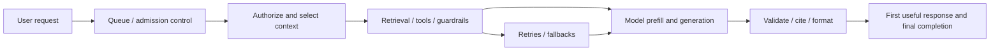
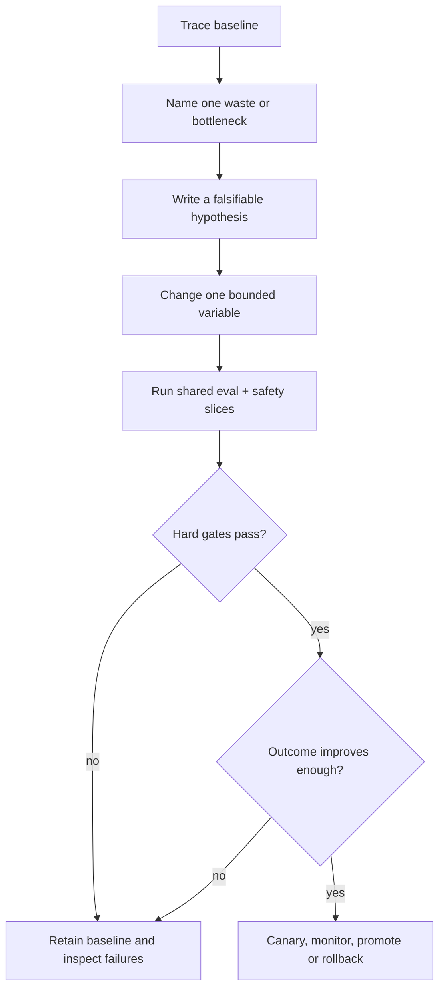

# Cost and latency engineering: make reliable AI systems economical

An AI application is not efficient because it uses few tokens. It is efficient when it reliably completes the right task, within a declared service objective and safety policy, at an acceptable total cost. A cheap unsupported answer, a fast route that sends a customer to the wrong team, and a low-token agent that creates a retry storm are all failures.

This lesson turns performance tuning into an evidence-based engineering practice. It uses the Northstar Support Copilot: a system that answers shipping-policy questions, investigates order issues, and drafts support case briefs. The same reasoning applies to RAG, tool use, agents, coding assistants, and multimodal applications.

> **Optimization order:** measure the whole trajectory → remove needless work → select the smallest reliable architecture → optimize infrastructure and serving → re-evaluate quality and safety. Never start by deleting evidence, validation, or approval gates.

## Learning outcomes

By the end of this lesson, you can:

1. Measure end-to-end and tail latency, not just one model-call average.
2. Attribute total task cost across model, retrieval, tools, retries, guardrails, and review.
3. Set a quality-aware optimization target such as cost per successful, policy-compliant task.
4. Choose among routing, context reduction, caching, concurrency, batching, and model allocation without weakening controls.
5. Run a controlled optimization experiment with a holdout set, trace review, and rollback rule.

## 1. Start with the outcome, not token count

### Define the service objective

For each task type, write a service-level objective (SLO) that includes success, time, and safety. Northstar might use:

```text
Shipping-policy answer:
- ≥ 95% source-supported answers on the reviewed evaluation set
- 0 critical cross-tenant, injection, or action-policy failures
- p95 time to first useful response ≤ 2.5 seconds
- p95 end-to-end completion ≤ 5 seconds
- cost per successful policy-compliant answer ≤ declared budget
```

These metrics deliberately separate **perceived latency** (when the user first sees a useful, streamed response) from **completion latency** (when citations, schema validation, and the final answer are done). A fast first token is not enough if a tool timeout or citation check makes the final result unusable.



### Use a quality-aware unit of cost

For a time window, calculate:

```text
cost_per_successful_compliant_task =
    total_variable_system_cost / successful_policy_compliant_tasks
```

`total_variable_system_cost` includes input, cached-input, output, and reasoning tokens when a provider reports them; embedding/retrieval/reranking; tool calls; moderation/guardrails; retry attempts; and any paid human review needed for that workflow. Fixed infrastructure cost can be reported separately or allocated consistently.

This numerator will often rise after you add a legitimate safety check. That may still be a net improvement if it prevents costly failures. Make the trade-off explicit rather than declaring safety “free” or treating it as an optimization bug.

## 2. Instrument one complete trajectory

### The minimum trace

Log enough to reconstruct where time and money went, subject to your privacy policy. Do not indiscriminately retain raw personal or confidential content.

```json
{
  "request_id": "req_1042",
  "task_type": "policy_answer",
  "prompt_version": "shipping-v4",
  "model": "model-version",
  "context_tokens": 1840,
  "cached_input_tokens": 1200,
  "output_tokens": 214,
  "retrieval": {"queries": 1, "documents": 4, "latency_ms": 340},
  "tools": [{"name": "policy_lookup", "latency_ms": 180, "outcome": "ok"}],
  "model_calls": 1,
  "retries": 0,
  "time_to_first_token_ms": 920,
  "end_to_end_latency_ms": 1710,
  "estimated_cost": 0.0042,
  "schema_valid": true,
  "evidence_supported": true,
  "outcome": "success"
}
```

Record durations at boundaries, not only one total. In particular, distinguish queue time, retrieval time, tool time, model time, validation time, and human approval/resume time. Also record configuration: model version, reasoning setting, prompt and schema version, retrieval index/source version, and tool version. This makes a regression explainable.

### Percentiles and slices matter

Report p50, p95, and p99 end-to-end latency, plus error and timeout rate. Slice the same measurements by task type, language, input-length bucket, cache hit/miss, model, tool availability, tenant plan, and fallback route. An attractive mean can hide an unacceptable long tail caused by a slow dependency or retries.

## 3. Build a cost and latency budget

### A useful accounting model

```text
task_cost = model_input + model_cached_input + model_output + reasoning
          + embeddings + retrieval/reranking + tools + guardrails
          + retries + allocated_human_review

end_to_end_latency = queue + authorization + retrieval + tool_wait
                   + model_prefill + model_generation + validation
                   + retries + approval_or_resume
```

Some terms overlap in a managed service; use the provider's usage reporting rather than pretending they are universally billed the same way. The model's output length, number of sequential round trips, long prompt prefill, and tool tail latency frequently dominate an interactive path. In an agent workflow, the **trajectory**—the number and sequence of calls—often matters more than the cost of one call.

### Exercise: calculate the real cost

```python
from dataclasses import dataclass

@dataclass(frozen=True)
class TaskRun:
    model: float
    retrieval: float
    tools: float
    guardrails: float
    retries: float
    human_review: float
    successful_and_compliant: bool

def total_cost(run: TaskRun) -> float:
    return sum((run.model, run.retrieval, run.tools,
                run.guardrails, run.retries, run.human_review))

def cost_per_successful_compliant_task(runs: list[TaskRun]) -> float:
    successful = sum(run.successful_and_compliant for run in runs)
    if successful == 0:
        raise ValueError("No successful compliant tasks: do not claim an efficiency metric")
    return sum(total_cost(run) for run in runs) / successful

runs = [
    TaskRun(0.003, 0.0004, 0.0002, 0.0001, 0.0, 0.0, True),
    TaskRun(0.003, 0.0004, 0.0002, 0.0001, 0.003, 0.0, False),  # retry then bad answer
]
print(cost_per_successful_compliant_task(runs))  # 0.0104, not 0.003
```

The second run demonstrates why cost per model call can be misleading: the failed retry still consumes budget, but does not belong in the success denominator.

## 4. Optimization sequence: remove work before accelerating work

Use this sequence one change at a time. Compare against the same representative evaluation set; inspect traces for safety regressions and hidden shifts between cost categories.

### Step 1 — Route to the least complex reliable path

Northstar has three classes of request:

| Request | Best initial architecture | Why |
| --- | --- | --- |
| “What is the delivery window?” | Authorized policy lookup → one structured answer | Known evidence path; no autonomous investigation needed. |
| “Where is my shipment?” | Validate ID → read-only order tool → template/answer | Live data, but known deterministic steps. |
| “My order was charged but never arrived.” | Bounded investigation with order state, payment state, policy, and escalation | The evidence path depends on what the first tools return. |

Do not use a multi-agent debate for a single policy lookup. Conversely, do not force a complicated investigation through a tiny model simply because it is cheaper per token. Measure task outcome and trajectory length for each route.

### Step 2 — Remove irrelevant context and cap output deliberately

Context quality is usually more valuable than raw context size. Remove duplicate instructions, stale conversation turns, unrelated documents, unused tools, and examples that no longer correct an evaluated failure. Keep each instruction once, close to the stage it controls, and preserve source-to-claim provenance.

Set a maximum output appropriate to the artifact: a JSON routing decision might need 80 tokens; a cited case brief might need 350. A hard cap can truncate a required answer, so evaluate output completeness before reducing it.

```text
Before: 12 policy excerpts + all conversation history + 9 tools + 900-word answer
After: 3 authorized, reranked excerpts + case summary + 2 relevant tools
       + 250-word answer with required citations
```

Run the same evidence-support and completeness checks after each reduction. See [Context engineering](03-context-engineering.md) and [LLM behavior and prompt structure](18-llm-behavior-and-prompt-structure.md).

### Step 3 — Cache stable, authorized prefixes and results

Caching has several distinct forms:

| Cache | Good candidate | Invalidation / security requirement |
| --- | --- | --- |
| Provider prompt cache | Stable system instructions, tool descriptions, and large static policy prefix | Respect provider scope, TTL, data policy, and prompt ordering. |
| Application result cache | Low-risk, public or tenant-scoped policy answers | Include tenant/authorization, policy version, locale, model/prompt version, and expiry in the key. |
| Retrieval cache | Repeated authorized query + filter combinations | Invalidate on index or policy-source changes; never bypass access filters. |
| Embedding cache | Repeated, approved content chunks | Scope to data-retention rules and source version. |

Provider caching can reduce request cost and prefill work on repeated prefixes, but cache writes, TTLs, privacy properties, and billing differ by provider and model. Track **cache hit rate**, **cache read/write tokens**, net cost, and latency by hit/miss; do not assume every cache increases savings.

OpenAI documents [prompt caching](https://developers.openai.com/api/docs/guides/prompt-caching) and [latency optimization](https://developers.openai.com/api/docs/guides/latency-optimization). Anthropic documents [prompt caching](https://platform.claude.com/docs/en/build-with-claude/prompt-caching). Google documents [context caching and provisioned throughput](https://docs.cloud.google.com/vertex-ai/generative-ai/docs/provisioned-throughput/measure-provisioned-throughput). Treat these as provider capabilities to benchmark, not portable guarantees.

### Step 4 — Parallelize independent reads, never dependent decisions

If a case investigation needs authorized order state and shipment state, start both reads together. Do not parallelize “retrieve policy” with “choose the policy clause” when the second action depends on the first output.

```python
import asyncio

async def investigate(order_id: str) -> dict:
    # These read-only calls are independent. Each must still enforce authorization.
    order_task = get_order_state(order_id)
    shipment_task = get_shipment_state(order_id)
    order, shipment = await asyncio.gather(order_task, shipment_task)
    return {"order": order, "shipment": shipment}
```

Set per-tool timeouts, an overall deadline, cancellation behavior, and a degraded response policy. Parallelizing too aggressively can raise downstream load, hit rate limits, and widen the tail if it creates a retry storm.

### Step 5 — Allocate models and reasoning budgets by measured value

Model routing is a policy decision, not an automatic “small model first” rule. Establish a stable contract and compare a small/fast configuration, a stronger configuration, and a deterministic fallback on the same task slices.

Examples:

- Use a compact capable model for strict, easy classification **only if** its unknown and unsafe-route performance clear the gate.
- Use a higher-capability or higher-reasoning configuration for complex policy analysis **only if** it produces a measured improvement in evidence support or task success.
- Use deterministic code for arithmetic, database filtering, authorization, and schema validation.

Higher reasoning effort, longer output, extra reflection rounds, and multi-agent coordination are investments. Keep them only where their quality gain changes the release decision. The current [OpenAI model guidance](https://developers.openai.com/api/docs/guides/latest-model) likewise recommends comparing quality, completeness, latency, tokens, and cost on representative workloads rather than assuming maximum effort is best.

### Step 6 — Make retries bounded and failure-aware

Retries are a reliability pattern that can quietly become a cost and latency incident. Classify failures:

| Failure | Typical safe response |
| --- | --- |
| Transient timeout / throttling | Bounded exponential backoff with jitter, deadline, and telemetry. |
| Invalid model output | Attempt limited repair or return a structured failure; do not repeat indefinitely. |
| Permission denied | Stop and escalate—retrying will not create permission. |
| Missing evidence | Ask a clarification or abstain; do not hallucinate a substitute. |
| Side-effect uncertainty | Do not blindly retry; check idempotency/status first. |

Define `max_attempts`, a total time budget, and a maximum cost budget **outside** the prompt. Log the original error and final disposition. See [Prompt security](06-prompt-security.md) and [Reliability](19-reliability-and-human-centred-ai.md).

### Step 7 — Move non-interactive work to a batch path

Evaluation, document enrichment, offline summarization, and large dataset generation often do not need an interactive request budget. Batch execution can trade completion time for lower cost or smoother throughput, but it needs idempotent jobs, status tracking, error handling, and data governance. Anthropic's [batch processing documentation](https://platform.claude.com/docs/en/build-with-claude/batch-processing) and provider-specific batch offerings are operational features to evaluate against your workload and retention requirements.

## 5. A trace-driven optimization workshop

### Baseline: a costly shipping answer

Suppose an ordinary “What is the delivery window?” request produces:

```text
Calls:        4 model calls, 3 retrieval queries, 2 tool calls
Context:      14 policy excerpts + complete chat history
Latency:      p50 4.1 s, p95 12.8 s
Cost:         $0.026 per request
Quality:      97% source-supported, but 8% citation-format failures
```

Trace review finds duplicate policy searches, an unnecessary “critique” call, and an answer model that receives irrelevant order tooling.

### Improvement hypothesis

```text
For policy-only questions, route to a one-turn cited-answer workflow.
Retrieve one authorized query, rerank to three excerpts, remove order tools,
cache the stable policy prefix, and validate citations locally.
```

### Run the experiment

1. Freeze the old workflow and version the candidate.
2. Evaluate both on the same normal, long-context, stale-source, ambiguous, and injection cases.
3. Measure task success, evidence support, citation validity, p50/p95/p99, cache hit rate, tool calls, retries, and total cost.
4. Inspect every case that changed from success to failure; a mean improvement does not excuse a safety regression.
5. Promote only if the candidate meets hard gates and improves the target metric. Otherwise retain the baseline and revise the hypothesis.



### A release decision, not a vanity metric

```text
Candidate is eligible only if:
- critical security and policy failures remain zero;
- schema and citation validity are not worse than baseline;
- reviewed task success stays within the quality margin;
- p95 end-to-end latency and cost per successful compliant task improve;
- trace review confirms no forbidden tool access or retry amplification.
```

## 6. State of the art: what is changing in production optimization

The field is shifting from “write shorter prompts” toward **systems-level inference engineering**:

- **Prefix/context caching** makes stable prompt prefixes and repeated context an explicit design concern. It is valuable only with correct ordering, lifecycle, scope, and privacy handling.
- **Model and reasoning routing** lets applications allocate higher-capability inference to cases where evaluation proves a return, while deterministic code and smaller configurations handle bounded work.
- **Tool-trajectory reduction** focuses on fewer reliable sequential steps, tighter tool schemas, and parallel read operations where dependencies allow—not simply fewer model tokens.
- **Serving-aware architecture** increasingly considers batching, queueing, throughput reservations, streaming, cancellation, and tail latency. Research surveys such as [LLM Inference Serving](https://arxiv.org/abs/2407.12391) and [Taming the Titans](https://arxiv.org/abs/2504.19720) describe the systems landscape; provider documentation defines the actual behavior you can rely on.
- **Evaluation-aware optimization** treats quality, safety, latency, and cost as joint release criteria. Automated optimizers and observability platforms help, but cannot decide acceptable risk or repair a weak dataset. See [Evaluation-driven prompt optimization](21-evaluation-driven-prompt-optimization.md).

## Common anti-patterns

| Anti-pattern | Why it fails | Better move |
| --- | --- | --- |
| Cut retrieved evidence to reduce tokens | Fewer sources can lower grounding and hide conflicts. | Measure context relevance; remove only proven noise and retain citations. |
| Always use the smallest model | A cheap wrong route increases downstream workload and may create harm. | Route by evaluated task slice and policy risk. |
| Cache every response | Stale, cross-tenant, or personalized output may be unsafe to reuse. | Cache only scoped, authorized, versioned, expiry-bound artifacts. |
| Parallelize everything | Downstream overload and retries can worsen p99. | Parallelize independent read-only operations with deadlines. |
| Optimize average latency | Users experience tails, timeouts, and fallbacks. | Track p50/p95/p99 plus error and retry rate. |
| Remove validators or approvals | The metric improves only because the system stopped checking. | Keep controls and optimize adjacent waste first. |
| Retest only happy paths | A candidate can improve demos while breaking ambiguity or injection handling. | Keep frozen holdouts, regression cases, and safety slices. |

## Guided practice and companion material

1. Run the [PromptOps capstone notebook](../notebooks/09_promptops_capstone.ipynb) and [lab](../labs/09_promptops_capstone.py).
2. Add one trace field for a cost category that is currently invisible (for example, retry cost or retrieval latency).
3. Choose one Northstar route, write its SLO, and identify its likely dominant latency component.
4. Make one controlled change: remove duplicate context, route a deterministic path, or cache a static prefix in a privacy-safe design.
5. Compare baseline and candidate on the [evaluation lab](../labs/07_prompt_evaluation.py), then write a promotion or rollback recommendation.

**Checkpoint:** A candidate reduces model tokens by 40%, but it drops evidence support from 97% to 89% and raises ambiguity misroutes. Should it ship? No. The optimization changed a quality and safety outcome; retain the baseline or redesign the route/context and test again.

## Production checklist

- [ ] Each task route has a quality, safety, latency, and cost SLO.
- [ ] Traces attribute queue, retrieval, tool, model, validation, retry, and approval time.
- [ ] Dashboards report p50, p95, p99, error rate, timeout rate, and retries by meaningful slice.
- [ ] Cost is measured per successful, policy-compliant task—not merely per model request.
- [ ] Context, output, and tool exposure are minimized without losing required evidence.
- [ ] Caches are scoped by authorization/tenant/source version and have explicit expiry and invalidation rules.
- [ ] Retries, circuit breakers, deadlines, and side-effect idempotency are implemented in code.
- [ ] Each optimization has a holdout comparison, safety review, version, and rollback criterion.

## References

### Official implementation guidance

- [OpenAI: Latency optimization](https://developers.openai.com/api/docs/guides/latency-optimization)
- [OpenAI: Prompt caching](https://developers.openai.com/api/docs/guides/prompt-caching)
- [OpenAI: model guidance](https://developers.openai.com/api/docs/guides/latest-model)
- [Anthropic: Prompt caching](https://platform.claude.com/docs/en/build-with-claude/prompt-caching)
- [Anthropic: Batch processing](https://platform.claude.com/docs/en/build-with-claude/batch-processing)
- [Google Cloud: Provisioned Throughput and context caching](https://docs.cloud.google.com/vertex-ai/generative-ai/docs/provisioned-throughput/measure-provisioned-throughput)
- [Google Cloud: Throughput quota and reserved capacity](https://docs.cloud.google.com/vertex-ai/generative-ai/docs/resources/throughput-quota)

### Research and adjacent course material

- [LLM Inference Serving: Survey of Recent Advances and Opportunities](https://arxiv.org/abs/2407.12391)
- [Taming the Titans: A Survey of Efficient LLM Inference Serving](https://arxiv.org/abs/2504.19720)
- [Prompt evaluation](07-evaluation.md), [PromptOps](09-promptops.md), [Model-aware guidance](16-model-aware-guidance.md), and [Reliability](19-reliability-and-human-centred-ai.md)
