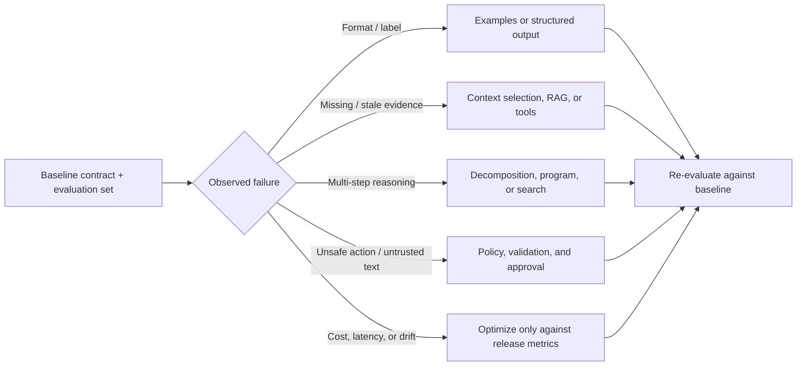

# Prompt technique catalog: choose a pattern by observed failure

This is a **decision catalog**, not a leaderboard. It groups the most useful prompt and context patterns into families, explains the failure each family is meant to address, and links to the lesson that teaches the surrounding engineering practice. It is informed by the taxonomy in [The Prompt Report](https://arxiv.org/abs/2406.06608), but deliberately emphasizes techniques that can be evaluated and operated safely in applications.

> **Rule of thumb:** establish a task contract and a small evaluation set first. Add the simplest technique that improves a measured failure. A more elaborate prompt can increase cost, latency, privacy exposure, and the number of ways a system fails.

## How to read an entry

Every technique answers five questions:

1. **Mechanism** — what changes in the inputs, control flow, or output interface?
2. **Use when** — what observable failure could it address?
3. **Do not use when** — when it is needless or creates a new risk.
4. **Control** — what must remain deterministic, validated, or human-reviewed?
5. **Learn it here** — the course material and runnable companion where available.



## 1. Instruction, example, and output-interface patterns

| Technique | Mechanism | Use when | Do not use when | Learn it here |
| --- | --- | --- | --- | --- |
| **Zero-shot instruction** | State the task, constraints, and success condition without demonstrations. | The task is familiar and output variability is acceptable. | A boundary, format, or label is repeatedly misunderstood. | [Instruction contracts](01-instruction-contracts.md) · [Notebook 01](../notebooks/01_instruction_contracts.ipynb) |
| **Role or audience framing** | Set the decision perspective, reader, and scope. | An explanation needs a defined audience or review rubric. | It is only decorative persona text (“be an expert”). | [Instruction contracts](01-instruction-contracts.md) · [Application playbooks](15-application-playbooks.md) |
| **One-shot / few-shot prompting** | Demonstrate input → output behavior, especially contrasts. | Labels, tone, edge cases, or formatting need a concrete boundary. | Examples are stale, confidential, unrepresentative, or consume needed context. | [Structured outputs](02-structured-outputs.md) · [Context engineering](03-context-engineering.md) |
| **Contrastive examples** | Show a near-miss pair with different correct outputs. | The system confuses adjacent intents (for example, refund vs duplicate charge). | You only have one generic “happy path” example. | [Application playbooks](15-application-playbooks.md) |
| **Delimited sections / templates** | Separate instructions, evidence, user input, and output contract with stable headings or tags. | The prompt mixes trusted instructions and variable data. | Delimiters are mistaken for a security boundary. | [LLM behavior and prompt structure](18-llm-behavior-and-prompt-structure.md) · [Prompt security](06-prompt-security.md) |
| **Structured output** | Constrain the response to a JSON schema or typed interface. | Software needs fields, enums, optional values, or detectable refusal/error states. | Schema conformance is treated as factual correctness. | [Structured outputs](02-structured-outputs.md) · [Notebook 02](../notebooks/02_structured_outputs.ipynb) |
| **Constrained decoding / grammar** | Limit legal tokens or structure at generation time. | Exact syntax, machine-readable forms, or safe enumerations are essential. | The semantic evidence still needs checking; grammar cannot validate truth. | [Technology review](10-technology-review.md) · [Structured outputs](02-structured-outputs.md) |

### Mini pattern: use a contrast before adding many examples

```text
Classify one customer request. Allowed labels: duplicate_charge, refund_request,
shipping, account, unknown.

Contrast examples:
- "My order was delivered but I want to return it." → refund_request
- "Checkout failed but my bank shows two charges." → duplicate_charge

Choose unknown when no label is supported by the request alone.
Return JSON: {"intent":"...", "evidence":"short quote"}.
```

The application, not the model, should validate the enum and decide which internal route the label can trigger.

## 2. Context and evidence patterns

| Technique | Mechanism | Use when | Do not use when | Learn it here |
| --- | --- | --- | --- | --- |
| **Context selection** | Choose the smallest authorized set of instructions, state, and evidence. | A response needs current task-specific information. | “More context” is being used as a substitute for source quality. | [Context engineering](03-context-engineering.md) · [Notebook 03](../notebooks/03_context_engineering.ipynb) |
| **Context compression** | Summarize, extract, or retain only decision-relevant state with provenance. | Long history crowds out current evidence. | A summary discards the legal, numerical, or contradictory detail needed later. | [Context engineering](03-context-engineering.md) |
| **Retrieval-augmented generation (RAG)** | Retrieve approved sources and answer from their evidence. | Knowledge changes, is too large for the prompt, or requires citations. | The answer is actually a live transactional fact better obtained from a tool. | [RAG and tools](04-rag-tools.md) · [Notebook 04](../notebooks/04_rag_and_tools.ipynb) |
| **Query rewriting / multi-query retrieval** | Create alternate search formulations, merge, then rerank results. | Retrieval recall—not generation quality—is the measured bottleneck. | Expanded queries can cross tenant boundaries, amplify noise, or exceed latency budget. | [RAG and tools](04-rag-tools.md) · [Application playbooks](15-application-playbooks.md) |
| **HyDE / hypothetical-document retrieval** | Draft a hypothetical answer/document to use as a retrieval query. | Semantic retrieval misses terminology or sparse queries. | The hypothetical text is shown as evidence or substitutes for source retrieval. | [RAG and tools](04-rag-tools.md) |
| **Cited generation / quote-then-answer** | Require source IDs or evidence excerpts for material claims. | Users need auditability and the system may need to abstain. | Citation presence is accepted without checking that the source entails the claim. | [Context engineering](03-context-engineering.md) · [Evaluation](07-evaluation.md) |
| **Memory retrieval** | Retrieve validated, scoped user or task facts from durable storage. | Repeated interactions need stable preferences or case state. | Stale or unreviewed memory can bias a new decision. | [Context engineering](03-context-engineering.md) · [Agentic prompts](08-agentic-prompts.md) |

**Safety note:** retrieved documents, search results, tool output, and user text are data—not instructions. Authorization filters must run before retrieval, and model instructions must never grant access to sources or tools. See [Prompt security](06-prompt-security.md).

## 3. Reasoning, planning, and verification patterns

| Technique | Mechanism | Use when | Do not use when | Learn it here |
| --- | --- | --- | --- | --- |
| **Task decomposition** | Break a known task into named, inspectable stages. | Different stages need different checks or inputs. | A deterministic function or direct answer already solves it. | [Reasoning techniques](11-reasoning-techniques.md) |
| **Chain-of-thought (CoT) examples** | Demonstrate intermediate reasoning for a multi-step task. | Small, well-defined symbolic or analytical tasks benefit from worked examples. | Internal rationale is needed for audit; request concise evidence or verifiable artifacts instead. | [Reasoning techniques](11-reasoning-techniques.md) · [CoT paper](https://arxiv.org/abs/2201.11903) |
| **Least-to-most / plan-and-solve** | Solve prerequisite subproblems before the final task. | A task has a dependency order that is known and checkable. | The plan is treated as proof or the task needs external evidence. | [Reasoning techniques](11-reasoning-techniques.md) · [Least-to-most](https://arxiv.org/abs/2205.10625) · [Plan-and-Solve](https://arxiv.org/abs/2305.04091) |
| **Self-consistency** | Sample multiple independent solutions and aggregate. | Answers are independently verifiable and ambiguity is real. | A majority vote is mistaken for evidence or cost is unjustified. | [Reasoning techniques](11-reasoning-techniques.md) · [Self-Consistency](https://arxiv.org/abs/2203.11171) |
| **Critique → revise / reflection** | Inspect a draft with a rubric, then repair confirmed defects. | Quality rules are explicit and the critique has access to the same evidence. | The same model's unverified critique is accepted as a guarantee. | [Evaluation](07-evaluation.md) · [Reliability](19-reliability-and-human-centred-ai.md) · [Reflexion](https://arxiv.org/abs/2303.11366) |
| **Tree of Thoughts (ToT)** | Generate, score, and prune several candidate reasoning paths. | Search choices are meaningful and a reliable scorer or verifier exists. | The scoring signal is vague, or exploration cost outweighs benefit. | [Reasoning techniques](11-reasoning-techniques.md) · [ToT paper](https://arxiv.org/abs/2305.10601) |
| **Graph of Thoughts** | Merge and transform dependent partial results as a graph. | Complex work has reuse or dependency across branches. | A simple chain is sufficient or graph bookkeeping is opaque. | [Reasoning techniques](11-reasoning-techniques.md) · [Graph of Thoughts](https://arxiv.org/abs/2308.09687) |
| **Generated knowledge** | Draft a hypothesis or background statement before solving a task. | The hypothesis can be independently checked against tools or sources. | Generated text will be treated as trusted evidence. | [Context engineering](03-context-engineering.md) · [Reliability](19-reliability-and-human-centred-ai.md) |

### Decision rule: search needs a verifier

Tree, graph, and multi-sample techniques create alternatives. They are only as sound as their scorer. If you cannot explain how a candidate is verified—by a test, calculation, source, rubric, or reviewer—prefer a simpler direct workflow.

## 4. Tool, program, and agent patterns

| Technique | Mechanism | Use when | Do not use when | Learn it here |
| --- | --- | --- | --- | --- |
| **Function / tool calling** | Ask the model to select a bounded operation with typed arguments. | Current facts or deterministic actions are needed. | A free-form “admin API(command)” exposes broad authority. | [RAG and tools](04-rag-tools.md) · [Agentic prompts](08-agentic-prompts.md) |
| **ReAct** | Alternate decision, tool action, observation, and updated decision. | Evidence changes the next step and the path cannot be known upfront. | A fixed workflow has known steps and fewer failure modes. | [Agentic prompts](08-agentic-prompts.md) · [ReAct paper](https://arxiv.org/abs/2210.03629) |
| **Program-aided language models (PAL) / program of thought** | Translate a problem into constrained executable logic; use a runtime for calculation. | Arithmetic, tables, transformations, or formal checks are safer in code. | Arbitrary generated code is executed with credentials or unrestricted access. | [Reasoning techniques](11-reasoning-techniques.md) · [PAL paper](https://arxiv.org/abs/2211.10435) |
| **Tool-use learning / Toolformer-style patterns** | Teach or optimize when an external tool is useful. | A model must choose among well-described, narrow tools. | Tool permissions and arguments are delegated to prompt text alone. | [RAG and tools](04-rag-tools.md) · [Toolformer](https://arxiv.org/abs/2302.04761) |
| **Prompt chaining** | Feed a bounded, inspectable artifact from one step to the next. | Each stage has a different contract and can be validated. | Hidden chain state makes failures impossible to inspect or replay. | [Application playbooks](15-application-playbooks.md) · [PromptOps](09-promptops.md) |
| **Router → specialist** | Classify a request, then invoke a narrow workflow or specialist. | Task families are separable and routes can be evaluated. | The route has low confidence and no escalation path. | [Application playbooks](15-application-playbooks.md) · [Agentic prompts](08-agentic-prompts.md) |
| **Evaluator–optimizer loop** | Generate a candidate, evaluate against a rubric/tests, make bounded revisions. | An objective, testable score exists. | The evaluator is subjective, biased, or has no access to evidence. | [Evaluation](07-evaluation.md) · [PromptOps](09-promptops.md) |

Tool schemas, permission checks, rate limits, idempotency, budgets, retries, and human approvals are **application controls**. A strong prompt can request them; it cannot enforce them. Continue with [Prompt security](06-prompt-security.md) and [Reliability](19-reliability-and-human-centred-ai.md).

## 5. Optimization and adaptation patterns

| Technique | Mechanism | Use when | Do not use when | Learn it here |
| --- | --- | --- | --- | --- |
| **Prompt versioning and A/B comparison** | Treat prompts, templates, context policy, and model settings as release artifacts. | A change must be attributable and reversible. | A “better” prompt is promoted from anecdotes. | [PromptOps](09-promptops.md) · [Evaluation](07-evaluation.md) |
| **Automatic prompt optimization** | Search or synthesize prompt candidates against a held-out evaluation set. | The task has stable metrics and human-reviewed constraints. | The optimizer is trained and judged on the same small set, or safety cases are absent. | [Evaluation-driven prompt optimization](21-evaluation-driven-prompt-optimization.md) |
| **Active prompting** | Prioritize uncertain or informative examples for labeling/review. | Building a dataset with limited reviewer time. | Uncertainty sampling excludes rare safety-critical failures. | [Evaluation](07-evaluation.md) · [Prompt optimization](21-evaluation-driven-prompt-optimization.md) |
| **Model-aware adaptation** | Adjust prompt shape, capabilities, and fallbacks by model/version. | A system supports multiple models or is migrating versions. | It becomes model-locked without a durable behavioral contract. | [Model-aware guidance](16-model-aware-guidance.md) |
| **Caching and prompt compression** | Reuse stable prefixes and reduce redundant context. | Cost or latency is measured as a production bottleneck. | Compression removes evidence or caching risks privacy/correctness. | [Cost and latency](13-cost-latency-engineering.md) |
| **Fine-tuning instead of prompting** | Change learned behavior with curated training data. | Evaluation shows a stable, repeated task remains unreliable or too expensive with prompting alone. | A prompt/data problem is being hidden behind a training job. | [Technology review](10-technology-review.md) · [Model-aware guidance](16-model-aware-guidance.md) |

## 6. Safety, reliability, and human-centred patterns

| Technique or control | Mechanism | Use when | Learn it here |
| --- | --- | --- | --- |
| **Abstention / clarification** | Return an explicit unknown state or ask for missing evidence. | The answer is not supported or confidence/risk policy says not to automate. | [Reliability](19-reliability-and-human-centred-ai.md) · [Application playbooks](15-application-playbooks.md) |
| **Evidence-first answer** | Separate source-backed claims from hypotheses and recommendations. | A decision depends on current, auditable information. | [Context engineering](03-context-engineering.md) · [RAG and tools](04-rag-tools.md) |
| **Input trust boundary** | Label user, retrieved, tool, and system content by trust level. | Any external content reaches the model. | [Prompt security](06-prompt-security.md) |
| **Output validation** | Parse/validate outputs before using them in software or tools. | Outputs drive routes, databases, or actions. | [Structured outputs](02-structured-outputs.md) · [Prompt security](06-prompt-security.md) |
| **Human approval gate** | Pause before high-impact actions and record approve/modify/reject. | Money, data, production systems, safety, or legal decisions are involved. | [Reliability](19-reliability-and-human-centred-ai.md) · [Agentic prompts](08-agentic-prompts.md) |
| **Adversarial / regression evaluation** | Test prompt injection, ambiguity, privacy, drift, and previous failures. | Before release and after every material prompt/model/tool change. | [Evaluation](07-evaluation.md) · [PromptOps](09-promptops.md) |

## Technique selection worksheet

For each proposed change, record the following before implementation:

```text
Observed failure:
Baseline metric and dataset slice:
Technique and mechanism:
Expected improvement:
Extra model calls / tokens / latency:
New trust boundary or permission:
Deterministic validator or human approval:
Rollback or stop criterion:
```

If you cannot state an expected metric and stop criterion, the change is an experiment—not yet a production technique.

## What this catalog intentionally does not claim

No catalog is a universal ranking. Results vary by model, task, domain, prompt budget, dataset, and evaluation design. Many named techniques overlap: a “planner,” “chain,” or “reflection” system may be the same underlying pattern with a different control loop. Prefer clear contracts, traceable evidence, and measured outcomes over fashionable labels.

## References

- [The Prompt Report: A Systematic Survey of Prompting Techniques](https://arxiv.org/abs/2406.06608) — broad taxonomy and terminology.
- [A systematic survey of prompt engineering](https://arxiv.org/abs/2402.07927) — survey reference and taxonomy perspective.
- [Chain-of-Thought](https://arxiv.org/abs/2201.11903), [Self-Consistency](https://arxiv.org/abs/2203.11171), [Tree of Thoughts](https://arxiv.org/abs/2305.10601), [Graph of Thoughts](https://arxiv.org/abs/2308.09687), and [ReAct](https://arxiv.org/abs/2210.03629).
- [PAL: Program-aided Language Models](https://arxiv.org/abs/2211.10435), [Toolformer](https://arxiv.org/abs/2302.04761), and [Reflexion](https://arxiv.org/abs/2303.11366).
- [OpenAI: Working with evals](https://developers.openai.com/api/docs/guides/evals) and [Google: Prompt design strategies](https://ai.google.dev/gemini-api/docs/prompting-strategies) — official implementation guidance.
- [OWASP Top 10 for LLM Applications](https://genai.owasp.org/llm-top-10/) — security risks that prompt patterns must not bypass.
