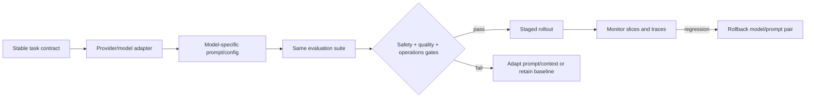
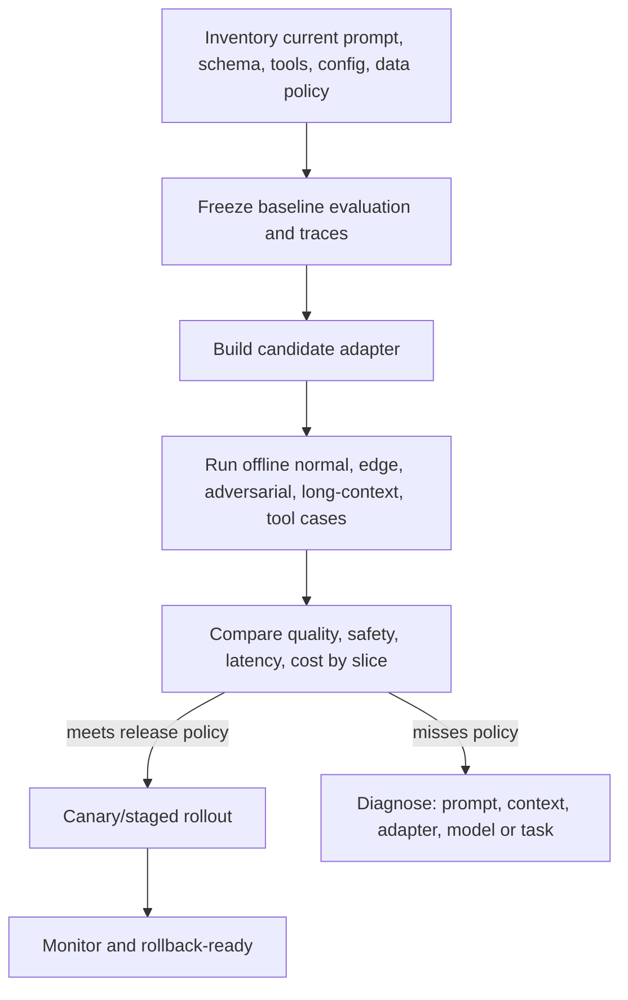

# Model-aware prompting: stable behavior across changing models

## Scenario: a model upgrade is a behavior change

Northstar replaces a support model with a newer one. The request schema stays the same, but the candidate model becomes briefer, selects a different tool, and treats a long policy document differently. The migration is not “change one model name”; it is a production behavior change that needs a contract, evaluation, staged rollout, and rollback.



## Learning outcomes

You will be able to define a provider-neutral behavioral contract, build a capability matrix, run an evidence-based model comparison, identify portability failures, and deploy a model migration with explicit risk gates.

## 1. Separate the durable contract from the variable implementation

The **contract** should remain stable across providers: task, allowed evidence, tool policy, output schema, safety rules, escalation conditions, and evaluation dataset. The **implementation** may vary: message format, prompt wording, model parameters, reasoning controls, tool schema conventions, and context assembly.

```text
Contract: classify support intent; use approved evidence only; return CaseBrief;
          ask/escalate when order facts are absent; never execute an action.

Adapter A: provider message format + provider structured-output mechanism.
Adapter B: alternate message format + alternate schema/tool mechanism.
```

Portability means equivalent verified behavior, not identical prompts or identical prose.

## 2. Capability matrix: ask the questions that affect architecture

| Capability | Why it matters | Northstar test |
| --- | --- | --- |
| Instruction hierarchy/messages | changes how durable rules and user task are represented | Does an injected user premise override the evidence rule? |
| Structured output | controls parsing/repair surface | Does every valid response satisfy `CaseBrief`? |
| Tool calling | changes tool selection, arguments, and state loop | Does the model choose `get_order_status` only with an order ID? |
| Reasoning controls | affects quality, token use, and latency | Does extra effort improve ambiguous-policy cases enough to justify cost? |
| Context length/attention | changes retrieval/compaction policy | Does source position affect policy support? |
| Multimodal support | changes extraction and provenance design | Can the invoice extraction retain page/region references? |
| Safety/data controls | affects architecture and compliance | Are retention, access, and regional requirements acceptable? |
| Observability | affects incident response and regression diagnosis | Can traces export model/config/context/tool metadata? |

Use current official documentation for the target model's limits and API semantics. Provider pages change frequently; do not encode a static marketing comparison as a course fact.

## 3. Naive migration versus reliable migration

### Naive

```text
change model identifier → production
```

This misses changed defaults, tool-call formats, model-specific reasoning behavior, output verbosity, context use, and data/price terms.

### Reliable



## 4. Step-by-step Northstar comparison experiment

### Step 1 — freeze the behavioral contract

Use the same `CaseBrief` schema, evidence policy, tool allowlist, customer cases, and scoring rubric for baseline and candidate. Do not silently change the evaluation to make the new model look better.

### Step 2 — construct representative slices

Include supported refund questions, missing-order cases, conflicting policies, assertive false premises, prompt-injection-like content, long-context position variants, tool errors, and document/image extraction if the application uses it.

### Step 3 — compare implementation artifacts

Record model/version, system/developer message, user/task format, examples, reasoning setting, token/output budget, tool definitions, retrieval policy, and SDK version. A model comparison without this metadata is not reproducible.

### Step 4 — score outcomes and trajectories

```text
quality: correctness, evidence support, abstention, schema validity
safety: forbidden claim, injection compliance, tenant/tool policy
operations: p50/p95 latency, tokens, cost, retries, tool calls
reliability: consistency across repeats and paraphrase variants
```

### Step 5 — inspect disagreements

Read failures rather than trusting a mean score. A candidate that wins on easy cases but misroutes financial actions or loses evidence in long context should not ship. Public benchmarks are useful context, but your production dataset and policy are the release authority.

## 5. Model-aware prompt adjustments

Adapt only after an observed difference:

| Observed difference | Adaptation | Do not do |
| --- | --- | --- |
| Candidate returns overly terse draft | make required sections/length explicit | add unrelated examples or raise temperature blindly. |
| Candidate loops after sampling change | restore model-recommended/default settings; set stop/budget | assume low temperature is always safer. |
| Tool arguments differ | validate adapter mapping and tighten tool schema | widen permissions to “make it work.” |
| Schema support differs | use the provider's native constraint, then app validation | parse arbitrary prose with regex. |
| Long-context support differs | rerun position/distractor tests and adjust retrieval | assume advertised context length proves usable recall. |
| Reasoning model handles planning internally | give goal, evidence, constraints, and success criterion | force verbose hidden reasoning as a universal pattern. |

## 6. Model routing is a policy decision

Some systems route simple, low-risk tasks to a smaller/faster model and complex investigations to a more capable one. Define routing on measurable properties—task type, required modality, evidence need, risk tier, and budget—not user prestige or a model's brand. Every route must obey the same authorization and output-policy gates.

```text
known low-risk classification → efficient model + schema validation
evidence-heavy policy question → model/context route proven on groundedness
high-risk action proposal → policy gate + human approval, regardless of model
```

## 7. Release and rollback policy

Example release gate:

```text
Ship only when critical safety failures are zero; schema validity is 100%;
groundedness and task success meet declared thresholds; p95 latency and cost
fit the budget; and human review finds no unacceptable slice regression.
```

Keep model and prompt together as a rollback unit. The runbook needs the last known-good model/version, prompt/context/config artifacts, rollback owner, verification test, and communication path. Monitor source drift, fallback rate, tool errors, cost per successful task, and quality samples after rollout.

## Guided exercise

Choose two available models (or use deterministic adapters if credentials are unavailable). Build a table with five Northstar cases and run the same contract. Explain one observed difference using trace evidence. Then decide: keep a shared prompt, introduce a documented model-specific variant, change context assembly, or retain the baseline.

### Challenge

Move the decisive policy excerpt from the beginning to the middle and end of a long context. Compare both models' support rate and a retrieval-selected short-context baseline. This tests usable context behavior rather than advertised window size.

## Production checklist

- Is the behavioral contract independent of provider message syntax?
- Are model, configuration, prompt, context, tool, and SDK versions captured in each trace?
- Has the candidate passed normal, adversarial, long-context, tool, and refusal/abstention slices?
- Are provider data/retention, regional, pricing, and capability requirements reviewed?
- Does a staged rollout have quality, safety, latency, and cost gates?
- Can the exact model/prompt/configuration pair be rolled back quickly?

## Key takeaway

> Model-aware prompting is not a collection of vendor tricks. It is disciplined portability engineering: keep the behavior contract stable, measure implementation differences, and migrate only when the complete system outcome improves.

## References

- [Google prompt design strategies](https://ai.google.dev/gemini-api/docs/prompting-strategies)
- [Google models](https://ai.google.dev/gemini-api/docs/models), [tools](https://ai.google.dev/gemini-api/docs/tools), and [thinking](https://ai.google.dev/gemini-api/docs/generate-content/thinking)
- [OpenAI prompting guide](https://platform.openai.com/docs/guides/prompting) and [evals](https://platform.openai.com/docs/guides/evals)
- [Anthropic documentation](https://docs.anthropic.com/)
- [PromptBridge: Cross-Model Prompt Transfer](https://arxiv.org/abs/2512.01420)
- [PromptBench](https://arxiv.org/abs/2312.07910)
- [Lost in the Middle](https://arxiv.org/abs/2307.03172)
