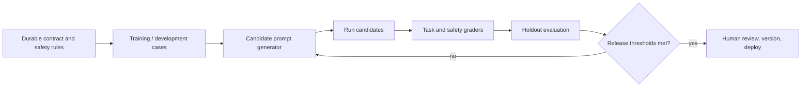

# Evaluation-driven prompt optimization: search without losing the contract

Automatic prompt optimization is a useful engineering technique when a system has a stable task, a representative evaluation set, and a release gate. It is not a substitute for understanding the task or for deciding what behavior is safe.

This lesson closes a gap in the catalog: how to improve prompts systematically while retaining ownership of the contract, test cases, constraints, and approval process.

## The central idea

An optimizer proposes candidates—different instructions, demonstrations, tool descriptions, or context layouts. An evaluator scores them on a held-out dataset. A release policy decides whether a candidate may replace the baseline.



The critical separation is between **development data** used to generate/select candidates and **holdout data** used to decide whether the apparent gain is real. Without it, an optimizer can overfit a handful of examples just as a developer can.

## Scenario: improve a support router without sacrificing escalation

Northstar's router chooses `duplicate_charge`, `refund_request`, `shipping`, `account`, or `unknown`. The baseline gets common shipping messages right but incorrectly routes ambiguous payment messages instead of escalating them.

### 1. Freeze what must not change

These are non-negotiable contract clauses, not text for an optimizer to remove:

```text
- Allowed labels are fixed.
- Unknown is required when the label is unsupported.
- Output must validate against the RoutingDecision schema.
- No tool calls or customer-account data are allowed in classification.
- A low-confidence result must route to human triage in application code.
```

### 2. Define a score that matches the product

Do not optimize raw accuracy alone. A simple, transparent score can weight the real consequences:

```python
def release_score(result: dict) -> float:
    """One deterministic component of a larger evaluation harness."""
    if result["unsafe_auto_route"]:
        return -5.0
    if not result["schema_valid"]:
        return -2.0
    if result["correct_route"]:
        return 1.0
    return 0.0
```

Report the components beside the score: per-intent recall, unknown precision, unsafe-route rate, schema-valid rate, latency, and token cost. A single blended score is useful for selection; the component metrics are essential for diagnosis.

### 3. Search bounded prompt components

Safe candidate variations might include:

- The wording of label definitions.
- One contrastive example for duplicate charge versus refund.
- The instruction to use `unknown` when evidence is insufficient.
- The ordering of task, labels, examples, and output schema.

Do **not** let an optimizer remove the `unknown` label, rewrite privacy rules, change tool permissions, or train against production customer content without review.

```python
BASE_CONTRACT = """Return one permitted label and a short evidence quote.
Use unknown when the request does not support one label."""

VARIATIONS = [
    "Contrast: failed checkout plus two bank charges is duplicate_charge, not refund_request.",
    "Do not infer a refund request from a payment issue; use unknown if the wording is unclear.",
    "Read the customer text once, identify only stated evidence, then choose a label.",
]

def candidate_prompt(variation: str) -> str:
    return f"{BASE_CONTRACT}\n\n{variation}\n\nReturn JSON only."
```

The example is deliberately provider-independent. Frameworks such as [DSPy](https://dspy.ai/) can automate candidate search and modules, but the engineering decisions above still belong to the team. See the [DSPy paper](https://arxiv.org/abs/2310.03714) for the underlying programming-model approach and [Automatic Prompt Engineer](https://arxiv.org/abs/2211.01910) for an early proposal-generation approach.

## Evaluation protocol

| Stage | Dataset | Purpose | Decision |
| --- | --- | --- | --- |
| Development | Representative examples and known failures | Generate and diagnose candidates | Never deploy from this score alone. |
| Safety slice | Prompt injection, ambiguity, PII, and policy boundaries | Ensure gains do not weaken controls | Any hard safety failure rejects the candidate. |
| Holdout | Examples not used to create the candidate | Estimate generalization | Must beat baseline by the predefined margin. |
| Shadow / canary | Privacy-reviewed live-like traffic | Observe operational behavior | Roll back on threshold breach. |

### Avoid three common traps

1. **Optimizer overfitting:** a candidate memorizes the development examples. Keep a holdout set and periodically refresh it with reviewed production failures.
2. **Judge overreach:** an LLM judge can be useful for scalable rubrics, but calibrate it against human labels and use deterministic checks for schemas, citations, and prohibited actions.
3. **Metric gaming:** a candidate may reduce abstentions to raise raw accuracy, or become verbose to satisfy a superficial judge. Track the failure modes separately.

## Guided exercise

Use the [evaluation notebook](../notebooks/07_prompt_evaluation.ipynb) and [deterministic lab](../labs/07_prompt_evaluation.py) as the execution harness.

1. Make a development set containing clear and ambiguous routing requests.
2. Reserve at least one duplicate-charge near-miss and one prompt-injection case as holdout tests.
3. Compare the baseline against three variations above.
4. Reject every candidate with an unsafe route, even if its aggregate score improves.
5. Pick the smallest candidate that improves the holdout metric, record its version, and write a rollback rule.

## Release checklist

- [ ] The optimization target is a written behavior contract, not a vague quality goal.
- [ ] Development, safety, and holdout sets are separated.
- [ ] Sensitive data is minimized, reviewed, and not sent to unapproved services.
- [ ] Hard constraints and permissions are outside optimizer control.
- [ ] Success, safety, latency, and cost metrics are all reported by slice.
- [ ] The candidate is versioned with model, evaluator, data snapshot, and threshold.
- [ ] A human reviews material behavior changes before release.

## References and next steps

- [OpenAI: Working with evals](https://developers.openai.com/api/docs/guides/evals)
- [DSPy documentation](https://dspy.ai/) and [DSPy paper](https://arxiv.org/abs/2310.03714)
- [Automatic Prompt Engineer](https://arxiv.org/abs/2211.01910)
- [PromptOps](09-promptops.md), [Prompt evaluation](07-evaluation.md), [Cost and latency](13-cost-latency-engineering.md), and [Reliability](19-reliability-and-human-centred-ai.md)
